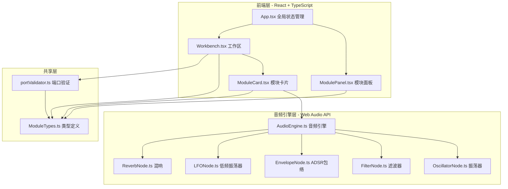
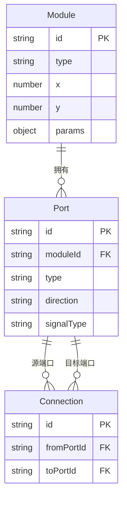

## 1. 架构设计



## 2. 技术说明

- 前端：React@18 + TypeScript + Vite
- 初始化工具：vite-init（react-ts模板）
- 样式：Tailwind CSS + CSS Modules（用于动画和特殊效果）
- 状态管理：React Context + useReducer（管理模块和连接状态）
- 音频渲染：Web Audio API（独立src/audio/模块）
- 后端：无
- 数据库：无

## 3. 路由定义

| 路由 | 用途 |
|------|------|
| / | 主工作台页面，包含模块面板、工作区、状态栏 |

## 4. API定义

不适用（纯前端项目，无后端API）

## 5. 服务器架构图

不适用（纯前端项目）

## 6. 数据模型

### 6.1 数据模型定义



### 6.2 数据定义

- Module：id（唯一标识）、type（振荡器/滤波器/包络/LFO/混响）、x/y（工作区位置）、params（模块参数对象）
- Port：id（唯一标识）、moduleId（所属模块）、type（input/output）、signalType（audio/control/trigger）
- Connection：id（唯一标识）、fromPortId（输出端口ID）、toPortId（输入端口ID）

### 文件结构

```
├── package.json
├── index.html
├── vite.config.js
├── tsconfig.json
└── src/
    ├── App.tsx
    ├── components/
    │   ├── ModulePanel.tsx
    │   ├── Workbench.tsx
    │   └── ModuleCard.tsx
    ├── audio/
    │   ├── AudioEngine.ts
    │   └── modules/
    │       ├── OscillatorNode.ts
    │       ├── FilterNode.ts
    │       ├── EnvelopeNode.ts
    │       ├── LFONode.ts
    │       └── ReverbNode.ts
    ├── types/
    │   └── ModuleTypes.ts
    └── utils/
        └── portValidator.ts
```
