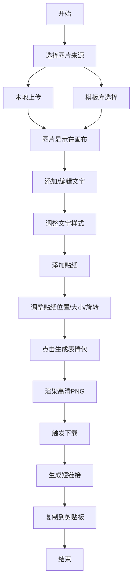

## 1. 产品概述

表情包生成器是一款帮助用户快速创建和分享个性化表情包的 Web 应用，解决在线制作表情包需要切换多个工具、图片编辑功能分散、无法快速复制分享的痛点问题。

- 主要用途：快速制作带有文字、贴纸的个性化表情包
- 目标用户：社交媒体用户、内容创作者、聊天爱好者
- 产品价值：一站式表情包制作工具，降低创作门槛，提升分享效率

## 2. 核心功能

### 2.1 功能模块

1. **图片上传与模板库**：本地图片上传 + 内置热门 Meme 模板选择
2. **文字编辑与样式调整**：顶部/底部文字编辑，支持字体、字号、颜色、描边等样式
3. **贴纸与装饰元素**：emoji 和图形贴纸，支持拖拽、缩放、旋转、层级调整
4. **一键导出与分享**：高清 PNG 导出 + 模拟短链接一键复制

### 2.2 页面详情

| 页面名称 | 模块名称 | 功能描述 |
|-----------|-------------|---------------------|
| 主应用页 | 页头 | 应用名称、操作提示、固定定位 |
| 主应用页 | 模板面板 | 模板缩略图网格、毛玻璃效果、悬停放大动画 |
| 主应用页 | 主画布 | 径向渐变背景、图片渲染、文字和贴纸叠加 |
| 主应用页 | 工具栏 | 字体样式调节、颜色取色器、贴纸选择、层级调整 |
| 主应用页 | 导出按钮 | 生成表情包、下载对话框、复制短链接 |

## 3. 核心流程

用户从本地上传图片或从模板库选择模板 → 在图片上添加顶部和底部文字并调整样式 → 添加贴纸装饰并调整位置/大小/旋转 → 点击生成按钮导出高清图片 → 自动下载并生成可复制的短链接

## 4. 用户界面设计

### 4.1 设计风格

- **主色调**：深灰 `#1a1a2e` 作为背景主色
- **强调色**：亮青 `#00d4aa` 作为按钮和交互元素强调色
- **按钮风格**：圆角 8px-16px，轻微阴影，悬停时从亮青渐变到深青，0.3s ease-out 过渡
- **字体**：Inter（英文）+ Noto Sans SC（中文）
- **卡片风格**：圆角、轻微阴影、毛玻璃效果
- **背景**：深色渐变网格纹理
- **画布背景**：深灰到浅灰的径向渐变

### 4.2 页面设计概述

| 页面名称 | 模块名称 | UI 元素 |
|-----------|-------------|-------------|
| 主应用页 | 页头 | 固定定位、应用标题、操作提示、深色背景 |
| 主应用页 | 模板面板 | 网格布局、缩略图、毛玻璃卡片、悬停放大动画 |
| 主应用页 | 主画布 | 径向渐变背景、图片、可拖拽文字、可交互贴纸 |
| 主应用页 | 工具栏 | 滑动条、取色器、下拉选择、贴纸选择器 |
| 主应用页 | 导出区 | 主按钮、复制提示气泡 |

### 4.3 响应式设计

- **桌面端（≥1024px）**：左右两栏布局，左侧模板和贴纸面板（可折叠），右侧主画布
- **平板端（768-1023px）**：面板折叠为顶部工具栏，画布居中
- **手机端（<768px）**：全屏画布，面板以底部弹窗形式唤起（从底部向上弹出带弹性过冲动画）

### 4.4 交互动效

- 模板悬停：放大动画 + 毛玻璃效果
- 文字拖拽：位置坐标显示 + 参考线 + 松手平滑回弹
- 贴纸交互：60FPS 流畅动画、缩放旋转反馈
- 复制成功：绿色提示气泡从顶部弹入
- 移动端面板：底部向上弹出 + 弹性过冲
- 按钮悬停：背景色渐变过渡 0.3s ease-out
