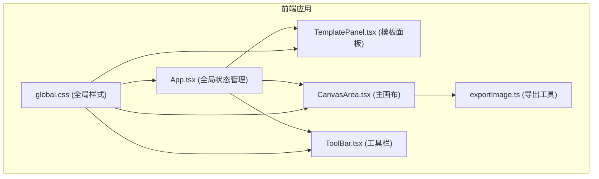

## 1. 架构设计



## 2. 技术描述

- **前端框架**：React 18 + TypeScript
- **构建工具**：Vite
- **样式方案**：原生 CSS（CSS 变量 + 响应式媒体查询）
- **状态管理**：React useState/useReducer（组件内状态）
- **图片导出**：Canvas API
- **字体**：Google Fonts（Inter + Noto Sans SC）

## 3. 文件结构

| 文件路径 | 用途 |
|-------|------|
| `package.json` | 项目依赖配置 |
| `vite.config.js` | Vite 构建配置（含 @ 路径别名） |
| `tsconfig.json` | TypeScript 配置（严格模式） |
| `index.html` | 入口页面 |
| `src/App.tsx` | 主应用组件，全局状态管理 |
| `src/components/TemplatePanel.tsx` | 模板库面板组件 |
| `src/components/CanvasArea.tsx` | 主画布组件 |
| `src/components/ToolBar.tsx` | 工具栏组件 |
| `src/utils/exportImage.ts` | 图片导出工具函数 |
| `src/styles/global.css` | 全局样式 |

## 4. 核心数据模型

### 4.1 文字样式类型

```typescript
interface TextStyle {
  text: string;
  fontFamily: string;
  fontSize: number;
  color: string;
  strokeColor: string;
  strokeWidth: number;
  x: number;
  y: number;
}
```

### 4.2 贴纸类型

```typescript
interface Sticker {
  id: string;
  type: 'emoji' | 'shape';
  content: string;
  x: number;
  y: number;
  scale: number;
  rotation: number;
  zIndex: number;
}
```

### 4.3 模板类型

```typescript
interface MemeTemplate {
  id: string;
  name: string;
  thumbnail: string;
  imageUrl: string;
}
```

### 4.4 应用状态

```typescript
interface AppState {
  image: string | null;
  topText: TextStyle;
  bottomText: TextStyle;
  stickers: Sticker[];
  selectedStickerId: string | null;
  activePanel: 'templates' | 'stickers' | 'text' | null;
}
```

## 5. 关键技术实现

### 5.1 画布渲染

- 使用 HTML Canvas 进行最终导出渲染
- 使用 DOM + CSS Transform 实现实时拖拽交互（60FPS）
- 文字和贴纸使用绝对定位 + transform 进行位置变换

### 5.2 拖拽交互

- 鼠标事件：mousedown → mousemove → mouseup
- 触摸事件：touchstart → touchmove → touchend
- 使用 requestAnimationFrame 确保流畅动画
- 贴纸缩放：双指缩放 / 鼠标滚轮
- 贴纸旋转：键盘快捷键微调

### 5.3 响应式布局

- CSS 媒体查询实现三端适配
- 移动端使用 transform 实现底部弹框动画
- 使用 CSS 变量统一管理主题色和间距

### 5.4 图片导出

- 使用 Canvas API 按 1280×720 分辨率渲染
- 按层级绘制：背景 → 图片 → 贴纸 → 文字
- 使用 a 标签 download 属性触发下载
- 使用 Clipboard API 实现短链接复制
