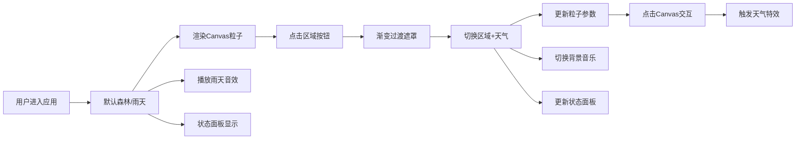

## 1. 产品概述

天气模拟与环境交互演示应用，展示开放世界探索游戏中的动态天气系统和环境互动机制。用户可在不同区域间切换，体验差异化的天气视觉效果、粒子动画和背景音乐，通过点击交互感受天气与环境的互动反馈。

- 主要用途：演示游戏级别的动态天气系统、粒子特效和环境交互技术
- 目标用户：游戏开发者、前端工程师、交互设计爱好者
- 产品价值：展示 Canvas 粒子系统、Web Audio API 合成音效、HSL 颜色过渡等前端高级技术的综合应用

## 2. 核心功能

### 2.1 用户角色

| 角色 | 注册方式 | 核心权限 |
|------|----------|----------|
| 访客用户 | 无需注册 | 浏览所有区域、切换天气、交互体验 |

### 2.2 功能模块

1. **区域选择模块**：四个预设区域（森林、沙漠、雪原、城镇），点击切换区域并自动匹配对应天气
2. **天气粒子系统**：基于 Canvas 的实时粒子动画，支持晴天、雨天、雪天、雷暴四种天气效果
3. **背景音乐系统**：使用 Web Audio API 实时合成各天气对应的环境音效
4. **环境交互系统**：点击 Canvas 触发与当前天气类型互动的视觉特效
5. **状态面板模块**：显示当前区域、体感温度、可见度等实时信息

### 2.3 页面详情

| 页面名称 | 模块名称 | 功能描述 |
|----------|----------|----------|
| 主页面 | 区域选择栏 | 顶部圆角胶囊按钮组，四个区域切换，选中态高亮蓝色发光 |
| 主页面 | 粒子画布 | 占主界面 80% 面积的 Canvas，渲染天气粒子动画和背景渐变 |
| 主页面 | 状态面板 | 底部固定半透明磨砂玻璃面板，显示区域图标、温度、可见度进度条 |
| 主页面 | 交互特效层 | 处理点击事件，生成涟漪、弹开、热气等交互反馈效果 |

## 3. 核心流程

用户进入应用 → 默认展示森林区域雨天效果 → 点击顶部区域按钮切换区域 → 背景渐变过渡 + 粒子淡出淡入 → 自动匹配区域对应天气 → 背景音乐平滑切换 → 点击画布触发交互特效 → 状态面板实时更新数据

## 4. 用户界面设计

### 4.1 设计风格

- **主色调**：深色哑光主题，深灰到深蓝渐变背景
- **强调色**：高亮蓝色 #4FC3F7（选中按钮、发光阴影）
- **进度条色**：高可见度绿色 → 低可见度红色渐变
- **按钮风格**：圆角胶囊按钮，选中态带发光阴影
- **字体**：Quicksand（Google Fonts）
- **视觉效果**：磨砂玻璃（backdrop-filter: blur(10px)）、HSL 颜色插值过渡
- **缓动函数**：cubic-bezier(0.4, 0, 0.2, 1)

### 4.2 页面设计概述

| 页面名称 | 模块名称 | UI 元素 |
|----------|----------|---------|
| 主页面 | 区域选择栏 | 4 个圆角胶囊按钮横向排列，选中态蓝色填充 + 发光阴影 |
| 主页面 | 粒子画布 | 80% 视口高度，背景渐变 + Canvas 粒子层叠 |
| 主页面 | 状态面板 | 底部固定，半透明深色，磨砂玻璃效果，左对齐布局 |
| 主页面 | 状态面板内容 | 区域 emoji 图标、温度文字、可见度进度条（圆角） |

### 4.3 响应式

- 桌面端优先设计
- 移动端自适应：按钮换行、画布高度调整
- 触摸设备优化：点击区域扩大

### 4.4 动画与过渡

- 区域切换：2 秒淡入淡出 + 渐变遮罩
- 背景色：HSL 插值平滑过渡，与粒子切换同步
- 粒子：帧率 60FPS，低于 40FPS 自动降质
- 交互特效：涟漪 1.5 秒、雪花弹开 0.8 秒、热气 1 秒
- 所有 CSS 过渡使用 cubic-bezier(0.4, 0, 0.2, 1)
