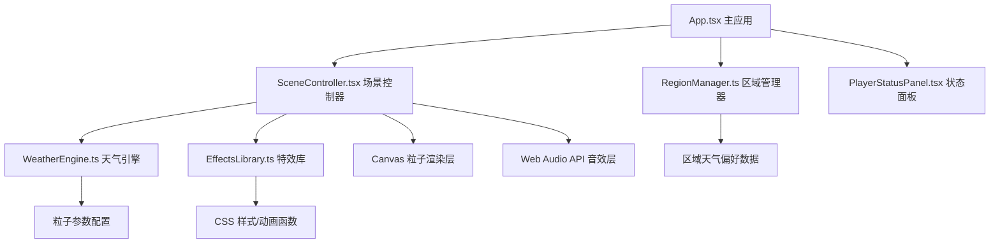

## 1. 架构设计



## 2. 技术描述

- **前端框架**：React 18 + TypeScript
- **构建工具**：Vite 5
- **状态管理**：React useState/useEffect（轻量场景，无需额外状态库）
- **渲染引擎**：Canvas 2D API（粒子系统）
- **音频引擎**：Web Audio API（OscillatorNode + GainNode 实时合成）
- **样式方案**：原生 CSS + CSS 变量（无需 Tailwind，保持轻量）
- **路径别名**：@ 指向 src 目录

## 3. 模块职责与数据流向

### 3.1 文件结构

```
src/
├── App.tsx                  # 主应用组件，全局状态管理
├── WeatherEngine.ts         # 天气引擎，粒子参数生成
├── SceneController.tsx      # 场景控制器，Canvas渲染+音效
├── RegionManager.ts         # 区域管理器，天气偏好规则
├── EffectsLibrary.ts        # 特效库，辅助视觉效果
├── PlayerStatusPanel.tsx    # 玩家状态面板组件
└── main.tsx                 # 入口文件
```

### 3.2 模块调用关系

| 模块 | 被谁调用 | 调用谁 | 数据流向 |
|------|----------|--------|----------|
| App.tsx | - | RegionManager, SceneController, PlayerStatusPanel | 用户操作 → 更新天气状态 → 传递子模块 |
| RegionManager.ts | App.tsx | - | 接收区域ID → 返回天气候选列表和过渡时长 |
| WeatherEngine.ts | SceneController.tsx | - | 接收天气类型 → 返回粒子密度/速度/颜色配置 |
| SceneController.tsx | App.tsx | WeatherEngine, EffectsLibrary | 获取配置 → 渲染粒子层和背景层 → 播放音效 |
| EffectsLibrary.ts | SceneController.tsx | - | 返回CSS样式对象或动画帧函数 |
| PlayerStatusPanel.tsx | App.tsx | - | 接收区域和天气状态 → 渲染UI |

## 4. 核心数据类型

```typescript
// 天气类型
type WeatherType = 'sunny' | 'rainy' | 'snowy' | 'stormy';

// 区域类型
type RegionType = 'forest' | 'desert' | 'snowfield' | 'town';

// 粒子参数
interface ParticleConfig {
  count: number;
  speedMin: number;
  speedMax: number;
  color: string;
  size: number;
  hasTrail: boolean;
  swayAmount: number;
}

// 区域配置
interface RegionConfig {
  name: string;
  icon: string;
  weatherWeights: Record<WeatherType, number>;
  transitionDuration: number;
  baseTemperature: number;
}

// 天气状态
interface WeatherState {
  type: WeatherType;
  temperature: number;
  visibility: number;
  particleOpacity: number;
}
```

## 5. 性能优化策略

1. **粒子降质**：帧率低于 40FPS 时自动降低粒子密度至 80%
2. **不可见剔除**：超出画布边界的粒子跳过渲染
3. **离屏渲染**：粒子数超阈值时使用离屏 Canvas 优化
4. **帧率监控**：requestAnimationFrame 循环中实时计算 FPS
5. **资源限制**：雨天最大 300 粒子，雪天最大 150 粒子
6. **首次加载**：控制在 200KB 资源内，3 秒内完成加载

## 6. 音效合成方案

| 天气 | 合成方式 | 描述 |
|------|----------|------|
| 晴天 | 白噪音 + 鸟鸣 Oscillator | 舒缓白噪音底噪，间隔性高频鸟鸣 |
| 雨天 | 滤波白噪音 + 低频 Oscillator | 持续沙沙声，偶尔低频雷声 |
| 雪天 | 正弦波 + 慢振幅调制 | 安静的笛声效果 |
| 雷暴 | 雨声 + 噪声爆冲 | 闪电时刻触发爆裂音效 |

所有音效通过 Web Audio API 实时生成，无需外部音频文件。
