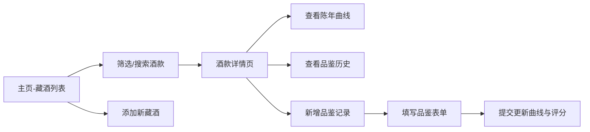

## 1. 产品概述

个人酒窖管理应用，专为红酒爱好者设计，用于系统化管理藏酒信息、记录品鉴笔记，并基于算法提供陈年建议与适饮期判断。

- 解决问题：藏酒信息散落、品鉴记忆模糊、难以判断最佳饮用时机
- 目标用户：葡萄酒收藏家、爱好者、品鉴师
- 产品价值：通过可视化陈年曲线与结构化数据，帮助用户科学管理私人酒窖

## 2. 核心功能

### 2.1 功能模块

1. **藏酒列表页（主页）**：统计看板、高级筛选、藏酒卡片网格、添加藏酒入口
2. **酒款详情页**：酒款完整信息、品鉴历史记录、陈年曲线图、新增品鉴入口
3. **品鉴记录表单（模态框）**：结构化品鉴数据录入、香气联想、口感滑块评分

### 2.2 页面详情

| 页面名称 | 模块名称 | 功能描述 |
|---------|---------|---------|
| 藏酒列表页 | 统计看板 | 总藏酒数、总花费、最高评分酒、平均评分（数字滚动动画） |
| 藏酒列表页 | 搜索筛选面板 | 名称模糊搜索、类型筛选、产区筛选、评分区间筛选（移动端可折叠抽屉） |
| 藏酒列表页 | 藏酒卡片网格 | 酒标色块、酒名、年份、评分，按评分降序，悬停动效，React.memo优化 |
| 藏酒列表页 | 添加藏酒表单 | 酒名、三级产区、多品种、年份、类型、数量、价格、评分 |
| 酒款详情页 | 酒款信息卡片 | 完整藏酒信息展示 |
| 酒款详情页 | 品鉴记录列表 | 按日期倒序展示所有品鉴笔记 |
| 酒款详情页 | 陈年曲线可视化 | 理论曲线+实际评分散点，判断适饮期 |
| 品鉴表单模态框 | 基础字段 | 日期、颜色下拉选择 |
| 品鉴表单模态框 | 香气输入 | 文本框+常见香气词联想 |
| 品鉴表单模态框 | 口感滑块 | 甜度/酸度/单宁/酒体 5档滑块 |
| 品鉴表单模态框 | 总体评分 | 1-100分滑块、一句话总结 |

## 3. 核心流程

用户打开应用 → 浏览统计看板与藏酒列表 → 通过筛选或搜索定位目标酒款 → 点击卡片进入详情 → 查看陈年曲线与品鉴历史 → 点击"新增品鉴"打开模态框 → 填写品鉴信息并提交 → 陈年曲线自动更新散点与评分历史

## 4. 用户界面设计

### 4.1 设计风格
- **主色调**：酒红色 #722F37（用于按钮、强调、主标题背景）
- **背景色**：浅米色 #F5F0E8（全局背景，营造温暖质感）
- **文字色**：深褐色 #4A2C2A（标题与重要文字，次级文字用 #6B4F4C）
- **卡片样式**：圆角 12px，阴影 box-shadow: 0 2px 8px rgba(0,0,0,0.08)，悬停阴影加深 + translateY(-4px)，过渡 0.3s
- **模态框**：深色背景（#2D1B1A），入场动画 scale(0.9)→scale(1) + fade-in
- **字体**：标题使用衬线字体（Playfair Display），正文使用优雅无衬线字体
- **图标**：使用 lucide-react 线性图标，尺寸统一 18px

### 4.2 页面设计概览

| 页面名称 | 模块名称 | UI 元素 |
|---------|---------|---------|
| 藏酒列表页 | 统计看板 | 4 个响应式卡片，每个带图标+标签+数字滚动值，桌面 2×2 布局，移动端单列 |
| 藏酒列表页 | 筛选面板 | 桌面横向排列，移动端折叠为顶部抽屉（下拉动画），按钮采用 pill 形状 |
| 藏酒列表页 | 卡片网格 | 桌面 3 列 / 平板 2 列 / 移动 1 列，酒标色块按类型生成不同渐变色 |
| 酒款详情页 | 陈年曲线 | Recharts 折线图，理论曲线平滑，实际散点为酒红色圆点，带 tooltip |
| 酒款详情页 | 品鉴列表 | 时间线样式，每条记录左侧有色条标识颜色分类 |
| 品鉴模态框 | 滑块组件 | 自定义滑块轨道为渐变色，thumb 为圆形酒红色按钮带阴影 |

### 4.3 响应式设计
- 桌面优先（Desktop-first），断点 768px
- <768px：卡片单列、筛选面板变可折叠抽屉、模态框占满 90% 宽高
- 触摸优化：按钮最小点击区 44×44px，滑块加大触摸范围

## 5. 陈年曲线算法说明

| 类型 | 曲线规则 |
|-----|---------|
| 红葡萄酒 | 装瓶后 0-10 年评分线性上升至峰值，之后平缓下降，20 年回落至初始值 |
| 白葡萄酒 | 装瓶后 0-5 年上升至峰值，之后较快下降，12 年回落至初始值以下 |
| 起泡酒 | 装瓶后 0-3 年保持稳定，之后持续下降，10 年明显衰减 |
