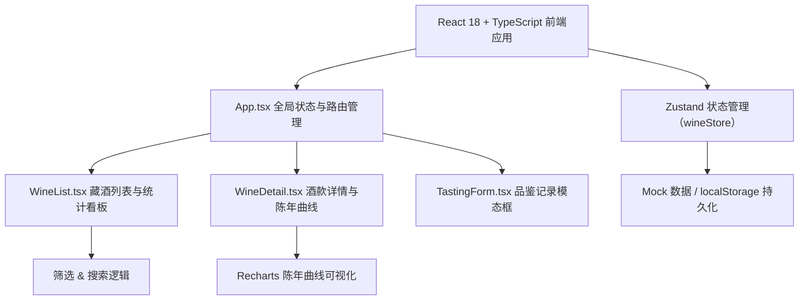
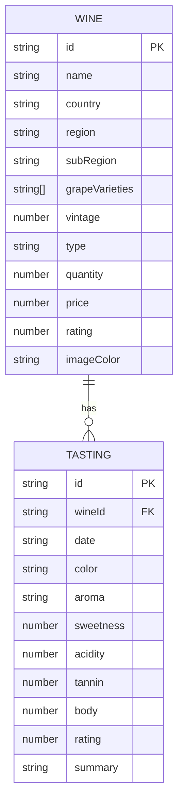

## 1. 架构设计



## 2. 技术说明

- **前端框架**：React 18 + TypeScript（严格模式）
- **构建工具**：Vite 5
- **状态管理**：Zustand（轻量全局 store，管理藏酒与品鉴数据）
- **可视化**：Recharts 2（折线图 + 散点图）
- **图标**：lucide-react
- **样式方案**：纯 CSS + CSS 变量（无需 Tailwind，按需求自定义设计令牌）
- **数据持久化**：localStorage + 预置丰富 Mock 数据
- **路由**：React Router DOM 6（hash 模式，无后端）

## 3. 路由定义

| 路由 | 用途 |
|-----|-----|
| / | 藏酒列表主页（含统计看板、筛选、卡片网格） |
| /wine/:id | 酒款详情页（含品鉴记录、陈年曲线） |

## 4. 数据模型

### 4.1 数据模型 ER 图



### 4.2 TypeScript 类型定义

```typescript
type WineType = 'red' | 'white' | 'sparkling' | 'sweet';

interface Wine {
  id: string;
  name: string;
  country: string;
  region: string;
  subRegion: string;
  grapeVarieties: string[];
  vintage: number;
  type: WineType;
  quantity: number;
  price: number;
  rating: number;
  imageColor: string;
}

interface Tasting {
  id: string;
  wineId: string;
  date: string;
  color: string;
  aroma: string;
  sweetness: number;
  acidity: number;
  tannin: number;
  body: number;
  rating: number;
  summary: string;
}
```

### 4.3 产区三级数据

```
国家 → 产区 → 子产区
法国 → 波尔多 → 梅多克 / 圣埃美隆 / 玛歌
法国 → 勃艮第 → 科多尔 / 博讷
法国 → 香槟 → 兰斯山 / 马恩河谷
意大利 → 托斯卡纳 → 基安帝 / 布鲁奈罗
意大利 → 皮埃蒙特 → 巴罗洛 / 巴巴莱斯科
西班牙 → 里奥哈 → 上里奥哈 / 下里奥哈
智利 → 迈坡谷 → 上迈坡 / 科尔查瓜
美国 → 纳帕谷 → 鹿跃区 / 奥克维尔
新西兰 → 马尔堡 → 威劳河 / 霍克斯湾
德国 → 摩泽尔 → 贝恩卡斯特 / 特拉本-特拉巴赫
```

### 4.4 常见香气联想词

黑醋栗、樱桃、覆盆子、蓝莓、黑莓、李子、烟草、皮革、雪松、香草、橡木、焦糖、巧克力、咖啡、烟熏、玫瑰、紫罗兰、薄荷、青椒、松露、蜂蜜、柑橘、苹果、梨、杏桃、矿物、燧石、面包、酵母、烤杏仁

### 4.5 颜色分类

淡宝石红、宝石红、石榴红、紫红、深红、墨红、浅金黄、金黄、琥珀色、柠檬黄、淡粉、三文鱼粉

## 5. 核心算法

### 5.1 陈年曲线生成函数

```typescript
function generateAgingCurve(type: WineType, vintage: number, baseRating: number): { year: number; rating: number }[] {
  const currentYear = new Date().getFullYear();
  const yearsSinceBottling = currentYear - vintage;
  const points = [];
  
  // 根据类型生成 0-20 年区间的理论评分
  for (let age = 0; age <= 20; age++) {
    let score = baseRating;
    if (type === 'red') {
      // 10年上升至峰值 +8，后平缓下降
      score = age <= 10 
        ? baseRating + (age / 10) * 8 
        : baseRating + 8 - ((age - 10) / 10) * 10;
    } else if (type === 'white') {
      // 5年上升至峰值 +5，后下降
      score = age <= 5
        ? baseRating + (age / 5) * 5
        : baseRating + 5 - ((age - 5) / 10) * 12;
    } else if (type === 'sparkling') {
      // 前3年稳定，后持续下降
      score = age <= 3
        ? baseRating + 2
        : baseRating + 2 - ((age - 3) / 10) * 15;
    } else {
      // 甜酒类似白葡萄酒，更耐陈年
      score = age <= 8
        ? baseRating + (age / 8) * 6
        : baseRating + 6 - ((age - 8) / 15) * 10;
    }
    points.push({ year: vintage + age, rating: Math.max(60, Math.min(100, Math.round(score))) });
  }
  return points;
}
```

## 6. 性能优化方案

1. **React.memo**：包裹 WineCard 组件，浅比较 props 避免不必要重渲染
2. **虚拟列表**：当藏酒 > 50 条时考虑，但默认直接渲染（<50 条无性能压力）
3. **useMemo/useCallback**：筛选逻辑、事件处理函数缓存
4. **CSS 过渡**：全部使用 transform/opacity，触发 GPU 合成
5. **初始渲染目标**：< 500ms（Vite HMR 加持，包体积小）

## 7. 文件结构（与需求完全一致）

```
/
├── package.json
├── index.html
├── vite.config.js
├── tsconfig.json
└── src/
    ├── App.tsx          (路由、全局状态、主题)
    ├── WineList.tsx     (列表、统计、筛选、搜索)
    ├── WineDetail.tsx   (详情、品鉴历史、陈年曲线)
    └── TastingForm.tsx  (品鉴模态框表单)
```
