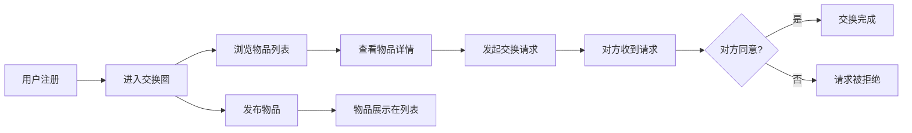

## 1. 产品概述
旧物漂流记是一个社区闲置物品交换平台，让居民在线上互相交换书籍、小家电、玩具等旧物品，无需花钱即可淘到需要的东西，同时减少浪费，促进邻里交流。

### 目标用户
- 社区居民，拥有闲置物品希望交换
- 希望减少消费、践行环保理念的用户
- 喜欢邻里社交、体验淘物乐趣的用户

### 产品价值
- 减少闲置物品浪费，促进资源循环利用
- 建立以小区为单位的交换社区，增强邻里连接
- 提供零成本的物品获取渠道

---

## 2. 核心功能

### 2.1 用户角色
| 角色 | 注册方式 | 核心权限 |
|------|----------|----------|
| 普通用户 | 填写昵称、小区、地址、头像、擅长标签注册 | 发布物品、浏览物品、发起交换、管理交换请求、发表评论 |

### 2.2 功能模块
1. **用户注册页**：昵称、小区名称、地址范围、头像上传、擅长类别标签选择
2. **交换圈首页**：小区信息展示、瀑布流物品列表、类别与新旧程度筛选、搜索
3. **物品详情页**：大图轮播、物品信息、交换请求、留言评论区
4. **我的交换中心**：我发起的/我收到的/历史记录 三个Tab管理
5. **物品发布页**：多图上传、拖拽排序、物品信息填写

### 2.3 页面详情
| 页面名称 | 模块名称 | 功能描述 |
|----------|----------|----------|
| 注册页 | 用户信息表单 | 昵称输入、小区选择、地址范围、头像上传、类别标签多选 |
| 交换圈首页 | 顶部区域 | 显示小区名称和成员数，暖橙到淡黄渐变背景 |
| 交换圈首页 | 筛选栏 | 按类别（书籍/家居/电子/玩具/运动/其他）和新旧程度区间筛选 |
| 交换圈首页 | 瀑布流列表 | 物品卡片瀑布流展示，含发布倒计时（30天自动下架） |
| 物品详情页 | 图片轮播 | 1-6张实物图轮播展示 |
| 物品详情页 | 交换功能 | "我想要"按钮，点击弹确认框并发送交换请求 |
| 物品详情页 | 留言区 | 评论发表、时间倒序展示、新评论滑入高亮动画 |
| 我的交换中心 | Tab切换 | 我发起的/我收到的/历史记录 三个Tab |
| 我的交换中心 | 请求卡片 | 对方头像昵称、物品缩略图、待确认橙黄色边框呼吸灯动画 |

---

## 3. 核心流程
用户注册后进入以小区为单位的交换圈，可以浏览、筛选其他居民发布的闲置物品，点击查看详情并发起交换请求，在"我的交换"中心管理所有交换状态。

---

## 4. 用户界面设计

### 4.1 设计风格
- **主色调**：暖橙色 (#FF9A3C) 到淡黄色 (#FFE8A3) 的渐变
- **辅助色**：柔和米白 (#FFF8ED)、温暖橙黄 (#FFB86C)
- **按钮风格**：圆润圆角 (16px)，悬停微弹跳动画 (transform: translateY(-2px) scale(1.02))
- **字体**：Google Fonts Nunito，圆润可爱风格
- **布局风格**：卡片式布局，圆角20px，柔和阴影
- **图标风格**：圆润可爱的线条图标，配合emoji增强亲切感

### 4.2 页面设计概览
| 页面名称 | 模块名称 | UI元素 |
|----------|----------|--------|
| 交换圈首页 | 顶部渐变区 | 暖橙-淡黄渐变背景，小区名称+成员数 |
| 交换圈首页 | 筛选栏 | 分类标签横向滚动，新旧程度滑块 |
| 交换圈首页 | 瀑布流卡片 | 2列瀑布流，圆角20px，图片+标题+新旧程度+倒计时 |
| 物品详情页 | 图片轮播 | 全屏宽度轮播，指示器，切换动画 |
| 物品详情页 | 底部操作 | "我想要"大按钮，橙黄色渐变背景 |
| 物品详情页 | 留言区 | 头像+昵称+评论内容，时间倒序 |
| 我的交换中心 | Tab栏 | 三个Tab切换，下划线动画 |
| 我的交换中心 | 请求卡片 | 待确认橙色边框，呼吸灯动画 |

### 4.3 响应式设计
- Desktop-first 设计，移动端自适应
- 卡片布局在移动端改为单列
- 触摸优化：增大点击区域，支持触摸滑动

---

## 5. 性能要求
- 页面切换流畅，使用CSS transform动画避免重排
- 列表滚动帧率不低于50fps
- 筛选切换时列表淡入淡出过渡
- 所有动画使用GPU加速属性（transform, opacity）
