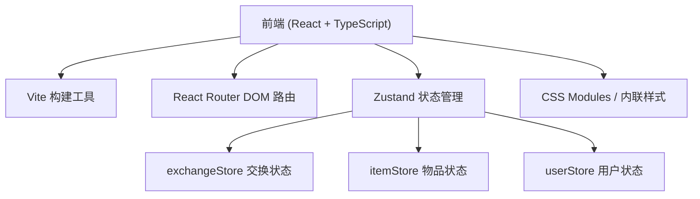
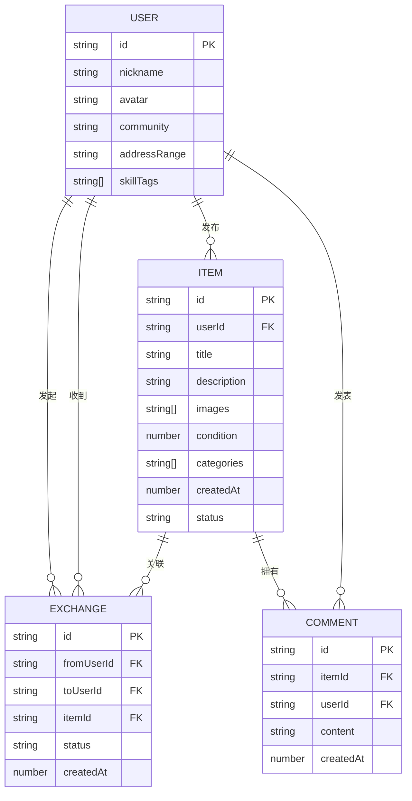

## 1. 架构设计



## 2. 技术选型说明
- **前端框架**：React 18 + TypeScript
- **构建工具**：Vite（路径别名 @ 指向 src）
- **路由**：react-router-dom
- **状态管理**：Zustand（轻量级，适用于小型应用）
- **样式方案**：CSS 变量 + 内联样式（避免引入额外依赖，用户未指定 Tailwind）
- **字体**：Google Fonts - Nunito

## 3. 路由定义
| 路由 | 页面 | 说明 |
|------|------|------|
| /register | 注册页 | 用户首次注册 |
| / | 交换圈首页 | 物品列表+筛选 |
| /item/:id | 物品详情页 | 大图轮播+交换+评论 |
| /publish | 物品发布页 | 发布新物品 |
| /my-exchanges | 我的交换中心 | 三个Tab管理交换请求 |

## 4. 数据模型

### 4.1 数据模型定义



### 4.2 类型定义
```typescript
interface User {
  id: string;
  nickname: string;
  avatar: string;
  community: string;
  addressRange: string;
  skillTags: string[];
}

interface Item {
  id: string;
  userId: string;
  title: string;
  description: string;
  images: string[];
  condition: number; // 1-10
  categories: string[];
  createdAt: number;
  status: 'active' | 'exchanged' | 'expired';
}

interface ExchangeRequest {
  id: string;
  fromUserId: string;
  toUserId: string;
  itemId: string;
  status: 'pending' | 'confirmed' | 'completed' | 'rejected';
  createdAt: number;
}

interface Comment {
  id: string;
  itemId: string;
  userId: string;
  content: string;
  createdAt: number;
}
```

## 5. 文件结构
```
d:\P\tasks\auto36/
├── package.json
├── index.html
├── vite.config.js
├── tsconfig.json
└── src/
    ├── App.tsx
    ├── HomePage.tsx
    ├── ItemDetail.tsx
    ├── MyExchanges.tsx
    ├── PublishPage.tsx
    ├── RegisterPage.tsx
    ├── exchangeStore.ts
    ├── itemStore.ts
    ├── userStore.ts
    └── components/
        ├── FilterBar.tsx
        ├── ItemCard.tsx
        ├── ImageCarousel.tsx
        └── ExchangeCard.tsx
```
