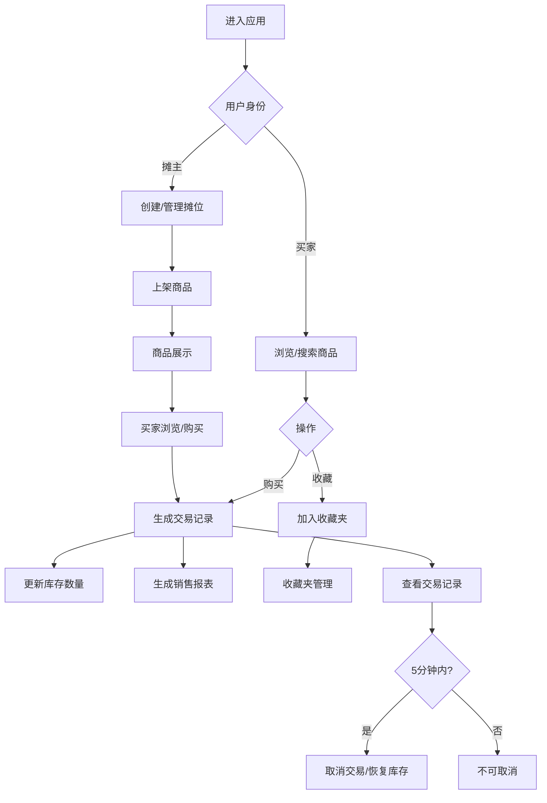

## 1. 产品概述

社区跳蚤市场摊位管理应用，为社区集市或跳蚤市场活动中的摊主和买家提供轻量级的摊位管理、商品展示和交易记录工具。解决摊主和买家在交易记录和商品展示方面的烦恼，提升集市活动的交易效率和体验。

- 核心目标：摊主可便捷管理摊位和商品、记录交易；买家可浏览、收藏和购买商品
- 目标用户：跳蚤市场摊主、集市买家
- 市场价值：提升社区集市活动的数字化管理水平，降低交易沟通成本

## 2. 核心功能

### 2.1 用户角色

| 角色 | 注册方式 | 核心权限 |
|------|----------|----------|
| 摊主 | 无需注册，本地创建 | 创建/管理摊位、上架商品、查看销售报表、管理交易记录 |
| 买家 | 无需注册，本地使用 | 浏览商品、搜索筛选、收藏商品、购买商品、取消交易（5分钟内） |

### 2.2 功能模块

1. **首页/商品浏览页**：商品卡片网格展示、搜索框、多维度筛选、类别筛选
2. **摊位与商品管理页**：创建摊位、编辑摊位信息、上架/编辑商品、商品列表管理
3. **交易记录页**：交易历史列表、取消交易、淡入动画展示
4. **收藏夹页**：瀑布流收藏商品展示、摊位/类别筛选、取消收藏动画
5. **销售报表页**：总交易额仪表盘、热销商品Top5柱状图、销售趋势折线图、交易统计

### 2.3 页面详情

| 页面名称 | 模块名称 | 功能描述 |
|----------|----------|----------|
| 首页 | 顶部导航栏 | 固定导航，深琥珀色背景，白色文字，包含页面切换入口 |
| 首页 | 搜索与筛选区 | 模糊搜索（商品名/摊位名）、价格范围、类别、摊位区域筛选，搜索结果高亮 |
| 首页 | 商品卡片网格 | 卡片悬停上浮、磨砂玻璃效果、金色描边、购买按钮、收藏心形图标、左侧滑入动画 |
| 摊位管理页 | 摊位信息表单 | 摊位名称、简介、背景颜色配置 |
| 摊位管理页 | 商品管理区 | 商品增删改、类别（服饰/手工/书籍/电器/其他）、商品卡片网格展示 |
| 交易记录页 | 交易列表 | 时间倒序展示、逐条淡入效果、悬停淡橙色背景、5分钟内可取消、取消标记为红色 |
| 收藏夹页 | 瀑布流展示 | 收藏商品瀑布流布局、摊位和类别筛选、取消收藏缩小移出动效 |
| 销售报表页 | 数据仪表盘 | 圆形进度仪表盘展示总销售额 |
| 销售报表页 | 图表区域 | 热销商品Top5柱状图、按日销售趋势折线图、总交易笔数统计 |

## 3. 核心流程

### 3.1 摊主流程
摊主创建摊位 → 填写摊位信息 → 上架商品（填写名称/价格/数量/图片/描述/类别）→ 商品展示在首页 → 买家购买后生成交易记录 → 查看销售报表

### 3.2 买家流程
浏览商品 → 搜索/筛选 → 点击收藏（心形图标）→ 点击购买（自动生成交易记录）→ 查看交易记录 → 5分钟内可取消交易 → 浏览收藏夹

### 3.3 Mermaid流程图

## 4. 用户界面设计

### 4.1 设计风格

- **主色调**：琥珀橙 (#D97706)、米白色 (#FFFBEB)
- **辅助色**：深琥珀色 (#92400E)、金色描边 (#F59E0B)、淡橙色 (#FED7AA)、红色取消标记 (#DC2626)
- **按钮样式**：圆角8px，琥珀橙填充，悬停时轻微缩放（scale(1.02)）和颜色加深，过渡动画 0.2s cubic-bezier
- **卡片样式**：半透明磨砂玻璃效果 (backdrop-filter: blur(10px))，细金色描边 (1px solid rgba(245,158,11,0.3))，悬停上浮 translateY(-4px) 加深阴影
- **字体**：标题使用 Playfair Display，正文使用 Poppins
- **布局风格**：顶部固定导航栏，卡片式网格布局，响应式适配
- **图标风格**：使用 Lucide React 线性图标，心形图标空白/填色切换

### 4.2 页面设计概览

| 页面名称 | 模块名称 | UI元素 |
|----------|----------|--------|
| 首页 | 导航栏 | 深琥珀色背景、白色文字、固定定位、阴影 |
| 首页 | 搜索区 | 圆角输入框、搜索图标、移动端折叠为图标按钮 |
| 首页 | 商品卡片 | 磨砂玻璃背景、金色描边、商品图、名称、价格、数量、购买按钮、心形收藏图标 |
| 首页 | 筛选标签 | 类别胶囊按钮、价格滑块、区域下拉选择 |
| 摊位管理页 | 摊位表单 | 输入框、颜色选择器、保存按钮 |
| 摊位管理页 | 商品表单 | 模态框/侧滑面板、表单字段、提交按钮 |
| 交易记录页 | 交易行 | 时间倒序、淡入动画、悬停淡橙色、取消按钮、红色取消状态 |
| 收藏夹页 | 瀑布流 | 多列瀑布流、筛选器、取消收藏动画 |
| 销售报表页 | 仪表盘 | 圆形进度环、总金额数字动画 |
| 销售报表页 | 图表区 | Recharts柱状图和折线图、数据标签 |

### 4.3 响应式

- **设计优先**：桌面端优先设计
- **移动端适配**（<768px）：
  - 商品卡片网格变为单列布局
  - 搜索框折叠为图标按钮，点击展开输入框
  - 导航栏简化，减少文字展示
  - 筛选区折叠为下拉面板
  - 瀑布流变为单列
- **触摸优化**：按钮最小触控尺寸 44x44px，合理间距

### 4.4 动效设计

- 新商品卡片：从左侧滑入 (translateX(-100%) → 0) + 淡入，带 stagger 延迟
- 交易记录：逐条淡入 (opacity 0→1) + 轻微上移
- 取消收藏：卡片先缩小 (scale 1→0.8) 再移出 (translateX 100%)
- 按钮交互：0.2s cubic-bezier 缩放和颜色过渡
- 搜索结果：高亮匹配文字，背景淡橙色闪烁
- 页面切换：淡入淡出过渡
