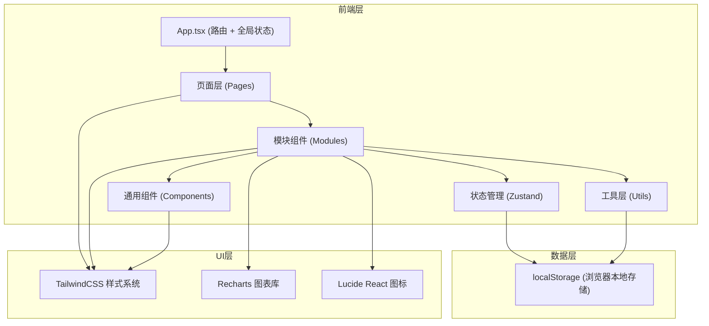
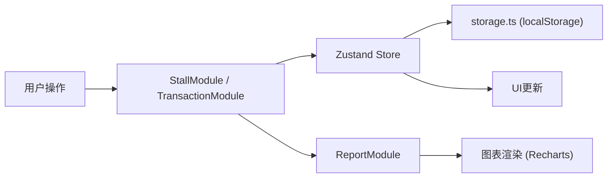

## 1. 架构设计



## 2. 技术说明

- **前端框架**：React 18 + TypeScript
- **构建工具**：Vite 5（含路径别名 @ 指向 src）
- **样式方案**：TailwindCSS 3（自定义主题配置）
- **状态管理**：Zustand（轻量级状态管理）
- **路由方案**：React Router DOM 6
- **图表库**：Recharts（销售报表可视化）
- **图标库**：Lucide React
- **数据存储**：浏览器 localStorage（无需后端）
- **字体**：Google Fonts - Poppins + Playfair Display

## 3. 路由定义

| 路由路径 | 页面组件 | 用途 |
|----------|----------|------|
| `/` | HomePage | 首页 - 商品浏览、搜索、筛选 |
| `/stall` | StallPage | 摊位与商品管理页 |
| `/transactions` | TransactionsPage | 交易记录页 |
| `/favorites` | FavoritesPage | 收藏夹页 |
| `/reports` | ReportsPage | 销售报表页 |

## 4. 数据模型

### 4.1 类型定义

```typescript
// 摊位
interface Stall {
  id: string;
  name: string;
  description: string;
  backgroundColor: string;
  area: string; // 摊位所在区域
  createdAt: number;
}

// 商品类别
type ProductCategory = 'clothing' | 'handmade' | 'books' | 'electronics' | 'other';

// 商品
interface Product {
  id: string;
  stallId: string;
  name: string;
  price: number;
  quantity: number;
  imageUrl: string;
  description: string;
  category: ProductCategory;
  createdAt: number;
}

// 交易状态
type TransactionStatus = 'completed' | 'cancelled';

// 交易记录
interface Transaction {
  id: string;
  productId: string;
  productName: string;
  stallId: string;
  stallName: string;
  buyerNickname: string;
  quantity: number;
  unitPrice: number;
  totalPrice: number;
  status: TransactionStatus;
  createdAt: number;
  cancelledAt?: number;
}

// 收藏项
interface Favorite {
  id: string;
  productId: string;
  createdAt: number;
}
```

### 4.2 数据流向



## 5. 文件结构与模块调用关系

```
src/
├── App.tsx                      # 主应用：路由 + 全局状态注入
├── main.tsx                     # 入口文件
├── index.css                    # 全局样式 + TailwindCSS
├── types/
│   └── index.ts                 # 全局类型定义
├── store/
│   └── useMarketStore.ts        # Zustand 全局状态管理
├── components/
│   ├── StallModule.tsx          # 摊位与商品管理模块
│   ├── TransactionModule.tsx    # 交易记录模块
│   ├── ReportModule.tsx         # 报表与统计模块
│   ├── ProductCard.tsx          # 商品卡片组件
│   ├── Navbar.tsx               # 顶部导航栏
│   ├── SearchBar.tsx            # 搜索框组件
│   ├── FilterPanel.tsx          # 筛选面板
│   ├── Modal.tsx                # 通用模态框
│   └── GaugeChart.tsx           # 圆形仪表盘组件
├── pages/
│   ├── HomePage.tsx             # 首页
│   ├── StallPage.tsx            # 摊位管理页
│   ├── TransactionsPage.tsx     # 交易记录页
│   ├── FavoritesPage.tsx        # 收藏夹页
│   └── ReportsPage.tsx          # 销售报表页
├── hooks/
│   ├── useDebounce.ts           # 防抖 Hook
│   └── useLocalStorage.ts       # localStorage Hook
└── utils/
    └── storage.ts               # 本地存储 CRUD API
```

### 模块调用关系：

1. **App.tsx** → 引入所有页面组件和路由，注入 Zustand store
2. **pages/*.tsx** → 组合使用 `components/` 下的模块组件
3. **StallModule.tsx** → 调用 `utils/storage.ts` 进行摊位/商品持久化，输出数据到全局 store
4. **TransactionModule.tsx** → 监听 store 中的商品数据，调用 `storage.ts` 持久化交易记录
5. **ReportModule.tsx** → 从 store 读取交易数据，使用 Recharts 渲染图表
6. **ProductCard.tsx** → 被 StallModule 和 HomePage 复用，处理购买/收藏交互
7. **utils/storage.ts** → 提供给 StallModule 和 TransactionModule 调用的底层 API

## 6. 性能优化策略

| 优化点 | 方案 |
|--------|------|
| 搜索防抖 | `useDebounce` Hook，延迟 100ms |
| 列表滚动 60FPS | CSS `transform` 动画、`will-change` 提示、避免 layout thrashing |
| 初次加载 <1.5s | 代码分割按需加载、首屏骨架屏、localStorage 数据预读取 |
| 渲染性能 | React `memo` 包裹列表项、`useCallback` 缓存事件处理器 |
| 动画性能 | 优先使用 CSS transform/opacity，避免触发重排 |
| 搜索高亮 | 虚拟 DOM diff 最小化，仅更新匹配文字的 span |
