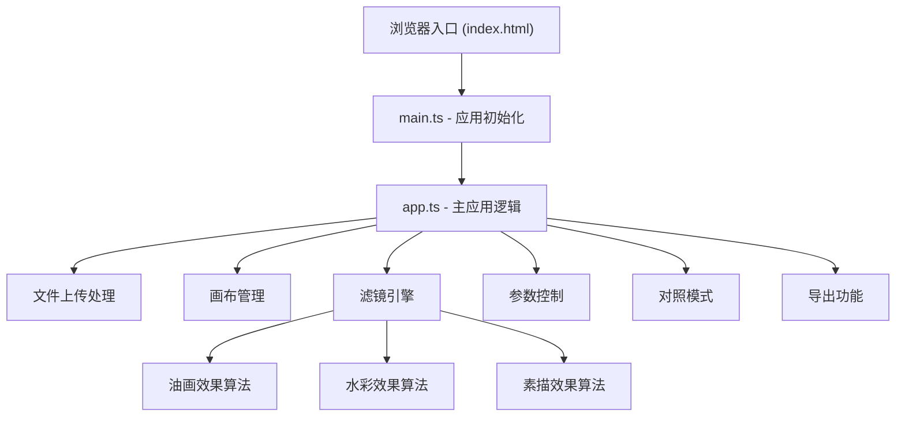

## 1. 架构设计



## 2. 技术描述
- 前端：TypeScript + Vite（纯Canvas 2D API实现，无需前端框架）
- 初始化工具：Vite官方模板
- 后端：无（纯浏览器端应用，所有计算在前端完成）
- 数据库：无
- 字体：Google Fonts Inter

## 3. 文件结构

```
auto39/
├── package.json
├── index.html
├── vite.config.js
├── tsconfig.json
└── src/
    ├── main.ts       # 应用入口，初始化并挂载
    └── app.ts        # 主应用逻辑，上传/画布/滤镜/导出协调
```

## 4. 核心模块说明

### 4.1 文件上传处理
- 支持拖拽和点击上传
- 校验格式：image/jpeg, image/png, image/webp
- 校验大小：≤ 10MB
- 使用 FileReader 读取为 Image 对象

### 4.2 画布管理
- 两个Canvas元素（原图+效果图）
- 统一尺寸：按3:4比例自适应容器宽度
- 离屏Canvas用于滤镜计算
- requestAnimationFrame 节流确保性能

### 4.3 滤镜引擎
**油画效果**：
- 随机色块堆叠模拟笔触
- 参数：笔触大小(2-20px)、颜色数量(4-32)
- 算法：颜色量化 + 随机斑块采样

**水彩效果**：
- 模糊+颜色扩散模拟晕染
- 参数：湿润度(1-10)、扩散半径(1-15px)
- 算法：高斯模糊 + 颜色空间扩散

**素描效果**：
- 边缘检测+纹理叠加
- 参数：线条密度(0.1-1.0)、背景亮度(0-255)
- 算法：Sobel边缘检测 + 反色 + 纸张纹理

### 4.4 参数控制
- 自定义渐变滑条组件
- 实时值显示在滑块上方
- 节流更新，确保30FPS+

### 4.5 对照模式
- 可拖拽垂直分割条
- 鼠标事件监听（mousedown/mousemove/mouseup）
- 圆形手柄悬停/拖拽状态样式

### 4.6 导出功能
- **保存PNG**：canvas.toDataURL + 动态创建a标签下载，文件名带时间戳（artwork_YYYYMMDD_HHmmss.png），绘制5px阴影边框
- **复制到剪贴板**：canvas.toBlob → Blob → navigator.clipboard.write()，成功/失败提示

## 5. 状态管理
纯TS单文件模块内状态，使用类/闭包维护：
- 当前上传的图片对象
- 当前选中的风格类型
- 各风格参数值
- 对照模式开关状态
- 分割条位置百分比
