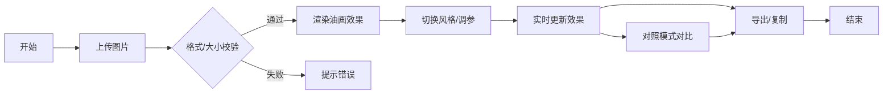

## 1. 产品概述

艺术风格转换Web应用，帮助普通用户在浏览器中快速将普通照片转换为油画、水彩画或素描等艺术风格效果，无需专业软件即可为照片添加艺术滤镜。

- 目标用户：摄影爱好者、社交媒体用户、设计师等需要快速为照片添加艺术效果的普通用户
- 核心价值：零门槛、实时预览、参数可调、一键导出

## 2. 核心功能

### 2.1 用户角色
无需注册，所有用户直接使用全部功能。

### 2.2 功能模块
1. **图像上传模块**：本地文件上传、拖拽上传、格式与大小校验
2. **滤镜引擎模块**：油画效果、水彩效果、素描效果三种风格转换算法
3. **参数调节模块**：每种风格2-3个可调参数滑条，实时更新效果
4. **画布对比模块**：对照模式下可拖拽分割条对比原图与效果图
5. **导出分享模块**：保存为PNG、复制到剪贴板

### 2.3 页面详情

| 页面名称 | 模块名称 | 功能描述 |
|-----------|-------------|---------------------|
| 主页 | 上传区域 | 拖拽/点击上传图片，支持jpg/png/webp格式，10MB大小限制 |
| 主页 | 画布区域 | 左侧原图、右侧效果图，3:4比例显示，对照模式拖拽分割条对比 |
| 主页 | 风格切换 | 胶囊按钮切换油画/水彩/素描，2秒渐变过渡动画 |
| 主页 | 参数调节 | 渐变滑条调节各风格参数，实时更新（30FPS+），延迟<100ms |
| 主页 | 导出区域 | 保存PNG（带时间戳文件名+5px阴影边框）、复制到剪贴板 |

## 3. 核心流程

用户上传图片 → 自动渲染默认油画效果 → 用户切换风格/调节参数 → 实时预览效果 → 开启对照模式对比 → 导出保存或复制

## 4. 用户界面设计

### 4.1 设计风格
- 主色调：深灰(#2d2d2d)到炭黑(#1a1a1a)垂直渐变背景
- 强调色：蓝色(#4a90d9)用于选中状态和交互元素
- 辅助色：橙色用于拖拽手柄激活态，绿色成功提示，红色错误提示
- 卡片效果：磨砂玻璃(backdrop-filter: blur(12px))+16px圆角
- 字体：Inter系统无衬线字体
- 按钮风格：胶囊形状，悬停上移+阴影加深，点击缩放反馈

### 4.2 页面设计概述

| 页面名称 | 模块名称 | UI元素 |
|-----------|-------------|-------------|
| 主页 | 上传区域 | 虚线边框+云朵SVG图标+浅灰文字，拖拽时蓝色脉冲动画 |
| 主页 | 画布区域 | 左右双画布3:4比例，悬停显示浮动提示，对照模式可拖拽分割条（圆形手柄，悬停放大，拖拽橙色带阴影） |
| 主页 | 风格切换 | 胶囊按钮组，选中蓝色填充，0.3s过渡 |
| 主页 | 参数滑条 | 渐变轨+圆形滑块，灰到蓝填充，数值显示在滑块上方 |
| 主页 | 操作按钮 | 悬停translateY(-2px)+阴影加深，点击scale(0.96) |

### 4.3 响应式
- 桌面端：左右双画布并排布局，参数滑条横向排列
- 移动端(≤480px)：上下布局，上传区在上，画布在下，滑条和按钮紧凑排列

## 5. 性能要求
- 首次滤镜渲染：< 1秒
- 滑条拖动渲染延迟：< 100ms
- 实时帧率：≥ 30FPS
