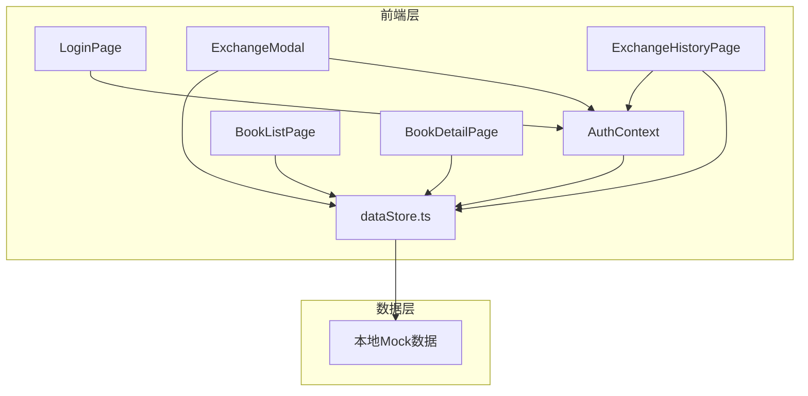
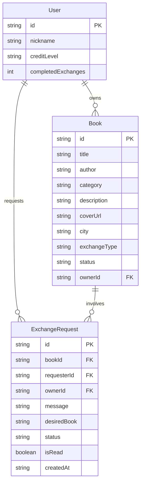

## 1. 架构设计



## 2. 技术说明

- 前端：React 18 + TypeScript + Vite
- 初始化工具：Vite
- 后端：无（纯前端）
- 数据库：无（本地Mock数据，通过dataStore.ts模拟后端接口）
- 路由：react-router-dom v6
- 状态管理：React Context（AuthContext）+ 本地dataStore共享

## 3. 路由定义

| 路由 | 用途 |
|------|------|
| /login | 登录页面 |
| / | 书籍列表页（需登录） |
| /books/:id | 书籍详情页（需登录） |
| /exchange-history | 交换记录页（需登录） |

## 4. 数据模型

### 4.1 数据模型定义



### 4.2 数据定义

- User：{ id, nickname, creditLevel, completedExchanges }
- Book：{ id, title, author, category, description, coverUrl, city, exchangeType, status, ownerId }
- ExchangeRequest：{ id, bookId, requesterId, ownerId, message, desiredBook, status, isRead, createdAt }
- exchangeType枚举："低价转让" | "等价交换" | "免费赠予"
- status枚举（Book）："可交换" | "交换中"
- status枚举（ExchangeRequest）："待确认" | "已接受" | "已拒绝" | "已完成"

## 5. 文件结构

```
├── package.json
├── index.html
├── vite.config.js
├── tsconfig.json
└── src/
    ├── main.tsx
    ├── App.tsx
    ├── modules/
    │   ├── auth/
    │   │   ├── AuthContext.tsx
    │   │   └── LoginPage.tsx
    │   ├── books/
    │   │   ├── BookListPage.tsx
    │   │   └── BookDetailPage.tsx
    │   └── exchange/
    │       ├── ExchangeModal.tsx
    │       └── ExchangeHistoryPage.tsx
    └── shared/
        ├── dataStore.ts
        └── styles.css
```

## 6. 关键技术决策

1. **AuthContext**：使用React Context管理用户登录状态，提供login/logout方法，跨模块共享
2. **dataStore.ts**：集中管理所有数据，模拟后端CRUD接口，确保各模块数据一致性
3. **防抖搜索**：使用300ms debounce避免高频重渲染
4. **状态即时更新**：交换操作后通过dataStore直接更新数据，组件重新读取即刷新
5. **路由守卫**：未登录用户重定向到登录页
