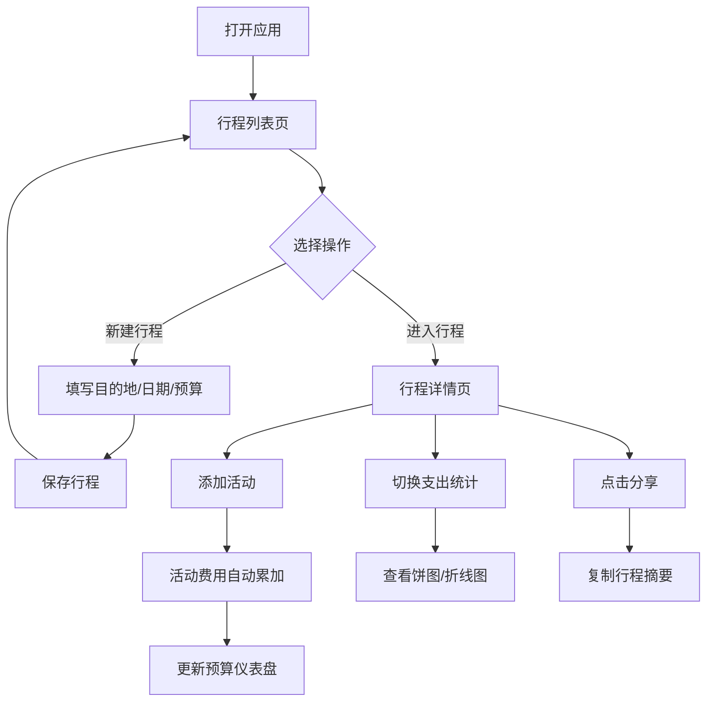

## 1. 产品概述

个人旅行行程规划与预算管理应用，帮助用户创建多日旅行行程、规划每日活动、记录消费并进行预算分析。目标用户为自助旅行爱好者，解决旅行中行程混乱和预算超支的痛点。

## 2. 核心功能

### 2.1 功能模块

1. **行程管理页面**：行程列表展示、新建行程、行程卡片网格
2. **行程详情页面**：活动时间线、添加活动、活动状态管理、预算仪表盘
3. **支出统计模块**：类别饼图、每日花费折线图、标签切换
4. **行程分享功能**：生成摘要文本、一键复制、Toast提示

### 2.2 页面详情

| 页面名称 | 模块名称 | 功能描述 |
|----------|----------|----------|
| 行程列表页 | 行程卡片网格 | 展示所有行程，含目的地图片占位、日期、预算进度条 |
| 行程列表页 | 新建行程表单 | 填写目的地、日期范围、总预算 |
| 行程详情页 | 预算仪表盘 | 圆形进度环显示预算使用率、每日平均花费 |
| 行程详情页 | 活动时间线 | 按天展示活动，时间圆点标记、完成状态切换 |
| 行程详情页 | 添加活动表单 | 填写时间、地点、描述、预计费用、类别 |
| 行程详情页 | 支出统计标签 | 饼图展示消费类别占比、折线图展示每日趋势 |
| 行程详情页 | 分享按钮 | 生成行程摘要、复制到剪贴板 |

## 3. 核心流程

用户打开应用 → 查看行程列表 → 创建新行程或进入已有行程 → 按天添加活动（活动费用自动计入消费）→ 查看预算仪表盘和支出图表 → 分享行程摘要

## 4. 用户界面设计

### 4.1 设计风格

- **主色调**：深海蓝（#1a365d）
- **强调色**：珊瑚橙（#ff6b6b）
- **背景色**：浅灰蓝（#f0f4f8）
- **卡片风格**：4px圆角、浅阴影、悬停上浮
- **字体**：Nunito（Google Fonts）
- **布局**：卡片式设计、固定导航栏

### 4.2 页面设计概述

| 页面名称 | 模块名称 | UI元素 |
|----------|----------|--------|
| 行程列表页 | 行程卡片 | 网格布局、图片色块、日期、预算进度条、悬停上浮阴影 |
| 行程详情页 | 顶部导航 | 固定定位、滚动时0→0.95透明度渐变、毛玻璃效果 |
| 行程详情页 | 仪表盘 | 圆形进度环（绿→红渐变）、超支时数字抖动变红 |
| 行程详情页 | 活动时间线 | 纵向排列、左侧时间圆点、完成活动灰色背景+对勾、从左滑入动画（50ms间隔） |
| 行程详情页 | 支出统计 | 标签切换、内容水平滑动、饼图+折线图入场动画 |

### 4.3 响应式

- Desktop-first设计，移动端（<768px）自适应
- 手机端：网格变单列、时间线充满宽度、圆环图直径200px

### 4.4 动效要求

- 页面切换淡入动画
- 活动卡片从左到右滑入（间隔50ms）
- 图表数据更新平滑过渡
- 导航栏滚动透明度变化（毛玻璃效果）
- 预算超支时数字抖动动画
- Toast提示弹出动画
