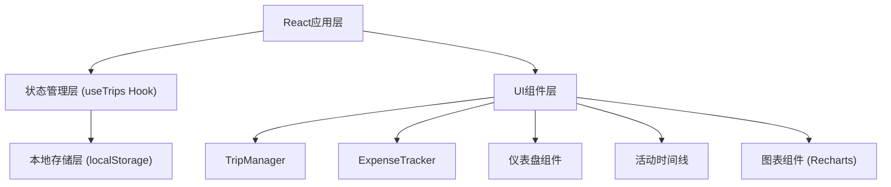
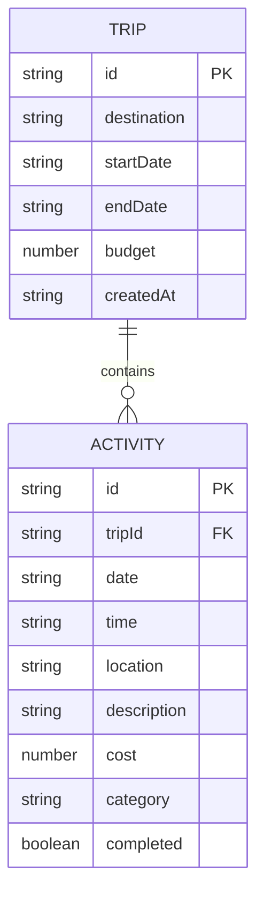

## 1. 架构设计

纯前端单页应用，使用localStorage进行数据持久化，无需后端服务。



## 2. 技术描述

- **前端框架**：React 18 + TypeScript
- **构建工具**：Vite
- **图表库**：Recharts
- **状态管理**：自定义Hook（useTrips）
- **数据持久化**：localStorage
- **唯一ID生成**：uuid
- **样式方案**：原生CSS（global.css + CSS变量）

## 3. 路由定义

由于应用规模较小，使用条件渲染代替路由库：
- 默认视图：行程列表（TripManager列表模式）
- 详情视图：特定行程详情（TripManager详情模式 + ExpenseTracker）

## 4. 数据模型

### 4.1 数据模型定义



### 4.2 TypeScript类型定义

```typescript
type ExpenseCategory = 'transport' | 'accommodation' | 'food' | 'ticket' | 'other';

interface Activity {
  id: string;
  tripId: string;
  date: string;
  time: string;
  location: string;
  description: string;
  cost: number;
  category: ExpenseCategory;
  completed: boolean;
}

interface Trip {
  id: string;
  destination: string;
  startDate: string;
  endDate: string;
  budget: number;
  createdAt: string;
}
```

## 5. 文件结构

```
src/
├── App.tsx                 # 主应用组件，视图切换
├── components/
│   ├── TripManager.tsx     # 行程核心管理模块
│   └── ExpenseTracker.tsx  # 支出记录与图表分析
├── hooks/
│   └── useTrips.ts         # 行程与预算数据CRUD逻辑
├── utils/
│   └── storage.ts          # localStorage工具函数
└── styles/
    └── global.css          # 全局样式与主题变量
```

## 6. 性能优化策略

- **动画性能**：使用CSS transform和opacity属性实现硬件加速动画
- **列表渲染**：活动卡片保持轻量级，避免不必要的重渲染
- **图表优化**：Recharts默认已做动画优化，数据<50条时控制在200ms内渲染
- **防抖节流**：高频操作（如滚动监听）使用节流优化
- **CSS变量**：主题颜色统一使用CSS变量，减少重绘开销
