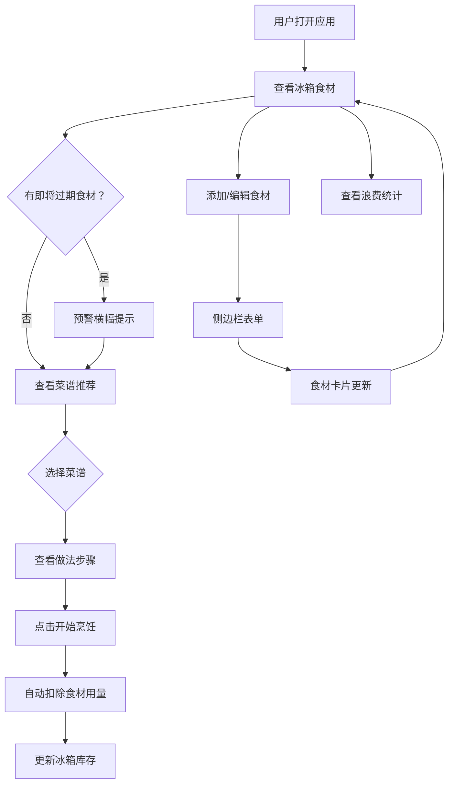

## 1. 产品概述
冰箱食材管理与智能菜谱推荐应用，帮助家庭用户高效管理冰箱存货、追踪保质期、减少食材浪费，并基于现有食材智能推荐可做菜谱。
- 解决家庭做饭前翻冰箱、忘买调料、重复购买、食材过期浪费等日常痛点
- 目标用户为注重生活效率与减少浪费的家庭用户

## 2. 核心功能

### 2.1 用户角色
| 角色 | 注册方式 | 核心权限 |
|------|----------|----------|
| 普通用户 | 无需注册（本地存储） | 食材增删改查、菜谱推荐、浪费统计 |

### 2.2 功能模块
1. **主页面**：双开门冰箱布局、食材管理面板、智能推荐面板、保质期预警横幅、浪费统计
2. **食材录入侧边栏**：添加/编辑食材表单（侧边滑出面板）

### 2.3 页面详情
| 页面名称 | 模块名称 | 功能描述 |
|----------|----------|----------|
| 主页面 | 保质期预警横幅 | 顶部横幅显示即将过期食材数量，点击展开过期食材处理建议小贴士 |
| 主页面 | 冷藏区面板 | 左侧冷藏区，展示蔬菜/水果/蛋奶/调料/其他类食材卡片，按类别和剩余保质期排序 |
| 主页面 | 冷冻区面板 | 右侧冷冻区，展示肉类及冷冻食品卡片，按类别和剩余保质期排序 |
| 主页面 | 智能推荐面板 | 基于已有食材推荐3-5道菜谱，展示菜品名称、所需食材匹配状态、烹饪时间、做法步骤（可展开/收起）、开始烹饪按钮 |
| 主页面 | 浪费统计区域 | 底部显示本月已消耗/已浪费食材次数和数量，支持按类别筛选查看历史浪费明细 |
| 侧边栏 | 食材录入表单 | 从右向左滑入，毛玻璃背景，填写名称/分类/数量/单位/保质期，输入框焦点渐变色下划线 |

## 3. 核心流程

用户打开应用→查看冰箱内食材（冷藏区+冷冻区）→发现即将过期食材（预警横幅提示）→点击"添加食材"→侧边栏填写表单→食材卡片出现在对应区域→查看智能推荐菜谱→选择菜谱→查看做法步骤→点击"开始烹饪"→食材用量自动扣除→月底查看浪费统计。

## 4. 用户界面设计

### 4.1 设计风格
- 主色调：米白色（#F5F0EB），辅色为低饱和度彩色
- 按钮风格：圆角胶囊按钮，带微弹跳悬停动画和点击涟漪效果
- 字体：主标题使用 Noto Serif SC（衬线体），正文使用 Noto Sans SC（无衬线体）
- 布局风格：双开门冰箱模拟布局，卡片网格排列
- 图标风格：食材使用对应emoji图标，功能按钮使用lucide-react图标

### 4.2 页面设计概览
| 页面名称 | 模块名称 | UI元素 |
|----------|----------|--------|
| 主页面 | 保质期预警横幅 | 红色/橙色渐变背景，白色文字，点击展开手风琴式小贴士 |
| 主页面 | 冷藏区 | 米白背景，5列网格（桌面），食材卡片3D翻转动效，类别色彩区分 |
| 主页面 | 冷冻区 | 浅蓝灰背景，5列网格，食材卡片3D翻转动效 |
| 主页面 | 食材卡片 | 类别底色（蔬菜绿/水果橙/肉类红/蛋奶白/调料灰），显示emoji图标/名称/剩余天数，悬浮上浮+阴影加深，≤3天红色预警条纹，<1天闪烁动画 |
| 主页面 | 推荐面板 | 卡片式布局，菜品名称+食材匹配列表（绿勾/红叉）+烹饪时间+展开步骤+开始烹饪按钮 |
| 主页面 | 浪费统计 | 柱状图+数据卡片，类别筛选下拉 |
| 侧边栏 | 添加表单 | 毛玻璃背景，右→左滑入400ms缓动，渐变色焦点下划线输入框 |

### 4.3 响应式适配
- 桌面端：卡片5列，双开门冰箱并排布局
- 平板端：卡片3列，双开门冰箱并排布局
- 手机端：卡片2列，冷藏区/冷冻区上下堆叠

### 4.4 动效设计
- 食材卡片：3D翻转动效（hover触发），显示背面详细信息
- 卡片悬浮：translateY(-4px) + box-shadow加深
- 侧边栏：右→左滑入400ms cubic-bezier(0.16, 1, 0.3, 1)
- 按钮悬停：scale(1.05) 弹跳动画
- 按钮点击：涟漪扩散效果
- 即将过期：opacity闪烁动画（1s循环）
- 预警条纹：底部红色渐变条
