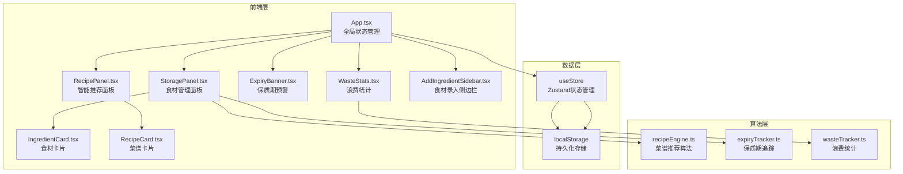
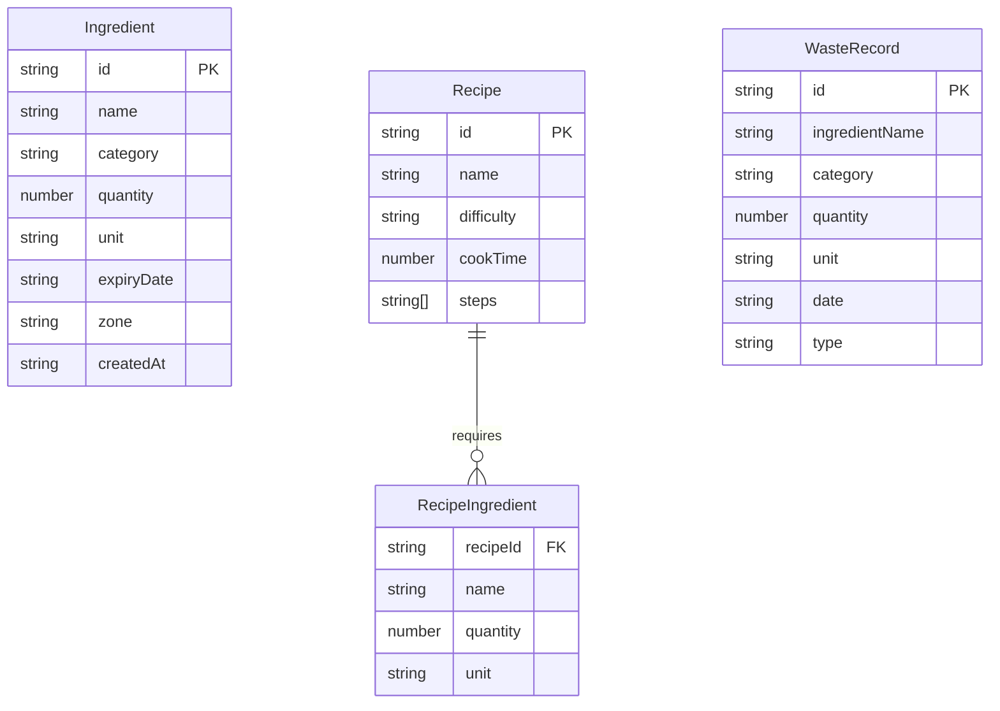

## 1. 架构设计



## 2. 技术说明
- 前端：React@18 + TypeScript + TailwindCSS@3 + Vite
- 初始化工具：vite-init（react-ts模板）
- 状态管理：Zustand（含localStorage持久化中间件）
- 后端：无（纯前端应用，数据存储在localStorage）
- 数据库：无（使用localStorage + Zustand persist中间件）

## 3. 路由定义
| 路由 | 用途 |
|------|------|
| / | 主页面（冰箱食材管理+菜谱推荐+浪费统计） |

## 4. 数据模型

### 4.1 数据模型定义



### 4.2 数据定义

- **Ingredient**：食材条目，id为UUID，category枚举（蔬菜/水果/肉类/蛋奶/调料/其他），zone枚举（冷藏/冷冻）
- **Recipe**：预置菜谱数据，difficulty枚举（简单/中等/复杂）
- **RecipeIngredient**：菜谱所需食材关联，recipeId关联Recipe
- **WasteRecord**：浪费/消耗记录，type枚举（consumed/wasted）

## 5. 文件结构与调用关系

```
src/
├── App.tsx                    # 主组件，管理路由和全局状态
│   ├── 调用 useStore 获取/更新状态
│   ├── 渲染 ExpiryBanner
│   ├── 渲染 StoragePanel（传入食材列表、回调函数）
│   ├── 渲染 RecipePanel（传入食材列表、菜谱数据、烹饪回调）
│   ├── 渲染 WasteStats（传入浪费记录、类别筛选回调）
│   └── 渲染 AddIngredientSidebar（传入显示状态、关闭回调、提交回调）
│
├── store/
│   └── useStore.ts            # Zustand store，含食材/浪费记录状态 + localStorage持久化
│
├── data/
│   └── recipes.ts             # 预置菜谱数据（12-15道家常菜）
│
├── engine/
│   ├── recipeEngine.ts        # 推荐算法：食材匹配度≥70%，按匹配度+难度排序
│   ├── expiryTracker.ts       # 保质期计算：剩余天数、预警判定
│   └── wasteTracker.ts        # 浪费统计：月度消耗/浪费统计，类别筛选
│
├── components/
│   ├── StoragePanel.tsx       # 食材管理面板
│   │   ├── 从App获取食材列表
│   │   ├── 按类别和保质期排序
│   │   ├── 分冷藏区/冷冻区渲染
│   │   └── 用户增删改触发回调→更新App状态
│   │
│   ├── IngredientCard.tsx     # 食材卡片
│   │   ├── 类别底色区分
│   │   ├── 3D翻转动效
│   │   ├── 预警条纹/闪烁动画
│   │   └── 数量修改/删除操作
│   │
│   ├── RecipePanel.tsx        # 智能推荐面板
│   │   ├── 从App接收食材列表
│   │   ├── 调用 recipeEngine 计算推荐
│   │   └── 渲染 RecipeCard 列表
│   │
│   ├── RecipeCard.tsx         # 菜谱卡片
│   │   ├── 食材匹配状态（绿勾/红叉）
│   │   ├── 做法步骤展开/收起
│   │   └── 开始烹饪按钮→回调扣减食材
│   │
│   ├── ExpiryBanner.tsx       # 保质期预警横幅
│   │   ├── 统计即将过期数量
│   │   └── 点击展开处理建议小贴士
│   │
│   ├── WasteStats.tsx         # 浪费统计区域
│   │   ├── 月度消耗/浪费数据展示
│   │   └── 类别筛选功能
│   │
│   └── AddIngredientSidebar.tsx  # 食材录入侧边栏
│       ├── 毛玻璃背景+右→左滑入
│       ├── 表单：名称/分类/数量/单位/保质期
│       └── 提交回调→更新App状态
│
├── types/
│   └── index.ts               # TypeScript类型定义
│
└── main.tsx                   # 入口文件
```

数据流向：
1. 用户操作 → 组件回调 → App.tsx → useStore → localStorage持久化
2. useStore状态变更 → App.tsx重新渲染 → 子组件接收新props
3. 食材列表变更 → RecipePanel → recipeEngine.ts → 推荐菜谱更新
4. 烹饪操作 → 扣减食材 → 记录消耗 → WasteStats更新
5. 过期检测 → expiryTracker.ts → ExpiryBanner预警
