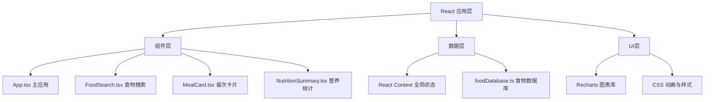

## 1. 架构设计



## 2. 技术描述

- **前端框架**：React 18 + TypeScript
- **构建工具**：Vite
- **图表库**：Recharts
- **状态管理**：React Context
- **字体**：Google Fonts - Quicksand
- **设计风格**：圆润清爽的扁平设计，薄荷绿+淡蓝色主色调
- **初始化方式**：Vite 脚手架

## 3. 路由定义

该应用为单页应用（SPA），无额外路由，所有功能在主页面完成。

| 路由 | 用途 |
|-------|---------|
| / | 主页面，包含所有功能模块 |

## 4. 数据模型

### 4.1 食物数据结构

```typescript
interface Food {
  id: string;
  name: string;
  icon: string;
  category: 'staple' | 'meat' | 'vegetable' | 'fruit' | 'snack';
  calories: number;       // 每100g/ml热量(kcal)
  protein: number;        // 每100g/ml蛋白质(g)
  fat: number;            // 每100g/ml脂肪(g)
  carbs: number;          // 每100g/ml碳水化合物(g)
  fiber: number;          // 每100g/ml膳食纤维(g)
  defaultUnit: 'g' | 'ml' | '份';
}
```

### 4.2 饮食记录数据结构

```typescript
interface FoodEntry {
  id: string;
  foodId: string;
  name: string;
  icon: string;
  amount: number;
  unit: 'g' | 'ml' | '份';
  calories: number;
  protein: number;
  fat: number;
  carbs: number;
  fiber: number;
}

type MealType = 'breakfast' | 'lunch' | 'dinner' | 'snack';

interface DayRecord {
  date: string; // YYYY-MM-DD
  meals: Record<MealType, FoodEntry[]>;
}
```

### 4.3 全局状态结构

```typescript
interface AppState {
  currentDate: string;
  records: Record<string, DayRecord>;  // 按日期索引
  calorieGoal: number;                  // 每日热量目标
}
```

## 5. 项目文件结构

```
auto45/
├── package.json
├── index.html
├── vite.config.js
├── tsconfig.json
└── src/
    ├── App.tsx
    ├── components/
    │   ├── FoodSearch.tsx
    │   ├── MealCard.tsx
    │   └── NutritionSummary.tsx
    └── data/
        └── foodDatabase.ts
```
