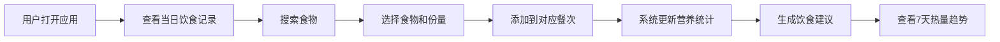

## 1. 产品概述

轻量级健康饮食日志应用，帮助用户快速记录每日饮食、分析营养成分并生成周报。解决用户对日常饮食缺乏记录习惯、营养摄入难以量化、无法直观看到自己饮食结构是否均衡的问题。

- **主要目标**：让用户能够轻松记录饮食、了解自身营养摄入情况、获得个性化饮食建议
- **目标用户**：关注健康饮食、需要管理体重或营养摄入的普通用户
- **产品价值**：通过简单直观的记录方式和可视化的营养分析，帮助用户建立健康饮食习惯

## 2. 核心功能

### 2.1 功能模块
1. **饮食记录模块**：食物搜索、手动输入、份量选择、营养数据展示、添加/删除记录
2. **餐次管理模块**：早餐/午餐/晚餐/加餐四个餐次分类、餐次卡片展示、热量进度条
3. **营养统计分析模块**：当日总热量汇总、三大宏量营养素环形进度图、近7天热量趋势折线图
4. **饮食建议模块**：根据当日摄入情况生成智能建议、打字机动画效果展示

### 2.3 页面详情
| 页面名称 | 模块名称 | 功能描述 |
|-----------|-------------|---------------------|
| 主页面 | 饮食记录模块 | 搜索食物、选择份量、添加记录到对应餐次，食物卡片底部滑入动画 |
| 主页面 | 餐次管理模块 | 四个餐次卡片展示、渐变背景色、餐次总热量和进度条 |
| 主页面 | 营养统计分析模块 | 环形进度图展示营养素占比、浮动按钮切换7天趋势折线图 |
| 主页面 | 饮食建议模块 | 智能建议气泡、绿色叶子图标、打字机效果 |

## 3. 核心流程

用户打开应用后，查看当日各餐次记录情况，通过搜索框搜索食物，选择食物和份量后添加到对应餐次，系统自动更新营养统计数据并生成饮食建议。用户可通过浮动按钮查看近7天的热量趋势。

## 4. 用户界面设计

### 4.1 设计风格
- **主色调**：薄荷绿（#98D8C8）和淡蓝色（#A8D8EA）
- **背景色**：白色（#FFFFFF）
- **卡片圆角**：8px
- **卡片投影**：微弱的阴影效果
- **字体**：Quicksand（圆润无衬线体）
- **餐次渐变背景**：
  - 早餐：暖黄 → 浅橙
  - 午餐：浅绿 → 墨绿
  - 晚餐：淡紫 → 深紫
  - 加餐：浅粉 → 淡灰
- **动画**：所有交互过渡动画0.2~0.4秒，卡片悬停缩放动画0.3秒缓动

### 4.2 页面设计概述
| 页面名称 | 模块名称 | UI元素 |
|-----------|-------------|-------------|
| 主页面 | 饮食记录模块 | 搜索框（防抖+加载动画）、食物下拉列表、食物卡片（左图标右文字双列布局、底部滑入动画） |
| 主页面 | 餐次管理模块 | 圆角矩形卡片、左上角餐次小图标、渐变背景、右侧热量和进度条 |
| 主页面 | 营养统计分析模块 | 环形进度图（三大营养素占比）、浮动圆形按钮、折线图（天蓝色渐变填充、数据点悬停气泡） |
| 主页面 | 饮食建议模块 | 浅灰色圆角气泡、左侧绿色小叶子图标、打字机效果文字 |

### 4.3 响应式设计
- 移动端优先设计
- 桌面端最大宽度800px并居中布局
- 触摸操作优化

### 4.4 性能要求
- 数据更新（添加/删除）响应时间 ≤ 100ms
- 搜索框输入后300ms内显示匹配结果
- 页面加载时间 ≤ 1.5秒
