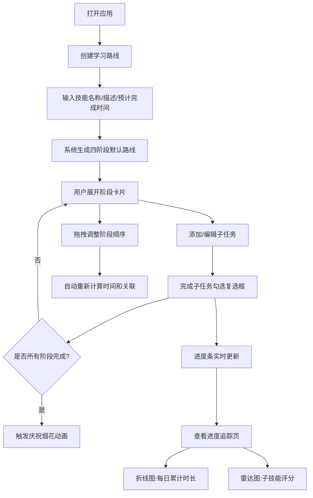

## 1. 产品概述

个人兴趣技能学习路线规划工具——帮助用户自定义学习路径、记录每个阶段的学习时长和掌握程度，并生成可视化进度报告。面向自学者和终身学习者，解决学习路径不清晰、进度难以量化和追踪的问题。

## 2. 核心功能

### 2.1 用户角色

| 角色 | 注册方式 | 核心权限 |
|------|----------|----------|
| 个人用户 | 无需注册（本地应用） | 创建/编辑/删除学习路线，追踪进度，查看报告 |

### 2.2 功能模块

1. **学习路线规划页**：创建技能学习路线，自动生成四阶段路线，支持拖拽调整顺序，展开阶段卡片管理子任务
2. **进度追踪页**：可视化展示每日累计学习时长折线图和子技能评分雷达图

### 2.3 页面详情

| 页面名称 | 模块名称 | 功能描述 |
|----------|----------|----------|
| 学习路线规划页 | 路线创建表单 | 输入技能名称、总目标描述、预计完成时间，自动生成入门-基础-进阶-精通四阶段路线 |
| 学习路线规划页 | 时间轴路线图 | 水平时间轴展示阶段卡片，浅蓝到深紫渐变背景，虚线连接，支持拖拽排序 |
| 学习路线规划页 | 阶段卡片详情 | 展开后添加/编辑/删除子任务，记录预计/实际耗时，复选框标记完成，绿色光晕动画 |
| 学习路线规划页 | 庆祝动画 | 所有阶段完成后触发彩虹烟花粒子动画 |
| 进度追踪页 | 折线图 | 每日累计学习时长（蓝色虚线目标线 + 橙色实线实际线），带圆点标记和悬停提示 |
| 进度追踪页 | 雷达图 | 子技能评分（理论理解、动手实践、项目经验等1-10分），渐变填充外圈 |
| 进度追踪页 | 统计概览 | 总学习时长、完成百分比、掌握评分汇总 |

## 3. 核心流程

用户打开应用 → 创建新学习路线（输入技能名称、描述、预计完成时间） → 系统自动生成四阶段默认路线 → 用户展开阶段卡片添加子任务 → 完成子任务时勾选复选框 → 进度条实时更新 → 拖拽调整阶段顺序 → 切换到进度追踪页查看折线图和雷达图 → 所有阶段完成后触发庆祝动画

## 4. 用户界面设计

### 4.1 设计风格

- **主色调**：品牌蓝 #4A90D9，辅助色为阶段渐变色（浅蓝 #B3D9F2 → 深紫 #6B3FA0）
- **按钮风格**：品牌色圆角按钮，悬停上浮效果，点击缩放 transform: scale(0.97)
- **字体**：Inter（西文） + Noto Sans SC（中文），标题 24px/600，正文 14px/400
- **布局风格**：极简卡片式，白色圆角 12px 阴影卡片
- **背景色**：主背景 #f5f7fa
- **动画**：绿色光晕过渡（完成子任务）、拖拽半透明跟随、卡片让位平滑移动、庆祝彩虹烟花粒子

### 4.2 页面设计概览

| 页面名称 | 模块名称 | UI元素 |
|----------|----------|--------|
| 学习路线规划页 | 路线创建表单 | 居中卡片表单，品牌蓝按钮，输入框带焦点边框 |
| 学习路线规划页 | 时间轴路线图 | 水平滚动区域，阶段卡片从左到右排列，浅蓝→深紫渐变，虚线连接 |
| 学习路线规划页 | 阶段卡片 | 未开始浅灰底纹，进行中蓝色左边框，已完成绿色左边框+浅绿背景，展开/收起动画 |
| 学习路线规划页 | 子任务列表 | 复选框+文本+预计/实际耗时，完成后绿色光晕边框动画 |
| 进度追踪页 | 折线图 | recharts LineChart，蓝色虚线目标线，橙色实线实际线，圆点标记，tooltip |
| 进度追踪页 | 雷达图 | recharts RadarChart，1-10分刻度，渐变填充外圈，用户手动评分 |
| 进度追踪页 | 统计概览 | 数字卡片显示总时长/完成百分比/掌握评分 |

### 4.3 响应式设计

- 桌面端优先（≥768px）：水平时间轴，阶段卡片横向排列，支持横向滚动
- 移动端（<768px）：垂直时间轴，阶段卡片上下排列，全宽布局

### 4.4 状态视觉反馈

- 阶段未开始：浅灰色底纹（#e8ecf0）
- 阶段进行中：左侧蓝色边框（4px #4A90D9）
- 阶段已完成：左侧绿色边框（4px #52c41a）+ 浅绿色背景（#f6ffed）
- 子任务完成：卡片边缘绿色光晕（box-shadow 动画过渡）
- 拖拽中：被拖拽卡片 opacity: 0.6，跟随鼠标移动
- 全部完成：彩虹烟花粒子动画覆盖路线图区域
