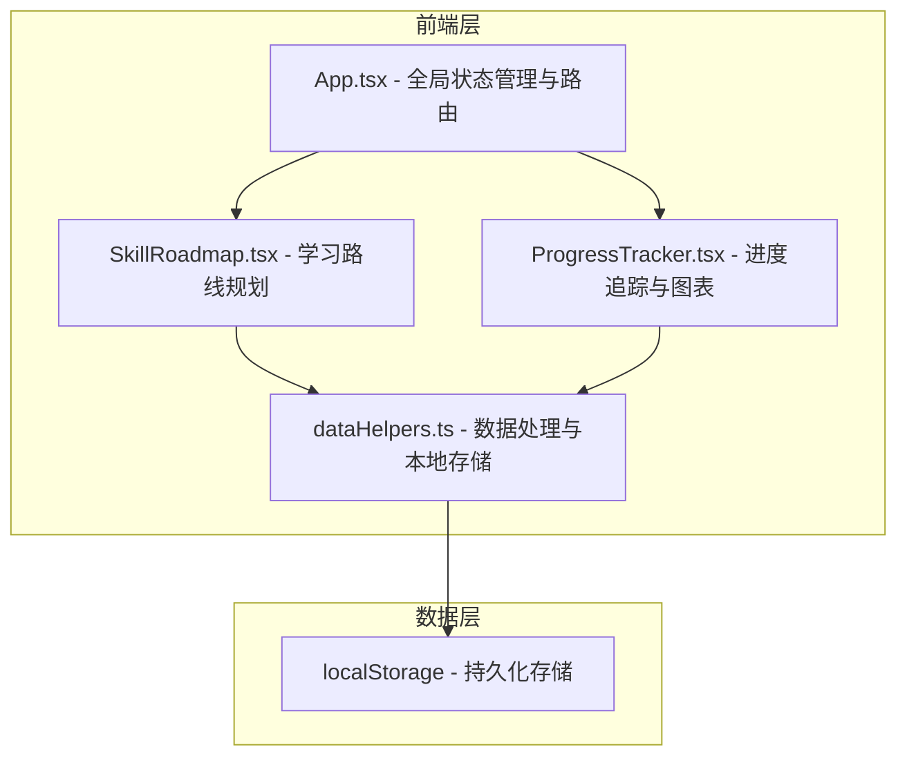
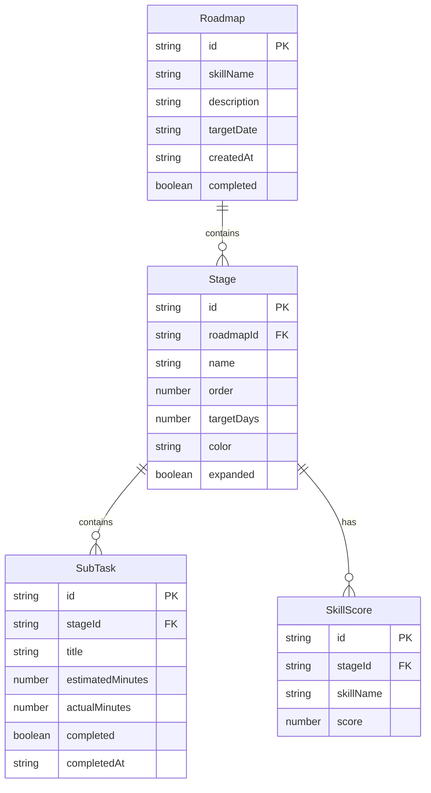

## 1. 架构设计



## 2. 技术说明

- **前端框架**：React@18 + TypeScript + Vite
- **样式方案**：CSS Modules + CSS 变量
- **图表库**：recharts
- **唯一标识**：uuid
- **状态管理**：React useState/useReducer（全局状态提升至 App.tsx）
- **本地存储**：localStorage（通过 dataHelpers.ts 封装）
- **拖拽实现**：HTML5 Drag and Drop API
- **动画实现**：CSS transitions + requestAnimationFrame（烟花粒子）
- **构建工具**：Vite
- **无后端服务**

## 3. 路由定义

| 路由 | 用途 |
|------|------|
| / | 学习路线规划页（默认首页），展示时间轴路线图和阶段管理 |
| /progress | 进度追踪页，展示折线图、雷达图和统计概览 |

## 4. 数据模型

### 4.1 数据模型定义



### 4.2 类型定义

```typescript
interface Roadmap {
  id: string;
  skillName: string;
  description: string;
  targetDate: string;
  createdAt: string;
  completed: boolean;
  stages: Stage[];
}

interface Stage {
  id: string;
  roadmapId: string;
  name: string;
  order: number;
  targetDays: number;
  color: string;
  expanded: boolean;
  subTasks: SubTask[];
  skillScores: SkillScore[];
}

interface SubTask {
  id: string;
  stageId: string;
  title: string;
  estimatedMinutes: number;
  actualMinutes: number;
  completed: boolean;
  completedAt: string | null;
}

interface SkillScore {
  id: string;
  stageId: string;
  skillName: string;
  score: number;
}

interface DailyRecord {
  date: string;
  actualMinutes: number;
  targetMinutes: number;
}
```

## 5. 文件结构

```
├── package.json
├── index.html
├── vite.config.js
├── tsconfig.json
├── src/
│   ├── App.tsx
│   ├── App.css
│   ├── main.tsx
│   ├── components/
│   │   ├── SkillRoadmap.tsx
│   │   ├── SkillRoadmap.css
│   │   ├── ProgressTracker.tsx
│   │   ├── ProgressTracker.css
│   │   ├── StageCard.tsx
│   │   ├── StageCard.css
│   │   ├── SubTaskItem.tsx
│   │   ├── SubTaskItem.css
│   │   ├── Fireworks.tsx
│   │   └── Fireworks.css
│   ├── utils/
│   │   └── dataHelpers.ts
│   └── types/
│       └── index.ts
```

## 6. 性能策略

- 使用 React.memo 优化子组件渲染，避免不必要的重渲染
- 拖拽操作使用 requestAnimationFrame 确保 60fps
- 图表数据超过 500 条时进行聚合降采样
- localStorage 读写操作做防抖处理（300ms）
- CSS 动画优先使用 transform 和 opacity 触发 GPU 加速
