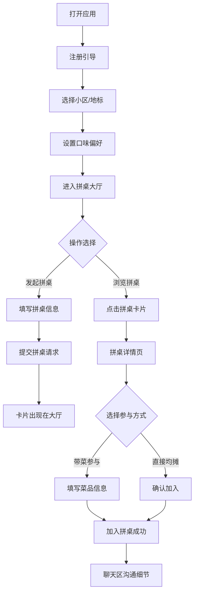

## 1. 产品概述
社区拼桌吃饭平台——"拼桌小饭桌"，让住在同一栋楼或附近的邻居们可以发起拼桌邀请，一起买菜、一起做饭、一起吃饭，顺便聊聊天、交个朋友，解决一个人做饭吃不完、又不想总点外卖的孤单感。

- 核心目标：降低邻里社交门槛，通过美食为纽带创造温馨的社区交流场景
- 目标用户：住在城市社区中的独居青年、上班族、退休老人等希望有人陪伴吃饭的人群
- 市场价值：填补社区邻里社交空白，结合"吃饭"这一高频刚需场景，打造有温度的社区生活方式

## 2. 核心功能

### 2.1 用户角色
| 角色 | 注册方式 | 核心权限 |
|------|----------|----------|
| 普通用户 | 填写昵称、选择小区、设置口味偏好完成注册 | 浏览拼桌大厅、发起拼桌、加入拼桌、参与聊天 |

### 2.2 功能模块
1. **注册引导页**：小区选择、口味偏好设置（辣度滑块、香菜喜好、素食选项）
2. **拼桌大厅页**：暖色调食物横幅、拼桌卡片列表、发起拼桌入口
3. **发起拼桌弹窗**：时间选择器（精确到半小时）、人数设置（2-8人）、费用预估、邀请语、美食图片上传
4. **拼桌详情页**：参与者列表、菜品清单、内置聊天框、加入方式选择（带菜/均摊）

### 2.3 页面详情
| 页面名称 | 模块名称 | 功能描述 |
|----------|----------|----------|
| 注册引导页 | 小区选择 | 下拉选择所在小区或附近地标，支持搜索 |
| 注册引导页 | 口味偏好设置 | 辣度滑块（微辣→变态辣）、是否吃香菜开关、是否素食者开关 |
| 拼桌大厅页 | 顶部横幅 | 暖色调食物横图背景，展示平台slogan |
| 拼桌大厅页 | 拼桌卡片网格 | 展示发起人头像、时间、人数缺口环形进度条、费用预估、加入按钮 |
| 拼桌大厅页 | 发起拼桌按钮 | 固定位置悬浮按钮，点击弹出表单 |
| 发起拼桌弹窗 | 时间选择 | 日期时间选择器，时间步长30分钟 |
| 发起拼桌弹窗 | 人数设置 | 数字输入/步进器，范围2-8人 |
| 发起拼桌弹窗 | 费用预估 | 数字输入框，自动调出数字键盘 |
| 发起拼桌弹窗 | 邀请语 | 多行文本输入，限制字数 |
| 发起拼桌弹窗 | 美食图片 | 图片上传，带圆角预览和淡入动画 |
| 拼桌详情页 | 参与者列表 | 头像+昵称两行展示，显示每人带的菜品和简短自我介绍 |
| 拼桌详情页 | 菜品汇总 | 汇总所有参与者带的菜品 |
| 拼桌详情页 | 聊天框 | 底部聊天区域，消息带发送人头像和时间，新消息从底部弹入 |
| 拼桌详情页 | 加入按钮 | 选择带菜/直接均摊两种参与方式 |

## 3. 核心流程
用户打开应用 → 完成注册（选择小区+设置口味）→ 进入拼桌大厅浏览 → 两种路径：
1. 浏览拼桌卡片 → 点击感兴趣的拼桌 → 进入详情页 → 选择带菜/均摊 → 加入拼桌 → 在聊天区与邻居沟通
2. 点击发起拼桌 → 填写时间、人数、费用、邀请语、上传图片 → 提交 → 拼桌卡片出现在大厅 → 等待邻居加入 → 在详情页聊天沟通

## 4. 用户界面设计

### 4.1 设计风格
- **主色调**：珊瑚橙 `#FF6B6B` 作为主色，搭配奶白色 `#FFFBF5` 作为背景色
- **辅助色**：温暖的琥珀色 `#FFA94D`、柔和的绿色 `#51CF66`（用于状态提示）
- **中性色**：深灰色 `#495057`（正文）、中灰色 `#868E96`（次要文字）、浅灰色 `#F1F3F5`（分割线）
- **按钮风格**：全圆角胶囊按钮，主按钮为珊瑚橙渐变，hover时有轻微上浮和阴影加深效果，点击有弹性缩放动画
- **卡片风格**：大圆角（16px-20px），柔和的投影（box-shadow: 0 4px 20px rgba(255, 107, 107, 0.08)），hover时向上浮动4px并增强阴影
- **字体**：标题用 "Noto Sans SC" 600-700 字重，正文用 "Inter" 400-500 字重
- **布局风格**：卡片式布局，充足的留白，呼吸感强
- **图标风格**：使用 lucide-react 线性图标，统一描边宽度为2px，圆角端点

### 4.2 页面设计概述
| 页面名称 | 模块名称 | UI元素 |
|----------|----------|----------|
| 拼桌大厅页 | 顶部横幅 | 暖色调美食图片背景，半透明渐变遮罩，白色slogan文字，入场时从下往上淡入 |
| 拼桌大厅页 | 卡片网格 | 桌面端3列网格，移动端单列瀑布流，卡片有入场错峰动画，点击向上翻开效果 |
| 拼桌大厅页 | 悬浮发起按钮 | 固定右下角，珊瑚橙圆形按钮，带"+"图标，点击有波纹扩散效果 |
| 拼桌卡片 | 环形进度条 | 珊瑚橙色环形，缺口人数显示在中心，平滑动画过渡 |
| 拼桌卡片 | 已满状态 | 整体变灰（grayscale滤镜），右上角显示"已满"徽章 |
| 拼桌详情页 | 参与者列表 | 头像圆形裁剪，昵称+菜品两行，卡片横向排列，滚动流畅 |
| 拼桌详情页 | 聊天消息 | 气泡式布局，左侧显示他人消息（浅灰），右侧显示自己消息（珊瑚橙），新消息从底部弹入 |
| 发起拼桌弹窗 | 表单控件 | 输入框全圆角，聚焦时珊瑚橙色边框，滑块使用珊瑚橙主题色 |
| 发起拼桌弹窗 | 图片预览 | 圆角12px，上传后淡入显示，支持再次点击更换 |

### 4.3 响应式设计
- **设计策略**：桌面端优先，移动端自适应
- **断点设置**：
  - ≥1024px（桌面）：拼桌卡片3列网格，详情页左右分栏
  - 768px-1023px（平板）：拼桌卡片2列网格
  - <768px（手机）：拼桌卡片单列瀑布流，详情页全宽堆叠
- **触摸优化**：移动端所有可点击元素最小44x44px，输入框聚焦时自动避免键盘遮挡，聊天框支持下拉查看历史消息

### 4.4 动画与过渡规范
- **页面切换**：全局淡入淡出（opacity 0→1，200ms ease-out）
- **卡片点击**：向上翻开效果（transform: translateY(-8px) + rotateX(3deg)，250ms cubic-bezier(0.34, 1.56, 0.64, 1)）
- **按钮点击**：弹性效果（scale 1→0.95→1.02→1，200ms）
- **新消息入场**：从底部弹入（translateY(30px)→0 + opacity 0→1，300ms ease-out）
- **环形进度条**：数值变化时平滑过渡（stroke-dasharray 动画，400ms ease-out）
- **图片上传预览**：淡入效果（opacity 0→1 + scale(0.95)→1，350ms ease-out）
- **滚动性能**：使用 `will-change: transform` 优化长列表，目标帧率50fps以上
