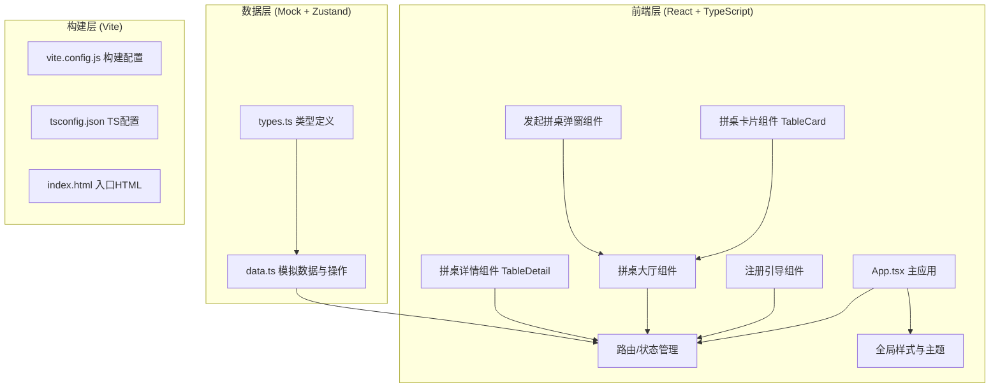

## 1. 架构设计



## 2. 技术说明

- **前端框架**：React@18 + TypeScript@5，函数组件 + Hooks 开发模式
- **构建工具**：Vite@5，配置 `@` 路径别名指向 `./src`
- **状态管理**：React Context + useReducer 实现轻量全局状态管理（用户信息、拼桌数据、消息）
- **样式方案**：CSS Modules + CSS Variables 主题系统，配合原生 CSS 动画
- **字体方案**：Google Fonts 引入 Inter（英文正文）+ Noto Sans SC（中文显示）
- **图标方案**：lucide-react 线性图标库
- **唯一ID生成**：uuid 库生成拼桌ID、消息ID
- **后端方案**：无后端，全部使用 Mock 数据模拟，数据操作函数封装在 data.ts 中
- **初始化方式**：使用 vite-init react-ts 模板脚手架初始化项目

## 3. 路由定义

由于用户要求单应用管理路由但未引入 react-router-dom，使用内部状态路由（View 状态切换）：

| View 名称 | 路径逻辑 | 用途 |
|-----------|----------|------|
| Register | 默认首次进入显示 | 注册引导，选择小区和口味偏好 |
| Hall | 注册完成后默认视图 | 拼桌大厅，展示所有拼桌卡片 |
| Detail | 点击卡片后切换 | 拼桌详情，展示参与者、菜品、聊天 |

## 4. 类型定义 (TypeScript)

```typescript
// 用户类型
interface User {
  id: string;
  nickname: string;
  avatar: string;
  community: string;
  taste: {
    spicyLevel: number; // 0-5 微辣到变态辣
    eatCilantro: boolean;
    isVegetarian: boolean;
  };
  bio: string;
}

// 参与者信息
interface Participant {
  userId: string;
  user: User;
  bringDish?: string;
  joinType: 'dish' | 'share'; // 带菜 or 均摊
  joinedAt: Date;
}

// 拼桌请求
interface TableRequest {
  id: string;
  hostId: string;
  host: User;
  time: Date;
  maxPeople: number; // 2-8
  participants: Participant[];
  costPerPerson: number;
  invitationText: string;
  foodImage: string;
  status: 'open' | 'full';
  createdAt: Date;
}

// 聊天消息
interface ChatMessage {
  id: string;
  tableId: string;
  userId: string;
  user: User;
  content: string;
  timestamp: Date;
}

// 全局状态
interface AppState {
  currentUser: User | null;
  currentView: 'register' | 'hall' | 'detail';
  selectedTableId: string | null;
  tables: TableRequest[];
  messages: Record<string, ChatMessage[]>;
}
```

## 5. 文件结构设计

```
d:\P\tasks\auto47/
├── .trae/documents/           # 文档目录
│   ├── PRD.md                 # 产品需求文档
│   └── Technical.md           # 技术架构文档
├── index.html                 # 入口HTML
├── package.json               # 依赖与脚本
├── vite.config.js             # Vite配置
├── tsconfig.json              # TypeScript配置
└── src/
    ├── App.tsx                # 主应用组件
    ├── types.ts               # 全局类型定义
    ├── data.ts                # Mock数据与操作函数
    ├── styles/
    │   └── global.css         # 全局样式、主题变量、动画
    └── components/
        ├── Register.tsx       # 注册引导组件
        ├── Hall.tsx           # 拼桌大厅组件
        ├── TableCard.tsx      # 拼桌卡片组件
        ├── TableDetail.tsx    # 拼桌详情组件
        └── CreateTableModal.tsx # 发起拼桌弹窗组件
```

## 6. 性能优化方案

### 6.1 列表滚动性能
- 拼桌卡片和聊天消息使用 CSS `will-change: transform` 提示浏览器优化
- 长列表使用虚拟滚动（如消息列表超过50条时只渲染可视区域+缓冲）
- 避免在滚动事件中进行重计算，使用 `requestAnimationFrame` 节流

### 6.2 页面切换响应
- 视图切换仅改变状态标记，组件常驻内存（条件渲染而非卸载）
- 所有过渡动画使用 CSS transform + opacity，触发合成层而非重排
- 目标切换时间 < 200ms，动画曲线使用 ease-out 保证响应感

### 6.3 动画帧率保证
- 所有动画仅操作 transform 和 opacity 属性
- 环形进度条使用 SVG stroke-dasharray 过渡，不触发重绘
- 卡片翻转动画使用 3D transform (translateY + rotateX) 启用 GPU 加速
- 使用 Chrome DevTools Performance 面板验证，目标帧率 ≥ 50fps

## 7. 数据初始化与操作

### 7.1 初始Mock数据
- 预置 5-8 条拼桌数据，覆盖不同时间段、人数、费用区间
- 预置 3-5 个模拟用户，包含不同口味偏好和头像
- 每个拼桌预置 2-3 条聊天消息历史

### 7.2 数据操作函数（data.ts 导出）
- `getMockTables(): TableRequest[]` - 获取初始拼桌列表
- `getMockUsers(): User[]` - 获取模拟用户
- `createTable(data): TableRequest` - 创建新拼桌，生成ID和时间戳
- `joinTable(tableId, participant): TableRequest` - 加入拼桌，检查人数是否已满，更新状态
- `sendMessage(tableId, userId, content): ChatMessage` - 发送消息，追加到对应拼桌消息列表
- `updateTableStatus(tableId): void` - 检查并更新拼桌 open/full 状态
