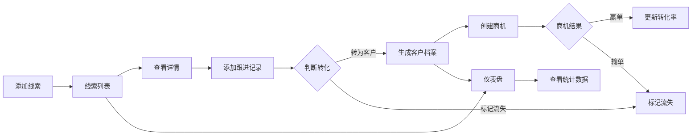

## 1. 产品概述

轻量级CRM系统，帮助小型创业团队管理客户线索、推进销售流程并生成统计报表。解决团队对潜在客户信息分散、跟进状态不透明、缺乏可视化数据的痛点。

- 主要用途：线索管理、销售跟进、客户转化、数据统计
- 目标用户：小型创业团队的销售及业务人员
- 产品价值：整合分散的客户信息，透明化跟进流程，提供数据驱动的决策支持

## 2. 核心功能

### 2.1 功能模块

1. **线索列表页**：线索卡片展示、筛选搜索、快速操作
2. **线索详情页**：线索基本信息、跟进时间线、状态变更
3. **客户档案页**：客户信息展示、商机管理、赢单输单操作
4. **仪表盘页**：核心指标统计、折线图趋势、环形图分布

### 2.2 页面详情

| 页面名称 | 模块名称 | 功能描述 |
|-----------|-------------|---------------------|
| 线索列表页 | 线索表单 | 添加新线索，包含公司名称、联系人、手机号、来源渠道、状态 |
| 线索列表页 | 线索卡片 | 彩色标签标识来源渠道，悬停显示操作按钮，点击有回弹动画 |
| 线索列表页 | 筛选搜索 | 按状态/来源筛选，搜索框快速定位 |
| 线索详情页 | 跟进时间线 | 时间倒序展示，铃铛图标提醒今日待跟进 |
| 线索详情页 | 跟进记录表单 | 右侧滑入模态框，新增记录高亮闪烁 |
| 客户档案页 | 商机卡片 | 进度条动画，金额渐变色彩 |
| 客户档案页 | 输赢单操作 | 商机关闭后更新转化率 |
| 仪表盘页 | 统计卡片 | 数字滚动动画展示核心指标 |
| 仪表盘页 | 折线图 | 近30天新增线索趋势，虚实线区分 |
| 仪表盘页 | 环形图 | 来源分布，悬停外扩显示百分比 |

## 3. 核心流程

## 4. 用户界面设计

### 4.1 设计风格

- 主色调：靛蓝 #5A67D8（强调色）
- 侧边栏：深灰 #2D3748
- 主内容区背景：纯白
- 文字颜色：深灰 #4A5568
- 辅助背景：浅灰 #F7FAFC
- 按钮样式：圆角按钮，悬停加深，点击收缩动效
- 字体：Inter（Google Fonts）
- 布局：左侧边栏 + 右侧主内容
- 动画：300ms ease-out 过渡，卡片切换、表单出现、数字变化均有动效

### 4.2 页面设计概览

| 页面名称 | 模块名称 | UI 元素 |
|-----------|-------------|-------------|
| 线索列表页 | 线索卡片 | 彩色来源标签、悬停操作按钮、回弹动画、卡片阴影 |
| 线索列表页 | 筛选栏 | 状态下拉、来源下拉、搜索框、间距均匀 |
| 线索详情页 | 时间线 | 垂直线条、日期圆点、跟进方式图标、铃铛摆动动画 |
| 线索详情页 | 模态框 | 右侧滑入、半透明遮罩、表单输入框 |
| 客户档案页 | 商机卡片 | 进度条填充动画、颜色渐变、金额显示 |
| 仪表盘页 | 统计卡片 | 数字滚动动画、图标、渐变背景 |
| 仪表盘页 | 图表 | 折线图虚实线、环形图悬停外扩、Tooltip |

### 4.3 响应式设计

- 桌面端（≥1200px）：侧边栏完整展开，三列布局仪表盘
- 平板端（768px-1199px）：侧边栏折叠为图标菜单，两列布局仪表盘
- 采用桌面优先设计，使用媒体查询适配平板

### 4.4 性能要求

- 1000条数据内列表初始渲染 ≤500ms
- 筛选和搜索响应 ≤200ms
- 动画流畅度 60fps
