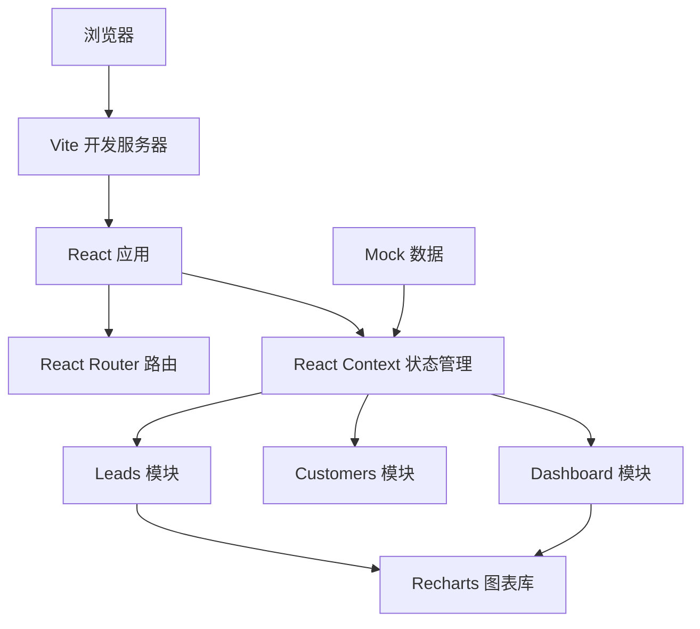
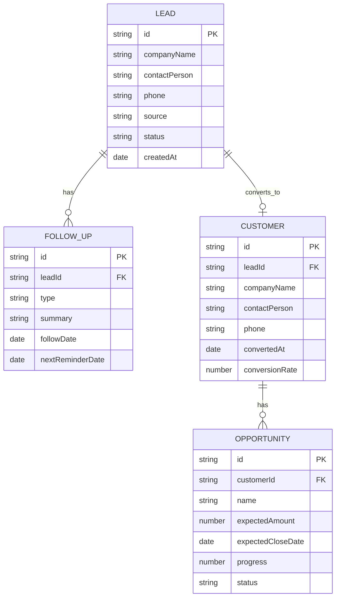

## 1. 架构设计



## 2. 技术描述

- 前端框架：React 18 + TypeScript
- 构建工具：Vite 5.x
- 路由管理：React Router v6
- 状态管理：React Context + useReducer
- 图表库：Recharts 2.x
- 唯一ID：UUID
- 样式方案：CSS Modules / 原生 CSS + CSS 变量
- 初始化方式：npm create vite@latest

## 3. 路由定义

| 路由路径 | 页面组件 | 用途 |
|-------|---------|---------|
| `/` | LeadsList | 线索列表页 |
| `/lead/:id` | LeadDetail | 线索详情页 |
| `/customer/:id` | CustomerProfile | 客户档案页 |
| `/dashboard` | Dashboard | 仪表盘页 |

## 4. 数据模型

### 4.1 数据模型定义



### 4.2 类型定义

```typescript
type LeadSource = 'online_ad' | 'offline_exhibition' | 'referral' | 'search';
type LeadStatus = 'new' | 'following' | 'converted' | 'lost';
type FollowUpType = 'phone' | 'email' | 'wechat' | 'meeting';
type OpportunityStatus = 'active' | 'won' | 'lost';

interface Lead {
  id: string;
  companyName: string;
  contactPerson: string;
  phone: string;
  source: LeadSource;
  status: LeadStatus;
  createdAt: string;
}

interface FollowUpRecord {
  id: string;
  leadId: string;
  type: FollowUpType;
  summary: string;
  followDate: string;
  nextReminderDate?: string;
}

interface Customer {
  id: string;
  leadId: string;
  companyName: string;
  contactPerson: string;
  phone: string;
  convertedAt: string;
  conversionRate: number;
}

interface Opportunity {
  id: string;
  customerId: string;
  name: string;
  expectedAmount: number;
  expectedCloseDate: string;
  progress: number;
  status: OpportunityStatus;
}
```

## 5. 项目文件结构

```
auto48/
├── package.json
├── index.html
├── vite.config.js
├── tsconfig.json
├── src/
│   ├── App.tsx
│   ├── context/
│   │   └── CRMContext.tsx
│   ├── modules/
│   │   ├── leads/
│   │   │   ├── LeadsList.tsx
│   │   │   └── LeadDetail.tsx
│   │   ├── customers/
│   │   │   └── CustomerProfile.tsx
│   │   └── dashboard/
│   │       └── Dashboard.tsx
│   ├── types/
│   │   └── index.ts
│   └── styles/
│       └── index.css
```

## 6. 核心模块说明

### 6.1 CRMContext (全局状态管理)
- 管理 leads、customers、opportunities、followUpRecords 四个数组
- 提供 addLead、updateLeadStatus、addFollowUp、convertToCustomer、addOpportunity、closeOpportunity 等方法
- 计算仪表盘汇总数据：总线索数、转化率、赢单金额、近30天新增线索、来源分布

### 6.2 LeadsList (线索列表)
- 从 Context 读取线索数据
- 实现按状态和来源的筛选逻辑
- 实现搜索功能（公司名/联系人）
- 卡片悬停操作按钮及动画

### 6.3 LeadDetail (线索详情)
- 展示线索基本信息
- 渲染跟进时间线（倒序）
- 今日提醒铃铛摆动动画
- 右侧滑入添加跟进记录模态框
- 新记录高亮闪烁效果

### 6.4 CustomerProfile (客户档案)
- 展示客户信息及关联线索记录
- 商机进度条卡片（填充动画、颜色渐变）
- 商机赢单/输单操作
- 转化率自动计算更新

### 6.5 Dashboard (仪表盘)
- 三列统计卡片（数字滚动动画）
- Recharts 折线图（近30天线索，虚实线）
- Recharts 环形图（来源分布，悬停外扩）
- 数据来源于 Context 计算值

## 7. Mock 数据

生成 100 条模拟线索数据，包含：
- 分布均匀的来源渠道
- 不同阶段的状态分布
- 30-50 条跟进记录
- 10-15 个已转化客户
- 20-30 个商机（含赢单/输单）
