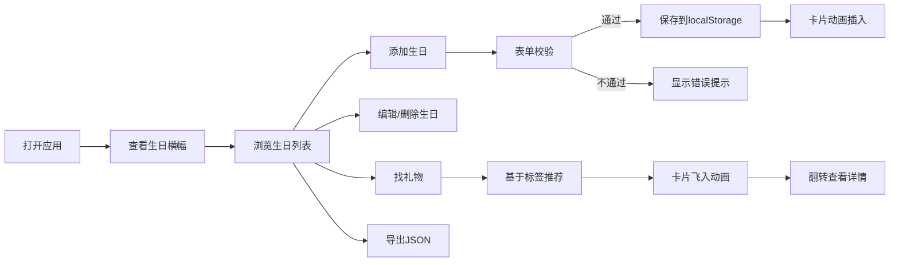

## 1. 产品概述

生日提醒与礼物灵感助手，帮助忙碌的上班族记录亲友生日、设置个性化提醒，并基于兴趣爱好推荐礼物创意，避免因忘记生日而造成的尴尬。

- 核心价值：解决现代人因工作繁忙忘记重要亲友生日的痛点，提供一站式生日管理与礼物推荐解决方案
- 目标用户：25-45岁的职场人士，需要管理多位亲友生日并希望获得贴心礼物建议
- 市场定位：温馨、高端、实用的个人生活助手类应用

## 2. 核心功能

### 2.1 用户角色
| 角色 | 注册方式 | 核心权限 |
|------|----------|----------|
| 普通用户 | 无需注册，本地存储 | 生日记录管理、提醒设置、礼物推荐、数据导出 |

### 2.2 功能模块
1. **生日记录管理**：添加、编辑、删除生日记录，表单即时校验
2. **倒计时与提醒**：动态显示生日倒计时，30天内生日特殊标识，即将到来生日横幅滚动展示
3. **礼物灵感推荐**：基于兴趣标签智能推荐礼物，卡片翻转动画，购买链接展示
4. **数据持久化**：localStorage本地存储，JSON格式导出

### 2.3 页面详情
| 页面名称 | 模块名称 | 功能描述 |
|---------|----------|----------|
| 主页 | 即将到来横幅 | 横向滚动展示30天内生日，自动循环，悬停暂停 |
| 主页 | 生日列表网格 | 2列桌面/1列移动端，卡片显示头像、姓名、倒计时，支持编辑删除 |
| 主页 | 添加生日表单 | 姓名、日期、兴趣标签输入，即时校验，提交后动画插入 |
| 主页 | 礼物推荐弹窗 | 3张礼物卡片依次飞入，翻转动画，购买建议链接 |
| 主页 | 数据导出 | 一键导出JSON格式数据备份 |

## 3. 核心流程

### 主要用户流程
用户打开应用 → 查看即将到来的生日横幅 → 浏览生日列表网格 → 点击"添加生日"按钮 → 填写表单（姓名、日期、兴趣标签）→ 即时校验通过后提交 → 新卡片动画插入列表 → 点击卡片可编辑/删除 → 点击"找礼物"按钮 → 基于兴趣标签推荐3个礼物 → 卡片翻转查看详情和购买链接 → 可导出数据备份

## 4. 用户界面设计

### 4.1 设计风格
- **主色调**：深蓝至靛蓝渐变背景（#1a1a2e → #16213e → #0f3460），暖金色（#D4AF37）点缀
- **字体**：Playfair Display（标题）+ Inter（正文），营造温馨高级感
- **卡片风格**：毛玻璃效果（backdrop-filter: blur(12px)），16px圆角，微弱内发光边框
- **按钮**：悬停放大动画（scale(1) → scale(1.05)），0.2s ease-out
- **头像**：姓名首字母彩色圆块，背景色根据姓名哈希生成

### 4.2 页面设计概述
| 页面名称 | 模块名称 | UI元素 |
|---------|----------|--------|
| 主页 | 顶部标题区 | Playfair Display字体大标题，暖金色装饰线 |
| 主页 | 即将到来横幅 | 横向滚动容器，180px卡片，自动循环，悬停暂停 |
| 主页 | 生日列表网格 | 2列网格，卡片左上角彩色头像，底部倒计时（7天内橙色、30天内蓝色、其余灰色），30天内卡片有红色脉动圆点 |
| 主页 | 添加表单弹窗 | 毛玻璃背景，输入框带即时校验提示，兴趣标签多选按钮组 |
| 主页 | 礼物推荐弹窗 | 3张渐变背景卡片，从左到右依次旋转飞入，悬停翻转显示背面详情 |
| 主页 | 操作按钮 | 暖金色背景，圆角，悬停放大动画 |

### 4.3 响应式设计
- 桌面端（≥768px）：2列网格布局，横幅正常显示
- 移动端（<768px）：1列单列布局，横幅自适应宽度，触控优化按钮大小

### 4.4 动画效果
- 新卡片添加：从顶部渐入滑下
- 礼物卡片：从左到右依次旋转飞入（总时长≤1.5s）
- 卡片翻转：3D翻转效果显示正反面
- 按钮悬停：scale(1.05)放大，0.2s ease-out
- 30天内生日卡片：左上角红色脉动圆点
- 即将到来横幅：横向自动循环滚动，悬停暂停

## 5. 性能要求
- 网格列表渲染100张卡片时滚动帧率≥50fps
- 礼物推荐从点击到卡片完全飞入≤1.5s
- 所有动画使用CSS transform和opacity，保证硬件加速
