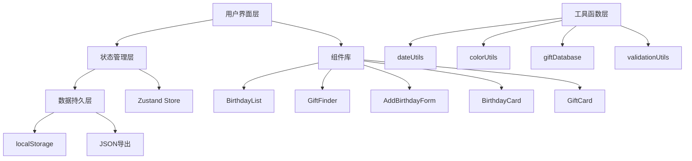

## 1. 架构设计



## 2. 技术描述
- **前端框架**：React 18 + TypeScript
- **构建工具**：Vite 5.x
- **状态管理**：Zustand
- **样式方案**：CSS Modules + CSS变量
- **工具库**：date-fns（日期处理）、uuid（唯一ID生成）
- **数据存储**：localStorage本地持久化
- **字体**：Google Fonts - Playfair Display + Inter

## 3. 项目结构

```
src/
├── types.ts              # 核心类型定义
├── App.tsx               # 主应用组件
├── main.tsx              # 应用入口
├── index.css             # 全局样式
├── store/
│   └── useBirthdayStore.ts  # Zustand状态管理
├── components/
│   ├── BirthdayList.tsx      # 生日列表组件
│   ├── BirthdayCard.tsx      # 生日卡片组件
│   ├── GiftFinder.tsx        # 礼物推荐组件
│   ├── GiftCard.tsx          # 礼物卡片组件
│   ├── AddBirthdayForm.tsx   # 添加生日表单
│   ├── UpcomingBanner.tsx    # 即将到来横幅
│   └── EditBirthdayModal.tsx # 编辑弹窗
├── utils/
│   ├── dateUtils.ts          # 日期处理工具
│   ├── colorUtils.ts         # 颜色生成工具
│   ├── giftDatabase.ts       # 礼物数据库
│   └── validationUtils.ts    # 表单校验工具
└── hooks/
    └── useCountdown.ts       # 倒计时Hook
```

## 4. 核心类型定义

```typescript
// types.ts
export interface Person {
  id: string;
  name: string;
  birthday: string; // ISO date string (YYYY-MM-DD)
  interests: string[];
  avatarColor: string;
  createdAt: number;
}

export interface Reminder {
  id: string;
  personId: string;
  daysBefore: number;
  enabled: boolean;
}

export interface GiftIdea {
  id: string;
  name: string;
  category: string;
  description: string;
  tags: string[];
  platforms: string[];
  gradient: string;
}
```

## 5. 状态管理设计

```typescript
// store/useBirthdayStore.ts
interface BirthdayState {
  people: Person[];
  reminders: Reminder[];
  selectedPerson: Person | null;
  isGiftModalOpen: boolean;
  isAddModalOpen: boolean;
  isEditModalOpen: boolean;
  
  // Actions
  addPerson: (person: Omit<Person, 'id' | 'createdAt' | 'avatarColor'>) => void;
  updatePerson: (id: string, updates: Partial<Person>) => void;
  deletePerson: (id: string) => void;
  selectPerson: (person: Person | null) => void;
  openGiftModal: (person: Person) => void;
  closeGiftModal: () => void;
  openAddModal: () => void;
  closeAddModal: () => void;
  openEditModal: (person: Person) => void;
  closeEditModal: () => void;
  exportToJSON: () => void;
  loadFromStorage: () => void;
}
```

## 6. 数据流向

1. **初始化**：App.tsx → useEffect调用loadFromStorage → 从localStorage加载数据到Store
2. **添加生日**：AddBirthdayForm → 表单校验 → store.addPerson → localStorage持久化 → BirthdayList重新渲染
3. **编辑生日**：BirthdayCard点击 → store.openEditModal → EditBirthdayModal → store.updatePerson → localStorage → 列表更新
4. **删除生日**：BirthdayCard点击删除 → store.deletePerson → localStorage → 列表更新
5. **礼物推荐**：BirthdayCard点击"找礼物" → store.openGiftModal → GiftFinder获取person.interests → 匹配giftDatabase → 渲染GiftCard
6. **数据导出**：点击导出按钮 → store.exportToJSON → 生成JSON文件下载

## 7. 预设兴趣标签（10个）
```
阅读、旅行、烹饪、游戏、运动、音乐、摄影、手工、宠物、科技
```

## 8. 礼物数据库分类（至少15种）
| 类别 | 礼物创意 |
|------|----------|
| 书籍类 | 经典文学套装、摄影集、烹饪食谱、旅行指南、科幻小说合集 |
| 电子产品 | 无线耳机、智能手表、便携音箱、电子书阅读器、迷你投影仪 |
| 手工品 | 手工皮具套装、羊毛毡DIY、香薰蜡烛制作、陶艺体验券、编织材料包 |
| 体验类 | 音乐会门票、SPA体验券、烹饪课程、跳伞体验、密室逃脱套餐 |

## 9. 性能优化策略
- 使用CSS transform和opacity实现动画，触发GPU加速
- 生日列表使用memo优化，避免不必要重渲染
- 倒计时使用requestAnimationFrame节流更新
- localStorage读写使用防抖，减少频繁IO
- 礼物卡片动画使用staggered delay，提升视觉流畅度
