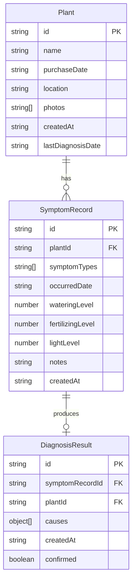

## 1. 架构设计

```mermaid
flowchart TB
    subgraph "前端层"
        "React应用" --> "植物列表模块"
        "React应用" --> "植物详情模块"
        "React应用" --> "症状记录模块"
        "React应用" --> "诊断引擎模块"
    end
    subgraph "数据层"
        "数据持久化模块" --> "localStorage"
        "主题配置模块" --> "设计令牌"
    end
    "植物列表模块" --> "数据持久化模块"
    "植物详情模块" --> "数据持久化模块"
    "症状记录模块" --> "诊断引擎模块"
    "症状记录模块" --> "数据持久化模块"
```

## 2. 技术说明

- 前端：React@18 + TypeScript + TailwindCSS + Vite
- 初始化工具：vite-init (react-ts 模板)
- 后端：无（纯前端应用）
- 数据库：localStorage（浏览器本地存储）
- 状态管理：Zustand

## 3. 路由定义

| 路由 | 用途 |
|------|------|
| / | 植物列表主页，展示所有植物健康卡片 |
| /plant/:id | 植物详情页，展示照片轮播、基本信息、诊断时间线 |
| /plant/:id/record | 症状记录页，选择症状并提交诊断 |

## 4. API定义

无后端API，所有数据通过 localStorage 持久化。数据接口定义如下：

```typescript
interface Plant {
  id: string;
  name: string;
  purchaseDate: string;
  location: '阳台' | '客厅' | '厨房' | '卧室' | '书房' | '其他';
  photos: string[];
  createdAt: string;
  lastDiagnosisDate?: string;
}

interface SymptomRecord {
  id: string;
  plantId: string;
  symptomTypes: SymptomType[];
  occurredDate: string;
  wateringLevel: number;
  fertilizingLevel: number;
  lightLevel: number;
  notes?: string;
  createdAt: string;
}

interface DiagnosisResult {
  id: string;
  symptomRecordId: string;
  plantId: string;
  causes: MatchedCause[];
  createdAt: string;
  confirmed: boolean;
}

type SymptomType = '叶片发黄' | '枯萎' | '虫害' | '霉斑' | '生长缓慢' | '烂根';

interface MatchedCause {
  name: string;
  probability: number;
  description: string;
  careMeasures: string[];
  severity: 'mild' | 'moderate' | 'severe';
}

interface DiseaseEntry {
  name: string;
  symptoms: SymptomType[];
  description: string;
  careMeasures: string[];
  severity: 'mild' | 'moderate' | 'severe';
}
```

## 5. 服务器架构图

无后端服务器。

## 6. 数据模型

### 6.1 数据模型定义



### 6.2 数据持久化策略

- 使用 localStorage 存储所有数据
- 键名规范：`plant_doctor_plants`、`plant_doctor_symptoms`、`plant_doctor_diagnoses`
- 照片使用 Base64 编码存储在 localStorage 中（演示用途）
- 数据操作封装在 `src/utils/db.ts` 中，提供增删改查接口
