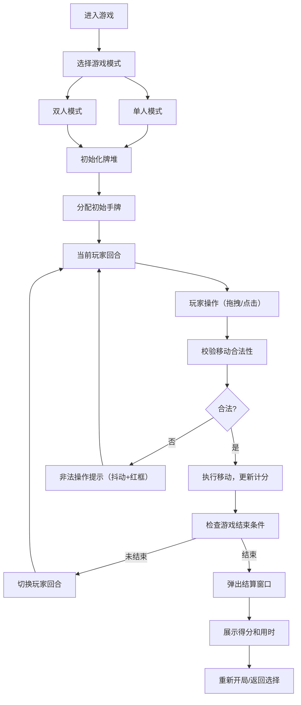

## 1. 产品概述

本项目是一个在线双人实时对战纸牌接龙（Solitaire）游戏，解决传统单人接龙缺乏实时对手、计分机制单一的问题。玩家可以体验经典克朗代克接龙规则，与另一名玩家在同一桌面对局，共享同一副牌但各自拥有独立的牌堆和回收堆。

- 目标用户：喜欢纸牌游戏的休闲玩家，追求竞技对战体验的用户
- 核心价值：将传统单人纸牌游戏升级为双人对战模式，增加竞技性和互动性
- 市场定位：轻量级网页游戏，无需下载，即开即玩

## 2. 核心功能

### 2.1 用户角色

| 角色 | 注册方式 | 核心权限 |
|------|----------|----------|
| 玩家 | 无需注册，直接进入游戏 | 进行游戏操作、查看得分、使用游戏功能按钮 |

### 2.2 功能模块

1. **模式选择页面**：单人模式/双人模式切换
2. **游戏主面板**：发牌区、七列牌堆、四个花色回收堆、状态栏
3. **纸牌组件**：拖拽交互、翻牌动画、正反面渲染
4. **游戏逻辑**：移动合法性校验、自动翻牌、计分系统
5. **对战系统**：回合制操作、独立牌堆、得分对比
6. **交互反馈**：物理动画、音效、非法操作提示

### 2.3 页面详情

| 页面名称 | 模块名称 | 功能描述 |
|-----------|-------------|---------------------|
| 模式选择页 | 模式切换 | 点击选择单人/双人模式，进入游戏 |
| 游戏主页面 | 发牌区 | 显示剩余牌数徽章，点击逐张翻牌（每次三张） |
| 游戏主页面 | 七列牌堆 | 同花色递减排列拖拽移动，自动翻牌，列顶部显示数字标签1-7 |
| 游戏主页面 | 回收堆 | 按A到K递增回收，播放纸牌落位音效，徽章闪光放大 |
| 游戏主页面 | 状态栏 | 实时显示双方分数、剩余牌数、操作步数、计时器（毫秒精度） |
| 游戏主页面 | 操作按钮 | 发牌、提示、撤回上一步、重新开局 |
| 结算弹窗 | 得分展示 | 显示双方得分（基分+连击加分）和用时 |

## 3. 核心流程

### 3.1 游戏主流程

### 3.2 操作流程

1. 玩家点击发牌区翻牌，每次翻三张
2. 拖拽纸牌到七列牌堆（同花色递减）或回收堆（同花色A到K递增）
3. 成功移动后自动计分，连续回收获得连击加分
4. 每移动一张牌到回收堆加10分，连击额外加分
5. 可使用提示功能查看可移动的牌
6. 可撤回上一步操作
7. 超时30分钟自动判定胜负

## 4. 用户界面设计

### 4.1 设计风格

- **主色调**：翠绿色（桌布背景）#0d5c33，深蓝（牌背）#1a365d，金色（按钮）#d4af37
- **辅助色**：红色（红桃/方块）#c41e3a，黑色（黑桃/梅花）#1a1a1a
- **按钮风格**：扁平金色设计，圆角8px，悬停暗金色渐变+轻微放大效果
- **字体**：标题使用 "Playfair Display" 衬线字体，正文使用 "Roboto" 无衬线字体
- **布局风格**：卡片式布局，翠绿桌布纹理背景填充整个画布
- **视觉特效**：细腻亚麻纹理卡片、深蓝斜纹牌背、阴影投影、闪光动画

### 4.2 页面设计概述

| 页面名称 | 模块名称 | UI元素 |
|-----------|-------------|-------------|
| 模式选择页 | 模式卡片 | 两张金色边框卡片，单人/双人图标，悬停放大动画 |
| 游戏主页面 | 发牌区 | 牌堆堆叠，剩余牌数圆形徽章，点击翻牌动画 |
| 游戏主页面 | 七列牌堆 | 列顶部数字标签1-7，纸牌堆叠，拖拽占位提示 |
| 游戏主页面 | 回收堆 | 四个花色槽位，回收成功徽章闪光放大 |
| 游戏主页面 | 状态栏 | 半透明深色背景，分数/剩余牌数/步数/计时器实时更新 |
| 游戏主页面 | 操作按钮 | 金色扁平按钮，等距排列，悬停动效 |
| 结算弹窗 | 弹窗内容 | 深色半透明遮罩，金色边框弹窗，双方得分对比，用时显示 |

### 4.3 响应式设计

- **设计原则**：桌面优先（Desktop-first），自适应1080p与720p分辨率
- **缩放策略**：使用CSS变量和rem单位，根据视口大小动态调整基础字号
- **断点设置**：
  - ≥1920px：1080p设计稿，1:1显示
  - 1280px-1919px：720p适配，整体缩放0.667
  - ＜1280px：最小宽度1280px，出现横向滚动条
- **触摸优化**：移动端增加触摸目标大小，支持触摸拖拽

### 4.4 动画与交互规范

- **拖拽动画**：物理跟随效果，惯性滑动，弹性回弹，使用requestAnimationFrame实现60fps
- **翻牌动画**：卡片3D翻转效果，划入新位置时褪色到清晰的opacity过渡
- **回收动画**：回收堆徽章scale放大+opacity闪光效果
- **非法操作**：卡片shake抖动动画，红色box-shadow边框闪烁
- **按钮悬停**：背景色渐变+transform: scale(1.05)放大
- **性能要求**：所有动画使用CSS transform和opacity属性，避免触发重排重绘
