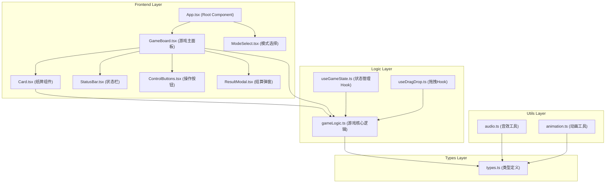
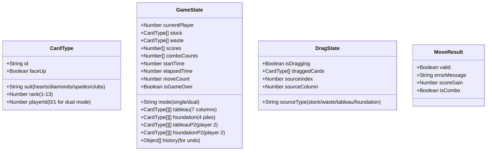

## 1. 架构设计



## 2. 技术描述

- **前端框架**：React 18 + TypeScript 5
- **构建工具**：Vite 5（含路径别名@指向src）
- **状态管理**：React Hooks (useState, useReducer) + 自定义Hook
- **拖拽实现**：原生HTML5 Drag & Drop API + 自定义拖拽Hook
- **动画方案**：CSS Animations + Transitions + requestAnimationFrame
- **音效实现**：Web Audio API（生成合成音效，无需外部资源）
- **样式方案**：CSS Modules + CSS Variables（无第三方UI库）
- **性能优化**：React.memo + useMemo + useCallback + 虚拟列表（按需）
- **依赖包**：react, react-dom, typescript, vite, @types/react, @types/react-dom, uuid

## 3. 目录结构

```
src/
├── App.tsx                 # 根组件，管理游戏状态和路由切换
├── GameBoard.tsx           # 游戏主面板组件
├── Card.tsx                # 单张纸牌组件
├── components/
│   ├── ModeSelect.tsx      # 模式选择组件
│   ├── StatusBar.tsx       # 状态栏组件
│   ├── ControlButtons.tsx  # 操作按钮组件
│   ├── ResultModal.tsx     # 结算弹窗组件
│   ├── StockPile.tsx       # 发牌区组件
│   ├── Tableau.tsx         # 七列牌堆组件
│   └── Foundation.tsx      # 回收堆组件
├── hooks/
│   ├── useGameState.ts     # 游戏状态管理Hook
│   └── useDragDrop.ts      # 拖拽逻辑Hook
├── gameLogic.ts            # 游戏核心逻辑模块
├── types/
│   └── index.ts            # 类型定义
├── utils/
│   ├── audio.ts            # 音效工具
│   └── animation.ts        # 动画工具
├── styles/
│   ├── variables.css       # CSS变量定义
│   └── animations.css      # 动画关键帧定义
├── main.tsx                # 入口文件
└── index.css               # 全局样式
```

## 4. 路由定义

| Route | Purpose |
|-------|---------|
| / | 模式选择页面 |
| /game/single | 单人游戏模式 |
| /game/dual | 双人对战模式 |

使用简单的条件渲染而非react-router，保持轻量级。

## 5. 数据模型

### 5.1 核心类型定义



### 5.2 数据结构说明

- **CardType**: 单张纸牌对象，包含唯一ID、花色、点数、正反面状态、所属玩家
- **GameState**: 完整游戏状态，包含所有牌堆、分数、时间、历史记录
- **DragState**: 拖拽过程中的临时状态
- **MoveResult**: 移动操作的校验结果

## 6. 核心API（纯函数）

### 6.1 gameLogic.ts 导出函数

| 函数名 | 参数 | 返回值 | 功能描述 |
|--------|------|--------|----------|
| `createDeck` | - | CardType[] | 创建52张标准牌堆 |
| `shuffleDeck` | CardType[] | CardType[] | Fisher-Yates洗牌算法 |
| `initGame` | mode: string | GameState | 初始化游戏状态 |
| `dealCards` | GameState | GameState | 分配初始手牌到七列牌堆 |
| `drawFromStock` | GameState, playerId | GameState | 从发牌区翻三张牌 |
| `validateMove` | cards: CardType[], target: string, targetIndex: number, gameState: GameState | MoveResult | 校验移动合法性 |
| `executeMove` | GameState, dragState, targetInfo | GameState | 执行移动并更新计分 |
| `autoFlipCard` | GameState, columnIndex, playerId | GameState | 列顶牌翻开 |
| `calculateScore` | cardsMoved: number, isCombo: boolean | number | 计算本次得分（含连击） |
| `checkWinCondition` | GameState | boolean | 检查是否获胜 |
| `undoMove` | GameState | GameState | 撤回上一步操作 |
| `findValidMoves` | GameState, playerId | MoveHint[] | 查找可移动的牌（提示功能） |

### 6.2 移动合法性校验规则

1. **七列牌堆间移动**：
   - 目标列顶部牌点数必须比移动牌底部点数大1
   - 颜色必须交替（红→黑→红）
   - 可以移动多张连续的牌

2. **移动到回收堆**：
   - 只能移动单张牌
   - 必须从A开始，依次递增
   - 必须同花色

3. **从发牌区/回收堆移动**：
   - 只能移动最顶部的牌
   - 需满足目标位置规则

## 7. 性能优化策略

### 7.1 渲染优化

- 使用 `React.memo` 包裹 Card 组件，避免不必要重渲染
- 使用 `useMemo` 缓存牌堆计算结果
- 使用 `useCallback` 缓存事件处理函数
- 拖拽时使用 CSS transform 而非 top/left，避免重排

### 7.2 动画优化

- 所有动画使用 `transform` 和 `opacity` 属性
- 启用 GPU 加速：`will-change: transform`
- 使用 `requestAnimationFrame` 实现流畅60fps拖拽
- 限制同时进行的动画数量，避免性能瓶颈

### 7.3 内存优化

- 历史记录限制最多50步，超出自动清理最旧记录
- 拖拽结束及时清理临时状态
- 音效对象复用，避免重复创建AudioContext

## 8. 构建配置

### vite.config.js

```javascript
import { defineConfig } from 'vite';
import react from '@vitejs/plugin-react';
import path from 'path';

export default defineConfig({
  plugins: [react()],
  resolve: {
    alias: {
      '@': path.resolve(__dirname, './src'),
    },
  },
  server: {
    port: 3000,
    open: true,
  },
  build: {
    target: 'es2020',
    minify: 'esbuild',
    sourcemap: false,
  },
});
```

### tsconfig.json

```json
{
  "compilerOptions": {
    "target": "ES2020",
    "useDefineForClassFields": true,
    "lib": ["ES2020", "DOM", "DOM.Iterable"],
    "module": "ESNext",
    "skipLibCheck": true,
    "moduleResolution": "bundler",
    "allowImportingTsExtensions": true,
    "resolveJsonModule": true,
    "isolatedModules": true,
    "noEmit": true,
    "jsx": "react-jsx",
    "strict": true,
    "noUnusedLocals": true,
    "noUnusedParameters": true,
    "noFallthroughCasesInSwitch": true,
    "baseUrl": "./src",
    "paths": {
      "@/*": ["*"]
    }
  },
  "include": ["src"],
  "references": [{ "path": "./tsconfig.node.json" }]
}
```

## 9. 关键技术点

### 9.1 拖拽实现

- 使用自定义 `useDragDrop` Hook 管理拖拽状态
- 支持单张和多张纸牌同时拖拽
- 拖拽时显示半透明预览，目标位置高亮
- 物理效果：拖拽跟随有延迟感，释放时有惯性回弹

### 9.2 双人对战模式

- 共享同一副牌，但各自有独立的七列牌堆和回收堆
- 回合制：当前玩家操作时，对方区域的纸牌添加 `pointer-events: none`
- 发牌区和弃牌堆共享，双方都可操作
- 游戏结束时比较双方回收堆的总得分

### 9.3 音效系统

- 使用 Web Audio API 合成音效，无需外部音频文件
- 纸牌落位：短促的正弦波 + 快速衰减
- 非法操作：低频方波 + 颤音效果
- 回收成功：上升音阶的正弦波序列
- 所有音效音量可调节，默认30%

### 9.4 计分系统

- 基础分：每张牌移到回收堆 +10分
- 连击加分：连续回收第n张额外 +(n×5)分
- 连击中断：移动到七列牌堆或对方回合时重置
- 时间惩罚：超过30分钟后每分钟扣5分
