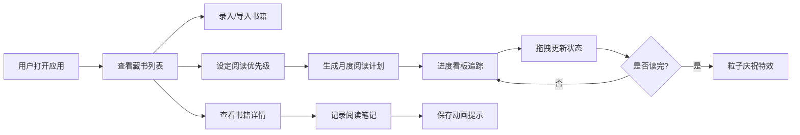

## 1. 产品概述

个人藏书管理与阅读计划推进应用，帮助用户管理家中藏书、设定阅读优先级、规划月度阅读清单，并通过看板追踪每本书的阅读状态。解决"买书如山倒，读书如抽丝"的痛点，让屯书族能够系统化地推进阅读进度。

- 目标用户：有屯书习惯、希望系统化管理阅读计划的读者
- 核心价值：将散乱的藏书转化为可执行的阅读计划，通过可视化看板推进阅读进度

## 2. 核心功能

### 2.1 功能模块

1. **藏书列表**：藏书网格展示、搜索筛选、书籍录入与批量导入
2. **阅读计划**：月度书单生成、优先级拖拽排序、手动调整
3. **进度看板**：三列看板（想读/在读/读完）、拖拽推进状态、完成庆祝效果
4. **书籍详情**：详情侧边面板、阅读笔记记录、状态切换

### 2.2 页面详情

| 页面名称 | 模块名称 | 功能描述 |
|---------|---------|---------|
| 藏书列表页 | 顶部导航栏 | Logo展示、搜索框（毛玻璃效果）、页面切换 |
| 藏书列表页 | 藏书网格 | 四列卡片布局、封面占位、优先级彩色圆点标记、悬停上浮效果 |
| 藏书列表页 | 添加书籍表单 | 手动录入书籍信息、自动联想内置图书数据库 |
| 藏书列表页 | 批量导入 | ISBN剪贴板粘贴导入、逐条验证进度条 |
| 阅读计划页 | 月度计划卡片 | 当月书单展示、日历翻页动画 |
| 阅读计划页 | 优先级排序 | 想读列表拖拽排序、优先级分数计算与显示 |
| 进度看板页 | 三列看板 | 想读/在读/读完三列、卡片拖拽移动、列高亮蓝光效果 |
| 进度看板页 | 完成特效 | 书籍移至"读完"时触发粒子庆祝特效 |
| 书籍详情面板 | 书籍信息卡 | 完整书籍信息展示 |
| 书籍详情面板 | 笔记区域 | 阅读笔记输入、保存动画提示 |
| 书籍详情面板 | 状态切换 | 快速切换阅读状态按钮 |

## 3. 核心流程

### 3.1 主要用户流程

1. 用户打开应用 → 查看藏书列表 → 搜索/筛选书籍 → 点击书籍查看详情 → 记录笔记
2. 用户录入藏书 → 手动添加/批量导入ISBN → 系统验证并添加 → 藏书列表更新
3. 用户设定阅读优先级 → 拖拽想读列表排序 → 系统自动计算优先级分数
4. 用户生成月度计划 → 系统取前5本生成当月计划 → 用户手动调整
5. 用户推进阅读进度 → 拖拽卡片在看板列间移动 → 状态更新 → 完成时庆祝特效

### 3.2 核心流程图

## 4. 用户界面设计

### 4.1 设计风格

- **整体风格**：暖色调木质质感风格，营造书房氛围
- **主色调**：胡桃木色 #5C4033（深棕色）、米白色 #F5F0E8（背景色）
- **点缀色**：高优先级红色 #E74C3C、中优先级橙色 #F39C12、低优先级灰色 #95A5A6
- **卡片风格**：圆角12px，细致内阴影模拟纸张厚度感
- **字体**：Merriweather（标题）、Noto Sans SC（正文），从Google Fonts引入
- **导航栏**：固定顶部，搜索框毛玻璃效果，输入时柔光效果
- **动效**：页面切换淡入淡出300ms，卡片悬停上浮translateY(-4px)，拖拽弹性动画

### 4.2 页面设计概览

| 页面名称 | 模块名称 | UI元素 |
|---------|---------|-------|
| 藏书列表页 | 顶部导航栏 | 胡桃木色背景、Logo（打开的书图标）、毛玻璃搜索框、页面切换标签 |
| 藏书列表页 | 藏书网格 | 四列布局、米白色卡片、内阴影、左上角彩色圆点、悬停上浮 |
| 阅读计划页 | 月度计划 | 日历翻页动画、优先级排行、拖拽排序 |
| 进度看板页 | 三列看板 | 三列等宽布局、列标题、卡片拖拽、蓝光高亮、缩放跟随效果 |
| 详情面板 | 侧边抽屉 | 右侧滑入、卡片式布局、笔记输入区、保存提示动画 |

### 4.3 响应式设计

- **桌面端**：四列网格布局、详情面板右侧滑入
- **平板及以下**：两列网格布局
- **手机端**：单列网格布局、详情面板全屏滑动抽屉
- **触控优化**：拖拽区域增大、点击目标不小于44px

### 4.4 动画与交互动效

- **页面切换**：淡入淡出过渡 300ms
- **卡片悬停**：translateY(-4px) + 阴影加深
- **拖拽效果**：卡片跟随鼠标、弹性动画、缩放效果
- **列高亮**：书籍拖入时列边框发蓝光
- **完成庆祝**：粒子特效（仅移至"读完"列时）
- **笔记保存**：底部"已保存"提示动画
- **计划生成**：日历翻页动画
