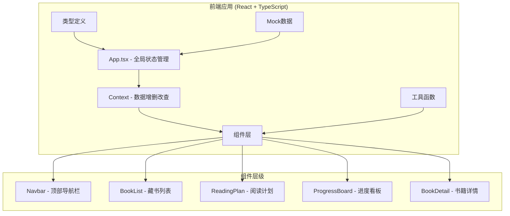
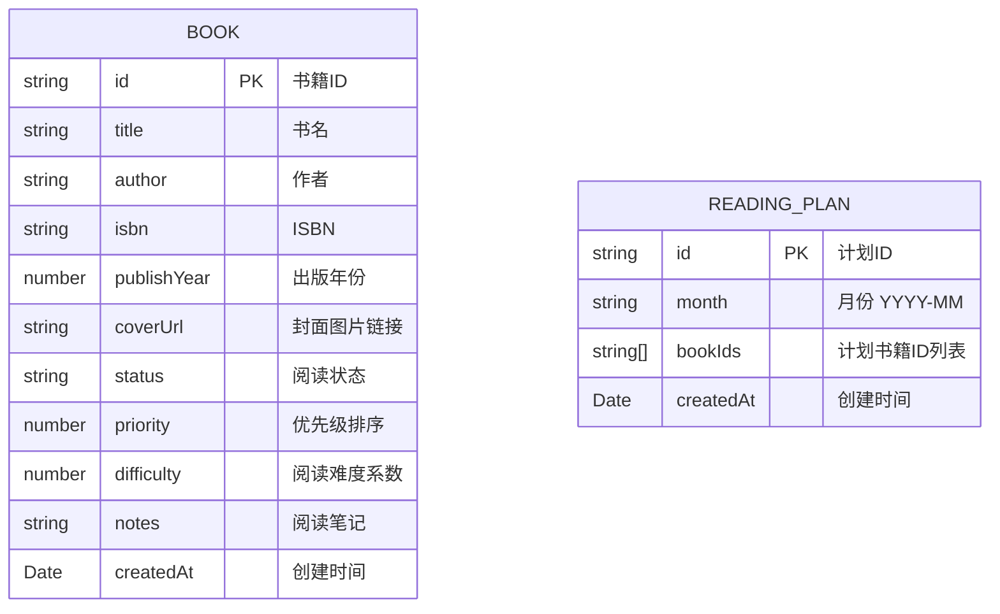

## 1. 架构设计

### 1.1 整体架构图



### 1.2 数据流向

1. **单向数据流**：App.tsx 管理全局状态 → 通过 Props/Context 传递给子组件
2. **用户操作**：子组件触发事件 → 回调更新 App 状态 → 重新渲染子组件
3. **状态管理**：使用 React useState + useContext 管理应用状态
4. **本地存储**：使用 localStorage 持久化用户数据

## 2. 技术选型

| 类别 | 技术 | 版本 | 用途 |
|------|------|------|------|
| 框架 | React | ^18.x | 前端UI框架 |
| 语言 | TypeScript | ^5.x | 类型安全 |
| 构建工具 | Vite | ^5.x | 开发与构建 |
| 拖拽库 | react-beautiful-dnd | ^13.x | 拖拽排序功能 |
| UUID | uuid | ^9.x | 生成唯一ID |
| 样式方案 | CSS Modules / 原生CSS | - | 组件样式 |
| 字体 | Google Fonts | - | Merriweather + Noto Sans SC |

## 3. 文件结构

```
src/
├── types/
│   └── index.ts          # 类型定义
├── data/
│   └── mockBooks.ts      # 内置图书数据库（50+本书）
├── utils/
│   ├── priority.ts       # 优先级计算工具
│   └── storage.ts        # 本地存储工具
├── context/
│   └── LibraryContext.tsx # 全局数据Context
├── components/
│   ├── Navbar.tsx        # 顶部导航栏
│   ├── BookList.tsx      # 藏书列表
│   ├── BookCard.tsx      # 书籍卡片组件
│   ├── BookForm.tsx      # 添加书籍表单
│   ├── BatchImport.tsx   # 批量导入组件
│   ├── ReadingPlan.tsx   # 阅读计划
│   ├── ProgressBoard.tsx # 进度看板
│   ├── BookDetail.tsx    # 书籍详情面板
│   └── Particles.tsx     # 粒子特效组件
├── hooks/
│   └── useLibrary.ts     # 自定义Hook
├── App.tsx               # 主应用组件
├── main.tsx              # 入口文件
└── index.css             # 全局样式
```

## 4. 数据模型

### 4.1 数据实体关系



### 4.2 TypeScript 类型定义

```typescript
type ReadingStatus = 'want-to-read' | 'reading' | 'finished';

interface Book {
  id: string;
  title: string;
  author: string;
  isbn?: string;
  publishYear?: number;
  coverUrl?: string;
  status: ReadingStatus;
  priority: number;
  difficulty: number;
  notes: string;
  createdAt: Date;
}

interface ReadingPlan {
  id: string;
  month: string;
  bookIds: string[];
  createdAt: Date;
}

interface LibraryState {
  books: Book[];
  plan: ReadingPlan | null;
  selectedBookId: string | null;
}
```

## 5. 核心组件说明

### 5.1 App.tsx
- 管理全局状态：books, plan, selectedBookId
- 提供增删改查方法
- 页面切换状态管理
- 数据持久化（localStorage）

### 5.2 BookList.tsx
- 接收 books 数组
- 搜索与筛选功能
- 四列网格布局
- 点击书籍触发详情面板

### 5.3 ReadingPlan.tsx
- 显示当月阅读计划
- 拖拽调整优先级
- 调用优先级计算工具

### 5.4 ProgressBoard.tsx
- 三列看板布局
- react-beautiful-dnd 拖拽
- 状态更新回调
- 完成粒子特效

### 5.5 BookDetail.tsx
- 右侧滑入面板
- 书籍完整信息
- 笔记编辑区域
- 状态切换按钮

## 6. 性能优化策略

| 优化点 | 策略 |
|--------|------|
| 列表渲染 | React.memo + 虚拟滚动（如需） |
| 拖拽性能 | 使用 transform 而非 top/left，避免重排 |
| 状态更新 | 批量更新，减少重渲染 |
| 图片加载 | 封面占位 + 懒加载 |
| 初始加载 | 组件懒加载 + Suspense |
| 动画性能 | 使用 CSS transform + opacity，保证 60fps |

## 7. 性能指标

- 拖拽帧率：≥ 50fps
- 初始加载（200本书）：≤ 800ms
- 笔记保存响应：≤ 300ms
- 页面切换过渡：300ms 淡入淡出
