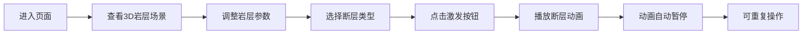

## 1. 产品概述

地质断层3D可视化演示系统，基于Web的交互式地质教学工具。通过Three.js在浏览器中展示地壳内部不同岩层在应力作用下的断裂、错动和褶皱过程，帮助学生和地质爱好者更直观地理解板块构造运动。

## 2. 核心功能

### 2.1 用户角色
| 角色 | 使用方式 | 核心权限 |
|------|----------|----------|
| 学生/地质爱好者 | 浏览器直接访问 | 查看3D场景、调整参数、播放断层动画 |

### 2.2 功能模块
1. **3D岩层可视化模块**：三层半透明岩层展示、边缘辉光效果、视角交互
2. **参数控制模块**：岩层厚度/纹理滑块、断层类型选择、激发按钮
3. **断层动画模块**：正断层/逆断层/平移断层动画、粒子特效、进度指示
4. **性能优化模块**：帧率控制、粒子回收、LOD动态优化

### 2.3 功能详情
| 模块名称 | 功能点 | 功能描述 |
|----------|--------|----------|
| 3D岩层可视化 | 三层岩层 | 棕色沉积层、灰色花岗岩层、深绿色变质岩层 |
| 3D岩层可视化 | 边缘辉光 | 旋转缩放时岩层边缘显示柔和辉光轮廓线 |
| 3D岩层可视化 | 视角交互 | 鼠标拖拽旋转、滚轮缩放 |
| 参数控制 | 滑块调节 | 每层厚度和纹理可通过滑块实时调整，带流速渐变背景和数值标签 |
| 参数控制 | 断层选择 | 下拉菜单选择正断层、逆断层、平移断层 |
| 参数控制 | 激发按钮 | 点击后触发断层错动动画 |
| 断层动画 | 正断层 | 上盘相对下降，小块岩石碎屑散落粒子效果 |
| 断层动画 | 逆断层 | 上盘隆起，裂缝处橙红色光芒闪烁 |
| 断层动画 | 平移断层 | 两侧岩层水平摩擦，横向灰色划痕纹理 |
| 断层动画 | 进度条 | 底部轻量化进度条，渐变填充和帧率数字 |
| 性能优化 | 帧率 | 至少30fps运行全部动画 |
| 性能优化 | 粒子 | 数量上限500个，超出自动回收 |
| 性能优化 | LOD | 视角拉远时降低多边形数量 |

## 3. 核心流程

用户进入页面 → 查看默认3D岩层场景 → 调整岩层参数（可选）→ 选择断层类型 → 点击激发按钮 → 观看断层错动动画 → 动画自动暂停 → 可重复操作

## 4. 用户界面设计

### 4.1 设计风格
- **主色调**：星空深蓝到墨黑的径向渐变背景
- **辅助色**：岩层色（棕色、灰色、深绿色），辉光淡蓝色
- **按钮风格**：圆角10px，微投影，深灰色到半透明毛玻璃背景，悬停时向上2px浮动+淡蓝色光晕
- **字体**：Google Fonts Inter字体，纤细白色无衬线标题
- **布局风格**：3D画布为主区域，控件浮于画布之上

### 4.2 页面设计
| 区域 | 元素 | 描述 |
|------|------|------|
| 顶部 | 标题栏 | 纤细白色无衬线字体标题 |
| 中央 | 3D画布 | Three.js渲染场景 |
| 左侧/顶部 | 控制面板 | 岩层参数滑块组 |
| 右侧/中部 | 断层控制 | 断层类型下拉、激发按钮 |
| 底部 | 进度条 | 动画进度、帧率显示 |

### 4.3 响应式
- 桌面端：3D画布全屏，控件浮于两侧
- 窄屏：3D画布缩小，控件改为垂直滚动条列
- 触屏：优化触摸交互

### 4.4 3D场景设计
- **环境**：深色星空背景，营造地下深处氛围
- **光照**：多光源设置，突出岩层层次和质感
- **相机**：透视相机，初始角度俯视30度
- **交互**：OrbitControls轨道控制
- **特效**：边缘辉光、半透明材质、粒子系统
