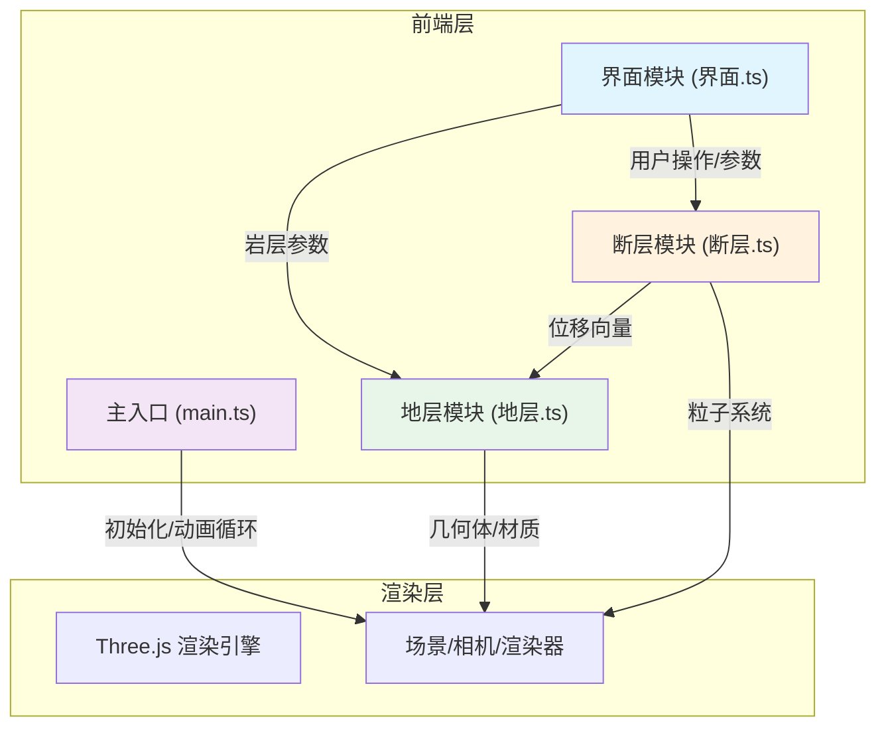

## 1. 架构设计



## 2. 技术描述
- **前端框架**：原生 TypeScript + Three.js
- **构建工具**：Vite
- **3D引擎**：three.js
- **类型定义**：@types/three
- **字体**：Google Fonts Inter

## 3. 文件结构
| 文件 | 用途 |
|------|------|
| package.json | 项目依赖与脚本 |
| index.html | 入口页面 |
| vite.config.js | Vite构建配置，含路径别名@ |
| tsconfig.json | TypeScript配置（严格模式，ESNext） |
| src/main.ts | 初始化Three.js场景、相机、渲染器，管理动画循环 |
| src/地层.ts | 岩层类，分层几何体、材质纹理、参数更新、顶点位移 |
| src/断层.ts | 断层位移算法、粒子特效、错动方向向量计算 |
| src/界面.ts | UI控件创建、事件绑定、参数分发 |

## 4. 模块数据流

### 4.1 数据流向总览
```
UI模块 → 断层模块 → 计算位移向量 → 地层模块 → 更新顶点位置
       ↘ 岩层参数 ↗
```

### 4.2 界面模块 (界面.ts)
- 输入：用户交互（滑块拖动、下拉选择、按钮点击）
- 输出：岩层参数（厚度、纹理）、断层类型、激发事件
- 职责：创建所有UI控件，绑定事件监听，参数格式化

### 4.3 断层模块 (断层.ts)
- 输入：断层类型、动画进度
- 输出：位移向量、粒子系统、特效参数
- 职责：实现不同断层类型的位移算法，管理粒子特效

### 4.4 地层模块 (地层.ts)
- 输入：岩层参数、位移向量
- 输出：岩层网格、边缘辉光
- 职责：生成分层几何体，应用材质纹理，响应参数更新，更新顶点位置

### 4.5 主入口 (main.ts)
- 职责：初始化Three.js场景、相机、渲染器，管理动画循环，协调各模块数据流动

## 5. 性能优化策略

### 5.1 帧率控制
- 目标帧率：30fps+
- 使用requestAnimationFrame
- 复杂计算分批处理

### 5.2 粒子系统
- 上限：500个粒子
- 超出自动回收（对象池模式）
- 距离裁剪：远处粒子不渲染

### 5.3 LOD优化
- 视角拉远时降低多边形数量
- 根据相机距离动态切换几何体精度

### 5.4 渲染优化
- 半透明材质排序
- 边缘辉光使用后期处理或描边Shader
- 合理设置相机远/近裁剪面
