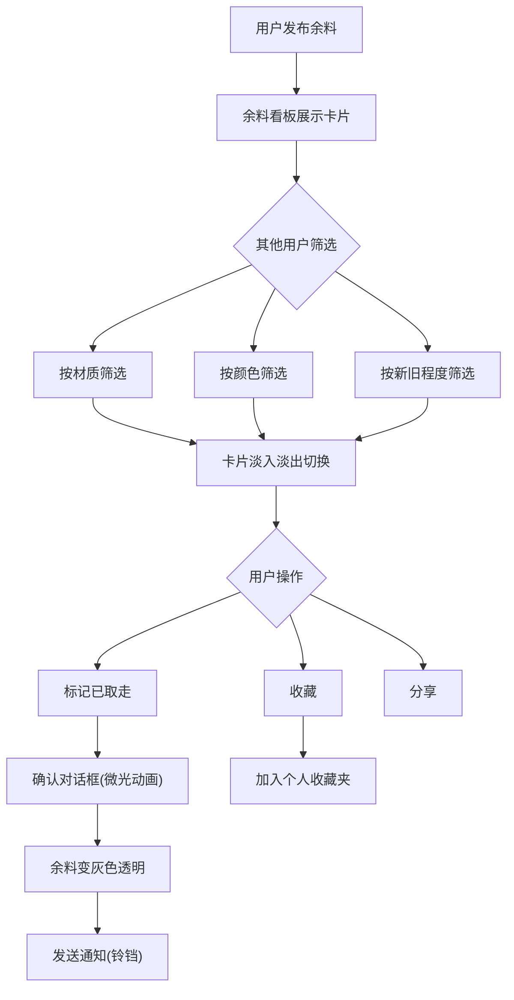

## 1. 产品概述

装修余料交换与项目灵感平台——让家庭装修后闲置的油漆桶、壁纸卷、五金件、木板等余料，通过智能匹配找到同城DIY爱好者二次利用，减少浪费、激发创意。

- 目标用户：正在装修或刚完成装修的家庭、DIY爱好者、手作达人
- 核心价值：让闲置余料找到新主人，同时为DIY项目提供灵感与材料匹配

## 2. 核心功能

### 2.1 用户角色
| 角色 | 注册方式 | 核心权限 |
|------|----------|----------|
| 普通用户 | 免注册直接使用 | 发布余料、发布项目灵感、搜索匹配、收藏与交换 |

### 2.2 功能模块
1. **余料看板页**：余料发布、搜索筛选、卡片展示、拖拽排序、交换操作
2. **项目灵感画廊页**：项目灵感发布、材料匹配度计算、高亮推荐、详情展开
3. **个人收藏夹**：收藏的余料和项目汇总侧边栏

### 2.3 页面详情
| 页面名称 | 模块名称 | 功能描述 |
|----------|----------|----------|
| 余料看板页 | 发布余料弹窗 | 上传1-3张照片（预览/裁剪），填写名称、数量、尺寸、材质、颜色（色环拾取器）、新旧程度（1-5 emoji评分） |
| 余料看板页 | 余料卡片列表 | 卡片左上角显示材质+颜色双标签，悬停浮现「标记已取走」「收藏」「分享」按钮，支持按材质/颜色/新旧程度筛选，淡入淡出过渡 |
| 余料看板页 | 筛选标签组 | 滑动式标签组，横向滑动切换动画过渡 |
| 项目灵感画廊页 | 发布项目弹窗 | 填写项目名称、所需材料清单（从余料库选择≥3个）、难度、预计工时 |
| 项目灵感画廊页 | 项目卡片列表 | 显示所需材料清单和匹配度（环形进度条），匹配度>70%金色渐变边框高亮 |
| 项目灵感画廊页 | 项目详情展开 | 展示匹配余料列表和联系人信息 |
| 全局 | 消息通知铃铛 | 页面左侧铃铛图标，数字气泡+弹跳动画，显示交换确认通知 |
| 全局 | 个人收藏夹抽屉 | 右侧滑入抽屉面板，汇总收藏的余料和项目 |
| 全局 | 导航栏 | 米白底色，滚动时从透明渐变为不透明+毛玻璃效果，768px以下变汉堡菜单 |

## 3. 核心流程

### 3.1 余料发布与搜索流程
用户点击「发布余料」→ 弹出发布表单 → 上传照片（预览/裁剪）→ 填写名称/数量/尺寸/材质/颜色/新旧程度 → 提交 → 余料在看板以卡片展示 → 其他用户按条件筛选 → 卡片淡入淡出切换

### 3.2 项目灵感匹配流程
用户点击「发布项目」→ 填写项目名称/材料清单/难度/工时 → 提交 → 系统自动计算与现有余料匹配度 → 匹配度>70%金色边框高亮 → 点击卡片展开详情 → 显示匹配余料列表

### 3.3 交换与收藏流程
用户点击余料卡片「标记已取走」→ 弹出确认对话框（微光动画）→ 确认 → 余料变灰色透明状态 → 向发布者发送通知（铃铛数字气泡+弹跳）→ 用户点击「收藏」→ 项目/余料进入个人收藏夹

## 4. 用户界面设计

### 4.1 设计风格
- 主色调：浅灰蓝（#D4E2F0）搭配原木色（#D4A574）和墨绿（#2C5F3B）
- 按钮样式：圆角（border-radius: 16px），悬停放大1.05倍+0.3s立方贝塞尔缓动，点击弹跳反馈
- 字体：标题使用 Playfair Display，正文使用 Noto Sans SC
- 布局风格：圆角卡片设计，24px间隙，轻微阴影（box-shadow: 0 4px 12px rgba(0,0,0,0.08)）
- 导航栏：米白底色（#F5F0E8），深灰文字（#333），滚动毛玻璃效果（backdrop-filter: blur(8px)）

### 4.2 页面设计概览
| 页面名称 | 模块名称 | UI元素 |
|----------|----------|--------|
| 余料看板页 | 卡片网格 | 四列圆角卡片，左上角双标签（材质+颜色色块），悬停浮现操作按钮，淡入淡出过渡 |
| 余料看板页 | 筛选标签组 | 横向滑动标签，切换动画，色环拾取器弹窗 |
| 余料看板页 | 发布弹窗 | 照片上传区（预览+裁剪），表单字段，emoji新旧评分，色环拾取器 |
| 项目灵感画廊页 | 项目卡片 | 环形匹配度进度条，金色渐变边框（>70%），材料清单标签 |
| 项目灵感画廊页 | 详情展开 | 展开动画，匹配余料列表，联系人信息卡片 |
| 全局 | 导航栏 | 固定顶部，毛玻璃效果，铃铛图标+数字气泡，汉堡菜单(移动端) |
| 全局 | 收藏夹抽屉 | 右侧滑入面板，分类展示余料和项目 |
| 全局 | 确认对话框 | 居中弹窗，微光边框动画，确认/取消按钮 |

### 4.3 响应式设计
- 桌面优先设计，768px以下断点适配
- 768px以下：卡片从四列变两列，导航变汉堡菜单，色环拾取器变全屏弹窗
- 触摸优化：按钮增大点击区域，滑动操作支持

### 4.4 动效规范
- 卡片筛选：淡入淡出过渡（opacity + transform），响应时间≤150ms
- 标签切换：横向滑动动画
- 按钮悬停：scale(1.05)，cubic-bezier缓动，0.3s
- 按钮点击：微小弹跳反馈
- 铃铛通知：数字气泡出现+弹跳动画
- 确认对话框：微光效果边框动画
- 收藏夹：右侧滑入过渡
- 导航栏：透明→不透明渐变+毛玻璃
