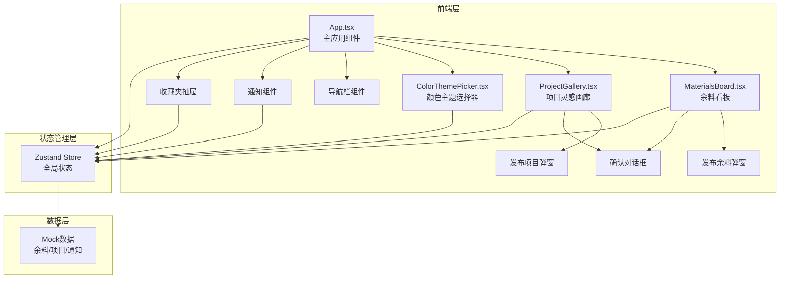
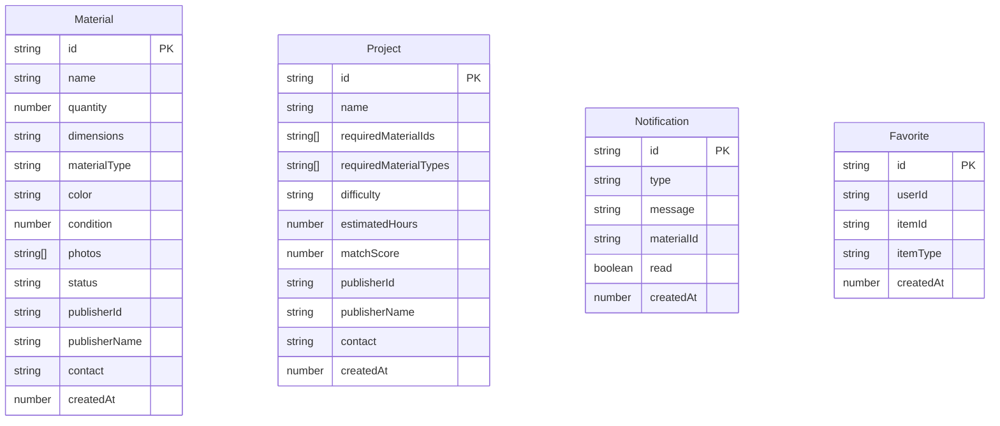

## 1. 架构设计



## 2. 技术说明
- 前端：React@18 + TypeScript + TailwindCSS@3 + Vite
- 初始化工具：vite-init（react-ts模板）
- 后端：无（纯前端，使用Mock数据）
- 数据库：无（使用内存状态 + Mock数据）
- 状态管理：Zustand
- 额外依赖：react-colorful（色环拾取器）、uuid（唯一ID生成）、lucide-react（图标）

## 3. 路由定义
| 路由 | 用途 |
|------|------|
| / | 主页面，包含余料看板和项目灵感画廊（Tab切换） |

## 4. 数据模型

### 4.1 数据模型定义



### 4.2 文件调用关系与数据流向

```
index.html
  └── src/main.tsx → App.tsx (主应用组件)
        ├── Zustand Store (全局状态管理)
        │     ├── materials: Material[] (余料列表)
        │     ├── projects: Project[] (项目列表)
        │     ├── notifications: Notification[] (通知列表)
        │     ├── favorites: Favorite[] (收藏列表)
        │     └── filters: FilterState (筛选条件)
        │
        ├── MaterialsBoard.tsx (余料看板)
        │     ├── 接收: filters, materials
        │     ├── 输出: 标记已取走/收藏/分享操作 → Store
        │     └── 包含: MaterialCard, PublishMaterialModal, ConfirmDialog
        │
        ├── ProjectGallery.tsx (项目灵感画廊)
        │     ├── 接收: projects, materials (用于匹配计算)
        │     ├── 输出: 项目点击详情/收藏操作 → Store
        │     └── 包含: ProjectCard, PublishProjectModal, ProjectDetail
        │
        ├── ColorThemePicker.tsx (颜色主题选择器)
        │     ├── 接收: 无 (独立运行)
        │     ├── 输出: 颜色变化 → App.updateColorFilter → Store
        │     └── 包含: react-colorful ColorPicker
        │
        ├── NavBar.tsx (导航栏)
        │     ├── 接收: notifications
        │     └── 输出: Tab切换/收藏夹开关
        │
        ├── NotificationBell.tsx (消息铃铛)
        │     └── 接收: notifications
        │
        └── FavoritesDrawer.tsx (收藏夹抽屉)
              └── 接收: favorites, materials, projects
```

数据流向：
1. **余料发布**：用户操作 → PublishMaterialModal → Store.addMaterial → MaterialsBoard刷新
2. **颜色筛选**：ColorThemePicker变化 → App.updateColorFilter → Store.filters更新 → MaterialsBoard重新过滤
3. **标记已取走**：用户点击 → ConfirmDialog确认 → Store.updateMaterialStatus → 卡片变灰色 + Store.addNotification → NotificationBell更新
4. **项目匹配**：用户发布项目 → Store.addProject → 自动计算matchScore → ProjectGallery刷新高亮
5. **收藏操作**：用户点击 → Store.addFavorite → FavoritesDrawer刷新
