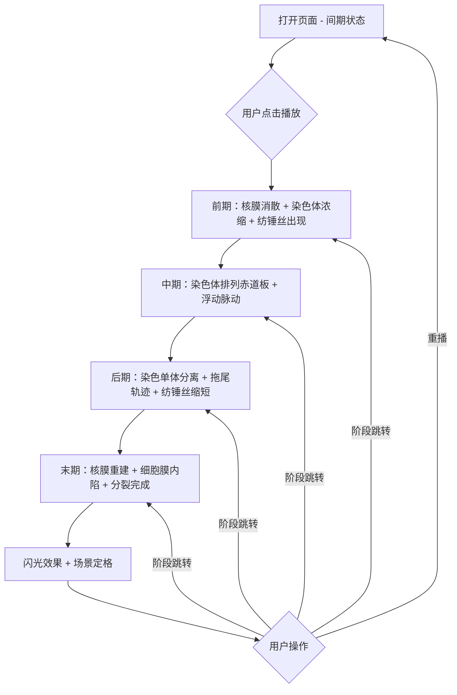

## 1. 产品概述

细胞有丝分裂3D可视化演示是一款面向中学生物教学的交互式Web应用，通过Three.js构建的三维场景动态展示细胞从间期到分裂末期的完整有丝分裂过程，解决课本插图呆板、分裂过程难以直观理解的教学痛点。

- 目标用户：中学生物教师与学生
- 核心价值：将抽象的细胞分裂微观过程转化为可交互、可旋转、可缩放的三维动态演示

## 2. 核心功能

### 2.1 功能模块

1. **3D场景页面**：半透明球体细胞模型、间期默认状态、旋转缩放交互、阶段动态动画
2. **控制面板**：播放/暂停、阶段跳转、重置视角
3. **信息面板**：阶段名称、持续时间、关键事件描述、进度条
4. **缩略小地图**：阶段缩略图导航

### 2.2 页面详情

| 页面名称 | 模块名称 | 功能描述 |
|---------|---------|---------|
| 3D场景页面 | 细胞模型 | 半透明球体细胞膜（浅蓝色流动纹理）、深紫色扁椭圆形细胞核、亮红色和绿色蝌蚪状染色体 |
| 3D场景页面 | 前期动画 | 核膜粒子碎片飞散、染色体浓缩变粗呈X形、纺锤丝从两极出现并与染色体相连、涟漪状光晕 |
| 3D场景页面 | 中期动画 | 染色体排列在赤道板（黄色半透明圆环标记）、纺锤丝连接着丝点、染色体上下浮动脉动 |
| 3D场景页面 | 后期动画 | 姐妹染色单体分离向两极移动、淡蓝色拖尾轨迹、纺锤丝缩短抖动 |
| 3D场景页面 | 末期动画 | 染色体到达两极重建核膜（粒子扩散）、细胞膜内陷形成环沟、分裂成两个子细胞、闪光效果定格 |
| 控制面板 | 播放/暂停 | 圆角药丸形按钮、半透明毛玻璃材质、悬停渐变紫蓝色微动效、点击弹性缩放0.95→1.05→1.0 |
| 控制面板 | 阶段跳转 | 前期/中期/后期/末期四个跳转按钮 |
| 控制面板 | 重置视角 | 恢复相机初始位置 |
| 信息面板 | 阶段信息 | 淡入向上滑动显示阶段名称、持续时间（秒）、关键事件描述，底部进度条 |
| 缩略小地图 | 阶段导航 | 底部右侧缩略图，当前阶段高亮 |

## 3. 核心流程

用户打开页面后看到间期状态的3D细胞模型，可自由旋转缩放观察。点击播放按钮后，系统按间期→前期（5秒）→中期→后期→末期顺序自动播放各阶段动画。每个阶段切换时信息面板更新显示当前阶段信息。用户可随时暂停、跳转到特定阶段或重置视角。末期分裂完成后场景定格。

## 4. 用户界面设计

### 4.1 设计风格

- 主色调：深空蓝黑背景（#0a0e27）搭配柔和渐变光晕
- 辅助色：浅蓝色半透明（细胞膜）、深紫色（细胞核）、亮红色和绿色（染色体）、浅黄色（纺锤丝）、淡蓝色（拖尾轨迹）
- 按钮风格：圆角药丸形、半透明毛玻璃材质、悬停渐变紫蓝色微动效、点击弹性缩放反馈
- 字体：圆润无衬线体（中文使用系统圆体，英文使用Nunito或Quicksand）
- 布局：3D场景全屏，右侧悬浮控制面板，左侧悬浮信息面板，底部右侧缩略小地图

### 4.2 页面设计概览

| 页面名称 | 模块名称 | UI元素 |
|---------|---------|--------|
| 3D场景页面 | 背景 | 深空蓝黑渐变背景 + 柔和径向光晕 |
| 3D场景页面 | 细胞膜 | 浅蓝色半透明球体，微微发光流动纹理，表面环境光高光反射 |
| 3D场景页面 | 细胞核 | 深紫色扁椭球体，间期可见 |
| 3D场景页面 | 染色体 | 亮红色和绿色蝌蚪状→X形结构 |
| 3D场景页面 | 纺锤丝 | 浅黄色细线从两极到着丝点 |
| 3D场景页面 | 赤道板 | 黄色半透明圆环 |
| 3D场景页面 | 控制面板 | 右侧悬浮，药丸形毛玻璃按钮 |
| 3D场景页面 | 信息面板 | 左侧悬浮，淡入上滑动画，进度条 |
| 3D场景页面 | 缩略小地图 | 底部右侧，5个阶段缩略图 |

### 4.3 响应式

- 桌面端优先设计（≥1024px）
- 1024px以下宽度时信息面板自动折叠为可展开抽屉
- 控制面板和缩略小地图在小屏幕上缩小但保持可用
- 3D场景始终全屏铺满

### 4.4 3D场景指导

- **环境/氛围**：深空蓝黑背景，径向渐变光晕营造微观世界氛围
- **光照设置**：环境光（低强度冷色调）+ 点光源（两极位置暖色调）+ 半球光（模拟散射）
- **相机设置**：透视相机，FOV 45°，初始距离使细胞占视口60%，OrbitControls支持旋转缩放
- **构图与焦点**：细胞居中，膜/核/染色体为视觉焦点
- **交互与动画**：OrbitControls鼠标拖拽旋转、滚轮缩放；各阶段动画5秒左右
- **后期处理**：可选辉光效果（UnrealBloomPass）增强发光质感
- **性能预算**：60fps流畅运行，模型面数≤10万，粒子数≤2000

## 5. 性能约束

- 60fps目标帧率
- 模型总面数控制在10万以内
- 粒子数量不超过2000个
- 使用BufferGeometry和Points优化粒子渲染
- 合理使用对象池和dispose方法管理内存
