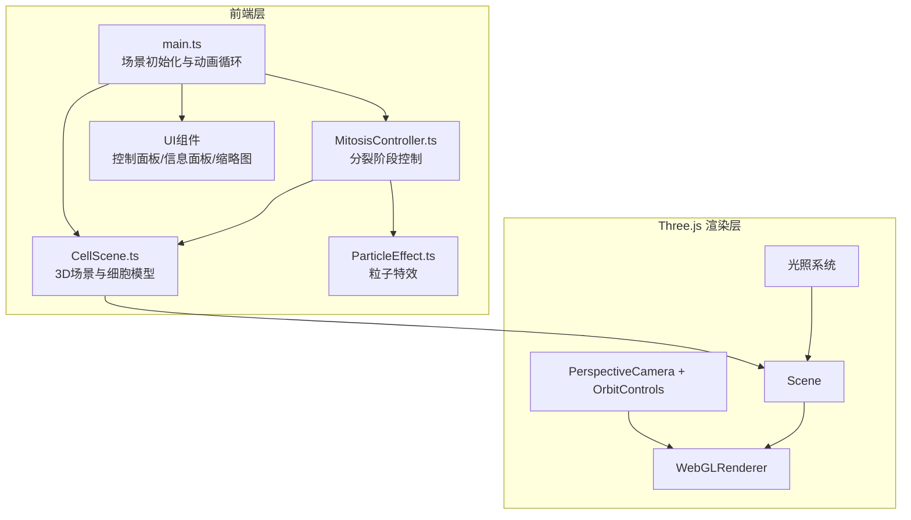

## 1. 架构设计



## 2. 技术说明

- 前端框架：原生 TypeScript + Three.js（不使用React，因3D场景为主，原生TS更适合精细控制）
- 构建工具：Vite
- 3D引擎：Three.js + @types/three
- 包管理：npm
- 无后端服务、无数据库

## 3. 文件结构

```
├── package.json
├── index.html
├── vite.config.js
├── tsconfig.json
└── src/
    ├── main.ts              # 入口：初始化场景、相机、渲染器，组装模块，启动动画循环
    ├── CellScene.ts          # 3D场景管理：光照、环境、背景、细胞膜/核几何体、更新方法
    ├── MitosisController.ts  # 分裂阶段控制：阶段切换逻辑、持续时间、过渡动画、UI指令驱动
    └── ParticleEffect.ts     # 粒子特效：核膜消散碎片、闪光效果，BufferGeometry+Points
```

## 4. 核心模块设计

### 4.1 main.ts

- 创建WebGLRenderer（antialias, alpha）
- 创建PerspectiveCamera（FOV 45, 细胞占视口60%）
- 创建OrbitControls（鼠标旋转、缩放、阻尼）
- 实例化CellScene、MitosisController
- 组装场景层级
- requestAnimationFrame动画循环
- 监听resize事件

### 4.2 CellScene.ts

- 管理场景全局状态（光照、环境、背景）
- 创建细胞膜：SphereGeometry + MeshPhysicalMaterial（半透明、流动纹理通过shader实现）
- 创建细胞核：SphereGeometry（scaleY压扁）+ MeshStandardMaterial（深紫色）
- 创建染色体：自定义几何体（蝌蚪状→X形）
- 创建纺锤丝：CylinderGeometry / Line
- 创建赤道板标记：TorusGeometry + MeshBasicMaterial（黄色半透明）
- 提供update(deltaTime, phase)方法根据阶段更新各结构

### 4.3 MitosisController.ts

- 定义阶段枚举：Interphase → Prophase → Metaphase → Anaphase → Telophase
- 管理每个阶段的持续时间（前期5秒，中期4秒，后期4秒，末期5秒）
- 控制阶段切换过渡动画
- 接收UI指令（play/pause/jumpTo/reset）
- 驱动CellScene和ParticleEffect更新

### 4.4 ParticleEffect.ts

- 使用BufferGeometry + Points管理粒子
- 核膜消散效果：粒子从核膜位置向外飞散
- 末期核膜重建效果：粒子从点向外扩散
- 闪光效果：短暂全屏辉光
- 提供init()、update(deltaTime)、dispose()方法
- 粒子数量限制2000以内

## 5. 关键技术决策

| 决策项 | 选择 | 原因 |
|-------|------|------|
| 前端框架 | 原生TypeScript | 3D场景需要精细控制，避免React重渲染开销 |
| 细胞膜材质 | MeshPhysicalMaterial + 自定义Shader | 需要半透明、流动纹理、高光反射 |
| 粒子系统 | BufferGeometry + Points | 性能最优，满足2000粒子限制 |
| 相机控制 | OrbitControls | Three.js内置，支持旋转缩放阻尼 |
| 动画系统 | 基于时间的线性插值 | 精确控制各阶段动画进度 |
| 染色体建模 | 程序化生成几何体 | 蝌蚪状→X形需要形变动画 |
| 细胞分裂 | 形变动画 + 实例化 | 末期细胞膜内陷用morph target或shader实现 |
