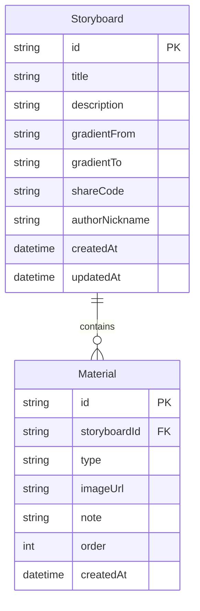

## 1. 架构设计

```mermaid
flowchart TD
    "前端层" --> "路由管理"
    "前端层" --> "全局状态(Zustand)"
    "前端层" --> "UI组件"
    "UI组件" --> "StoryboardList"
    "UI组件" --> "StoryboardDetail"
    "UI组件" --> "TimelineView"
    "UI组件" --> "MaterialCard"
    "全局状态(Zustand)" --> "故事板数据"
    "全局状态(Zustand)" --> "素材数据"
    "前端层" --> "工具函数(helpers)"
    "工具函数(helpers)" --> "随机短码生成"
    "工具函数(helpers)" --> "日期格式化"
    "工具函数(helpers)" --> "导出长图"
```

## 2. 技术说明

- 前端：React 18 + TypeScript + Vite + Tailwind CSS
- 初始化工具：vite-init（react-ts模板）
- 状态管理：Zustand
- 路由：react-router-dom
- 拖拽：react-beautiful-dnd
- 导出截图：html2canvas
- 工具库：uuid（唯一ID）、date-fns（日期处理）
- 后端：无（纯前端，数据存储在localStorage）
- 数据库：无（使用localStorage持久化）

## 3. 路由定义

| 路由 | 用途 |
|------|------|
| / | 故事板列表页，展示所有故事板封面网格 |
| /storyboard/:id | 故事板详情页，素材管理、时间轴、导出 |
| /share/:code | 分享查看页，只读模式 |

## 4. 数据模型

### 4.1 数据模型定义



### 4.2 数据结构定义

```typescript
interface Storyboard {
  id: string;
  title: string;
  description: string;
  gradientFrom: string;
  gradientTo: string;
  shareCode: string;
  authorNickname: string;
  createdAt: string;
  updatedAt: string;
}

interface Material {
  id: string;
  storyboardId: string;
  type: 'upload' | 'url';
  imageUrl: string;
  note: string;
  order: number;
  createdAt: string;
}
```

## 5. 文件组织

```
src/
  App.tsx                          # 根组件，路由与全局状态
  main.tsx                         # 入口文件
  index.css                        # 全局样式与Tailwind
  modules/
    storyboard/
      StoryboardList.tsx           # 故事板列表页
      StoryboardDetail.tsx         # 故事板详情页
      components/
        MaterialCard.tsx           # 素材卡片组件
    timeline/
      TimelineView.tsx             # 时间轴组件
  utils/
    helpers.ts                     # 工具函数
  store/
    useStoryboardStore.ts          # Zustand状态管理
```
