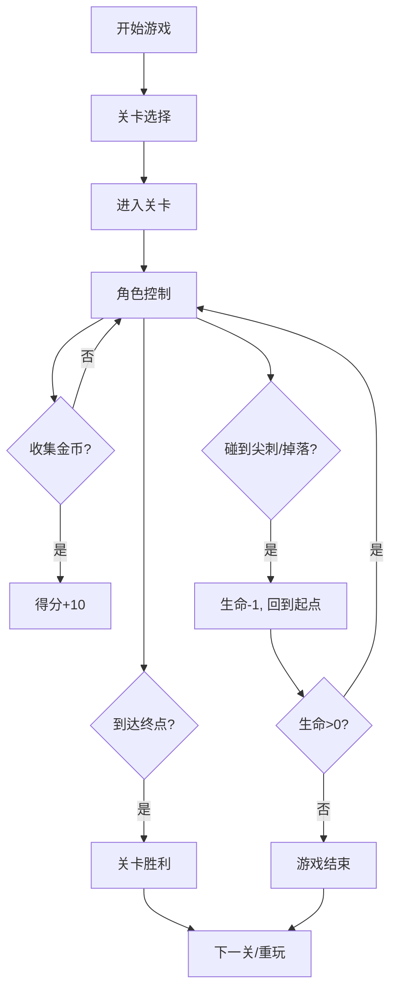

## 1. 产品概述

本项目是一款基于重力模拟的2D平台跳跃小游戏，玩家控制方块角色在多层级平台间移动，收集金币并躲避障碍物到达终点。游戏采用像素复古风格，提供3个递增难度的关卡以及关卡编辑器功能。

- 核心玩法：重力物理模拟 + 平台跳跃 + 金币收集 + 障碍躲避
- 目标用户：休闲游戏玩家、游戏爱好者
- 产品价值：提供有趣的平台跳跃游戏体验，支持自定义关卡编辑

## 2. 核心功能

### 2.1 功能模块

1. **游戏主界面**：Canvas游戏画布、得分显示、生命值显示
2. **关卡系统**：3个预设关卡、关卡选择、关卡进度
3. **物理引擎**：重力模拟、跳跃控制、碰撞检测、平台交互
4. **收集与障碍**：金币收集系统、尖刺障碍物、终点旗帜
5. **生命值系统**：3条初始生命、死亡重生、游戏结束判定
6. **关卡编辑器**：拖拽放置元素、保存/加载自定义关卡、localStorage存储

### 2.2 页面详情

| 页面名称 | 模块名称 | 功能描述 |
|-----------|-------------|---------------------|
| 游戏主界面 | Canvas画布 | 800x400px游戏区域，渲染角色、平台、金币、尖刺、终点 |
| 游戏主界面 | UI信息区 | 左上角得分显示、右上角生命显示（红色心形） |
| 游戏主界面 | 关卡选择 | 关卡选择按钮，切换不同难度关卡 |
| 游戏主界面 | 结束弹窗 | 胜利/失败弹窗，显示最终得分与重玩按钮 |
| 关卡编辑器 | 编辑画布 | 拖拽放置平台、金币、尖刺、终点旗帜 |
| 关卡编辑器 | 工具栏 | 元素选择工具、保存/加载按钮 |

## 3. 核心流程

### 3.1 游戏流程

玩家进入游戏 → 选择关卡 → 控制角色移动跳跃 → 收集金币躲避尖刺 → 到达终点或生命耗尽 → 显示结果 → 重玩或选择下一关

### 3.2 编辑器流程

进入编辑器模式 → 选择元素类型 → 拖拽放置到画布 → 调整位置 → 保存到localStorage → 加载自定义关卡游玩

### 3.3 流程图

## 4. 用户界面设计

### 4.1 设计风格

- **整体风格**：像素复古游戏风格
- **主背景色**：深蓝色 #1a1a2e
- **平台颜色**：浅灰色 #e0e0e0，1px黑色边框，圆角
- **角色颜色**：亮橙色 #ff6b35，跳跃时有发光效果
- **金币颜色**：金色渐变 #ffd700 到 #ffaa00，上下浮动动画
- **尖刺颜色**：红色 #e74c3c，尖端闪烁
- **终点旗帜**：绿色 #2ecc71，飘动动画
- **字体**：Press Start 2P 像素风格字体

### 4.2 页面设计概述

| 页面名称 | 模块名称 | UI元素 |
|-----------|-------------|-------------|
| 游戏主界面 | Canvas画布 | 深蓝色背景、像素风格元素、动画效果 |
| 游戏主界面 | 得分显示 | 左上角白色像素字体文字 |
| 游戏主界面 | 生命显示 | 右上角红色心形图标 |
| 游戏主界面 | 弹窗 | 半透明遮罩、白色圆角卡片、绿色按钮 |
| 关卡编辑器 | 工具栏 | 像素风格按钮、元素图标 |

### 4.3 响应式

- 桌面端：游戏画布800x400px，居中显示
- 屏幕小于900px时：游戏画布自动等比例缩放
- 支持键盘操作（A/D移动，空格跳跃）

### 4.4 动画效果

- 金币：上下浮动、收集时大小缩放动画
- 尖刺：尖端闪烁效果
- 终点旗帜：飘动动画
- 角色：跳跃时发光效果
- 胜利文字：闪烁动画
- 按钮：悬停效果

## 5. 性能要求

- 目标帧率：60FPS
- 驱动方式：requestAnimationFrame
- 物理更新与渲染帧同步
- 无卡顿、不掉帧
