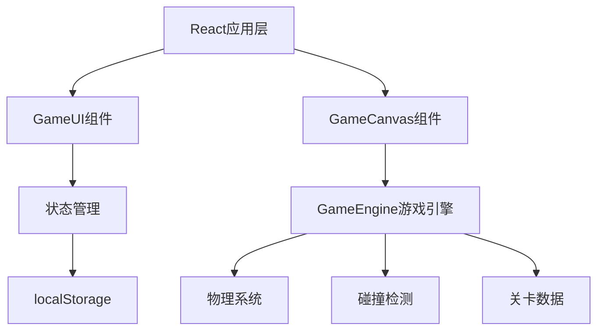

## 1. 架构设计



## 2. 技术描述

- **前端框架**：React 18 + TypeScript
- **构建工具**：Vite
- **渲染方式**：HTML5 Canvas
- **状态管理**：React useState/useReducer
- **数据持久化**：localStorage
- **字体**：Google Fonts - Press Start 2P

### 依赖包
- react
- react-dom
- typescript
- vite
- @types/react
- @types/react-dom

## 3. 文件结构

```
project/
├── package.json
├── index.html
├── vite.config.js
├── tsconfig.json
└── src/
    ├── main.tsx
    ├── App.tsx
    ├── gameEngine.ts
    ├── types.ts
    ├── levels.ts
    └── components/
        ├── GameCanvas.tsx
        └── GameUI.tsx
```

## 4. 核心模块说明

### 4.1 gameEngine.ts - 游戏引擎

负责游戏核心逻辑：
- 物理模拟：重力加速度、跳跃、速度计算
- 碰撞检测：角色与平台、金币、尖刺、终点的碰撞
- 游戏状态管理：得分、生命值、关卡状态
- 游戏循环：requestAnimationFrame驱动

### 4.2 GameCanvas.tsx - 画布组件

负责渲染和输入：
- Canvas画布渲染
- 键盘事件处理
- 动画帧绘制
- 元素绘制（角色、平台、金币、尖刺、终点）

### 4.3 GameUI.tsx - UI组件

负责界面交互：
- 得分显示
- 生命值显示
- 关卡选择按钮
- 胜利/失败弹窗
- 编辑器模式切换

### 4.4 levels.ts - 关卡数据

预设关卡数据：
- 3个递增难度的关卡
- 平台位置、金币位置、尖刺位置、终点位置
- 角色起始位置

## 5. 数据模型

### 5.1 游戏状态类型

```typescript
interface GameState {
  player: Player;
  platforms: Platform[];
  coins: Coin[];
  spikes: Spike[];
  goal: Goal;
  score: number;
  lives: number;
  level: number;
  gameStatus: 'playing' | 'won' | 'lost';
}
```

### 5.2 元素类型

```typescript
interface Player {
  x: number;
  y: number;
  width: number;
  height: number;
  vx: number;
  vy: number;
  isGrounded: boolean;
}

interface Platform {
  x: number;
  y: number;
  width: number;
  height: number;
}

interface Coin {
  x: number;
  y: number;
  radius: number;
  collected: boolean;
  animationFrame: number;
}

interface Spike {
  x: number;
  y: number;
  width: number;
  height: number;
}

interface Goal {
  x: number;
  y: number;
  width: number;
  height: number;
}
```

## 6. 物理引擎参数

- 重力加速度：g = 0.5
- 跳跃初速度：v = 8（向上）
- 移动速度：speed = 5
- 无惯性滑行（按键停止立刻停止移动）
- 只能在地面/平台上跳跃（无二段跳）

## 7. 性能优化

- 使用requestAnimationFrame驱动游戏循环
- 物理更新与渲染帧同步
- Canvas分层渲染（静态元素与动态元素分离）
- 对象池管理（可选，用于金币等可复用元素）
- 避免在游戏循环中创建新对象
