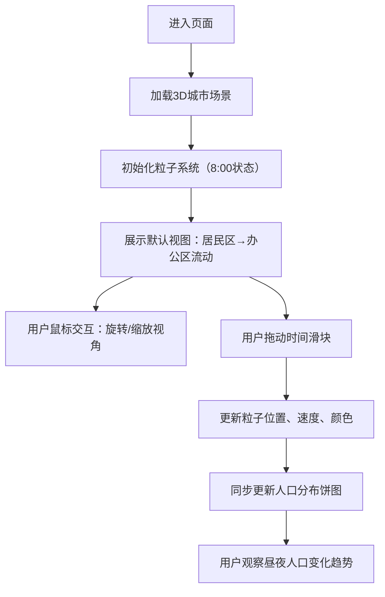

## 1. 产品概述

城市热力图与实时人口流动3D可视化系统，将城市地图数据叠加在三维地形上，通过动态粒子系统直观展示人群在不同区域的聚集与移动趋势，服务于城市规划者和数据爱好者进行城市昼夜人口变化分析。

- 核心目标：提供沉浸式的城市人口流动可视化体验，帮助用户理解城市空间使用的时间模式
- 目标用户：城市规划师、数据分析师、智慧城市研究者、数据可视化爱好者

## 2. 核心特性

### 2.1 用户角色
| 角色 | 注册方式 | 核心权限 |
|------|---------|---------|
| 访客用户 | 无需注册 | 浏览3D场景、拖动时间滑块、查看人口分布数据 |

### 2.2 功能模块
1. **3D城市场景模块**：曼哈顿下城区三维地形模型、建筑体块渲染、地面纹理、轨道相机控制
2. **粒子系统模块**：800+粒子模拟人群流动、颜色随速度变化、轨迹拖影效果
3. **时间控制模块**：24小时时间滑块、实时钟表显示、粒子状态随时间联动
4. **数据可视化模块**：人口分布环形饼图、四类区域占比（商业/办公/住宅/其他）、数字动画

### 2.3 页面详情
| 页面名称 | 模块名称 | 功能描述 |
|---------|---------|---------|
| 主页面 | 3D城市场景 | 渲染曼哈顿下城区建筑、街道、公园，支持鼠标旋转缩放，建筑边缘发光线框 |
| 主页面 | 粒子流动系统 | 800个粒子模拟人群昼夜迁移，颜色随速度变化（暖黄→亮白→浅蓝），带拖影轨迹 |
| 主页面 | 时间控制面板 | 24小时滑块控制模拟时间，带钟表图标，拖动时粒子密度连续变化 |
| 主页面 | 人口分布饼图 | 环形饼图显示商业/办公/住宅/其他四类区域人口占比，数字动画跳动 |
| 主页面 | 操作提示 | 10px等宽字体显示鼠标操作说明 |

## 3. 核心流程

用户进入页面后，默认以早上8:00时间点展示场景，可自由旋转缩放视角观察城市布局。用户拖动底部时间滑块，观察粒子从居民区流向办公区（上午）、聚集商业区（中午）、返回居民区（傍晚）的完整流动过程，同时查看右侧饼图实时更新的人口分布占比。

## 4. 用户界面设计

### 4.1 设计风格
- **主色调**：深灰背景 #2a2a3a
- **点缀色**：荧光橙 #ff7f3f、冰蓝 #4ac7ff
- **建筑配色**：冷灰白色调，边缘微发光
- **粒子配色**：低速暖黄、中速亮白、高速浅蓝
- **按钮/控件**：微圆角无边框毛玻璃设计（backdrop-filter: blur(12px)）
- **交互反馈**：按钮点击水波纹扩散效果
- **字体**：Inter 主字体、SF Mono 等宽字体用于提示文字
- **整体风格**：科技感、冷色调、克制不刺眼

### 4.2 页面设计概览
| 页面名称 | 模块名称 | UI元素 |
|---------|---------|--------|
| 主页面 | 3D场景容器 | 全屏渲染、冷灰雾效、环境光+方向光 |
| 主页面 | 时间滑块（底部） | 24h刻度、钟表图标、毛玻璃背景、橙色进度条 |
| 主页面 | 人口分布饼图（右下） | 环形结构、四类色块、数字动画跳动、毛玻璃面板 |
| 主页面 | 操作提示（左下） | 10px SF Mono、半透明文字、白色/冰蓝 |
| 主页面 | 标题（左上） | 项目名称、荧光橙点缀、毛玻璃卡片 |

### 4.3 响应式设计
- 桌面端：完整侧边控制面板 + 3D场景
- 平板竖屏：控制面板压缩，保留核心控件
- 手机横屏：自动隐藏侧边控制面板，仅保留3D场景和底部时间滑块
- 手机竖屏：提示用户横屏获得最佳体验

### 4.4 3D场景指导
- **环境与氛围**：冷灰色雾效（Fog），营造科技冷峻感，背景色 #1a1a2a
- **光照设置**：环境光（AmbientLight 0.4）+ 方向光（DirectionalLight 0.8，带微弱阴影）+ 半球光（HemisphereLight）模拟天光
- **相机设置**：PerspectiveCamera，初始位置俯视45°，OrbitControls 启用阻尼、禁用平移
- **构图与焦点**：曼哈顿下城区建筑群居中，相机环绕观察，粒子流动为视觉焦点
- **交互与动画**：建筑边缘 EdgesGeometry 微发光线框（跟随视角变化），粒子带 Trails 拖影
- **后期处理**：Bloom 泛光效果（轻微）增强发光元素，色调映射 ACESFilmic
- **资产来源**：程序化生成曼哈顿下城区建筑体块（简化几何），地面用 Canvas 纹理区分街道与公园
- **性能预算**：粒子 ≥ 800个，帧率 ≥ 30fps，滑块拖动零卡顿
