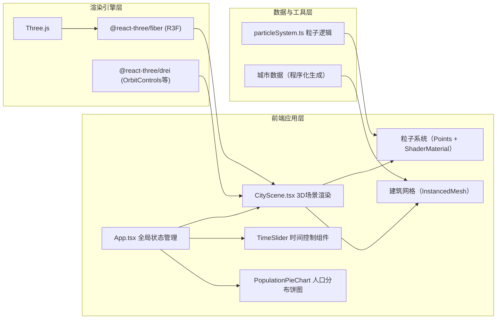

## 1. 架构设计



## 2. 技术描述

- **前端框架**：React 18 + TypeScript（严格模式）
- **构建工具**：Vite 5，配置路径别名 `@` → `src`
- **3D渲染引擎**：Three.js r160
- **React Three 绑定**：@react-three/fiber 8.x、@react-three/drei 9.x
- **状态管理**：React useState/useRef（轻量级场景，无需额外状态库）
- **后端**：无，纯前端数据可视化应用
- **数据来源**：程序化生成曼哈顿下城区简化建筑数据与粒子运动逻辑

## 3. 项目文件结构

```
auto60/
├── index.html                    # 入口HTML，引入Inter字体
├── package.json                  # 项目依赖与脚本
├── vite.config.js                # Vite构建配置
├── tsconfig.json                 # TypeScript严格模式配置
└── src/
    ├── main.tsx                  # React应用入口
    ├── App.tsx                   # 主应用组件，全局状态与布局
    ├── components/
    │   ├── CityScene.tsx         # 3D城市场景核心组件
    │   ├── TimeSlider.tsx        # 时间滑块组件（含钟表图标）
    │   ├── PopulationPieChart.tsx # 人口分布环形饼图
    │   └── ControlPanel.tsx      # 控制面板（毛玻璃UI）
    └── utils/
        ├── particleSystem.ts     # 粒子系统逻辑（800+粒子）
        └── cityData.ts           # 城市建筑与区域数据生成
```

## 4. 核心数据模型

### 4.1 粒子数据结构
```typescript
interface Particle {
  id: number;
  position: [number, number, number];  // 当前位置 [x, y, z]
  targetPosition: [number, number, number];  // 目标位置
  velocity: [number, number, number];  // 速度向量
  speed: number;  // 标量速度，用于颜色映射
  homeZone: 'residential' | 'commercial' | 'office' | 'other';  // 所属居民区
  currentZone: 'residential' | 'commercial' | 'office' | 'other';  // 当前所在区域
  trail: [number, number, number][];  // 轨迹点（用于拖影）
}
```

### 4.2 区域人口分布
```typescript
interface PopulationDistribution {
  residential: number;  // 0-1
  commercial: number;   // 0-1
  office: number;       // 0-1
  other: number;        // 0-1
}
```

### 4.3 建筑数据
```typescript
interface Building {
  id: string;
  position: [number, number, number];  // [x, y, z] y=0 地面
  size: [number, number, number];      // [width, height, depth]
  zoneType: 'residential' | 'commercial' | 'office' | 'park' | 'street';
}
```

## 5. 粒子运动时间模型

| 时间段 | 主要流动方向 | 粒子速度特征 |
|--------|------------|------------|
| 06:00-09:00 | 居民区 → 办公区 | 高速（浅蓝） |
| 09:00-12:00 | 办公区聚集 | 低速（暖黄） |
| 12:00-14:00 | 办公区 → 商业区 | 中速（亮白） |
| 14:00-17:00 | 商业区聚集 | 低速（暖黄） |
| 17:00-20:00 | 办公/商业区 → 居民区 | 高速（浅蓝） |
| 20:00-06:00 | 居民区聚集 | 极低速（暖黄） |

## 6. 性能优化策略

1. **建筑渲染**：使用 `InstancedMesh` 批量渲染所有建筑，减少Draw Call
2. **粒子系统**：使用 `BufferGeometry` + `Points` + 自定义 `ShaderMaterial`，在GPU端计算粒子位置与颜色
3. **轨迹拖影**：使用 `LineSegments` 复用顶点缓冲，限制每条轨迹最多12个点
4. **时间滑块更新**：采用 requestAnimationFrame 节流，确保滑块拖动流畅
5. **建筑发光线框**：使用 `EdgesGeometry` + `LineBasicMaterial`，仅在相机移动时更新可见性
6. **LOD策略**：远处建筑降低线框精度，近处显示完整细节
