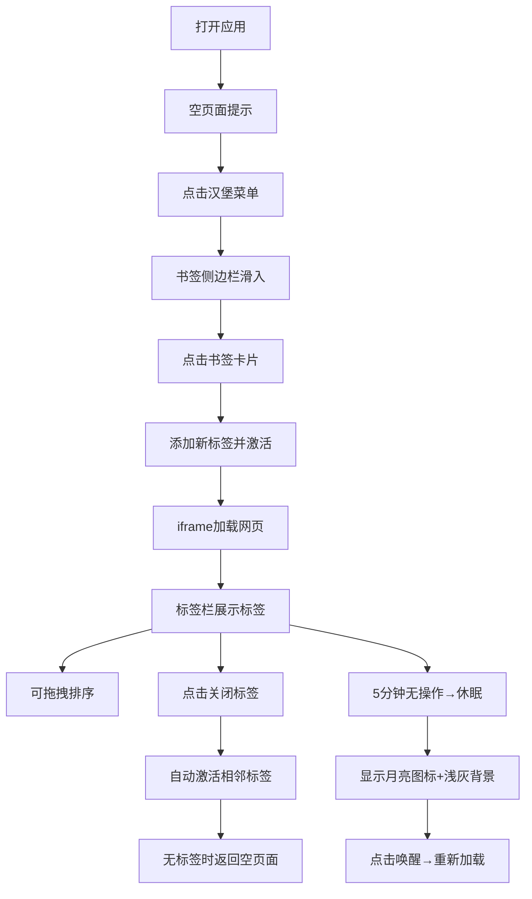

## 1. 产品概述

TabFlow 是一个轻量级的浏览器标签页管理应用，帮助用户在单一页面内统一管理和快速切换多个网页书签，解决多标签页混乱和内存占用问题。

- 面向日常需要频繁切换多个网站的工作人群，提供类似浏览器的标签页体验
- 通过书签侧边栏快速添加、拖拽排序、智能休眠等功能，提升浏览效率

## 2. 核心功能

### 2.1 用户角色

| 角色 | 注册方式 | 核心权限 |
|------|---------|----------|
| 普通用户 | 无需注册，本地使用 | 添加/关闭/排序标签页、管理书签、休眠唤醒标签 |

### 2.2 功能模块

1. **标签栏模块**：横向标签展示、激活切换、关闭按钮、拖拽排序、滚动导航
2. **内容面板模块**：iframe网页渲染、加载进度条、休眠状态显示、唤醒动画
3. **书签管理器模块**：侧边栏滑入动画、书签卡片展示、点击添加标签
4. **全局状态管理**：标签列表维护、激活状态同步、休眠定时器管理

### 2.3 页面详情

| 页面名称 | 模块名称 | 功能描述 |
|---------|----------|---------|
| 主页面 | 标签栏 | 胶囊形标签展示，蓝色下划线激活高亮，支持横向滚动（最多10个标签），拖拽排序时有上浮阴影和插入指示器 |
| 主页面 | 内容面板 | iframe渲染网页，加载时蓝色进度条，完成后淡入；无标签时显示居中提示文字并带有淡入回弹动画 |
| 主页面 | 书签侧边栏 | 12个预设网站书签卡片，点击添加新标签并自动关闭侧边栏；半透明遮罩背景，右侧滑入动画 |

## 3. 核心流程

用户打开应用 → 查看空页面提示 → 点击汉堡菜单打开书签侧边栏 → 选择书签网站 → 自动添加标签页并激活 → iframe加载网页 → 可拖拽调整标签顺序 → 点击关闭按钮关闭标签 → 长时间无操作标签自动休眠 → 点击休眠标签唤醒重载

## 4. 用户界面设计

### 4.1 设计风格
- **主色调**：冷色调为主，标签栏背景 #f8f9fa，激活标签白色，文字 #343a40，关闭按钮 #adb5bd，高亮蓝色用于进度条和激活指示
- **按钮风格**：圆角胶囊形标签，关闭按钮为小叉号，汉堡菜单为三线图标
- **字体**：Inter 无衬线字体，标题 14px，正文 13px
- **布局风格**：顶部标签栏（44px）+ 左侧主内容区 + 右侧书签入口；卡片式书签设计
- **视觉效果**：毛玻璃背景模糊 4px，轻微阴影，平滑过渡动画

### 4.2 页面设计概述

| 页面名称 | 模块名称 | UI元素 |
|---------|----------|--------|
| 主页面 | 标签栏 | 高度44px，#f8f9fa背景，胶囊标签带圆角，激活标签蓝色下划线，拖拽时10px上浮阴影，插入指示器蓝色竖线 |
| 主页面 | 内容面板 | 白色背景，iframe加载时顶部蓝色进度条，完成后淡入；空页面文字从底部上浮50px再回弹 |
| 主页面 | 书签侧边栏 | 宽度320px，奶白色背景圆角，半透明遮罩rgba(0,0,0,0.3)，从右侧滑入；书签卡片左侧favicon、右侧网站名 |

### 4.3 响应式
- Desktop-first 设计，断点 768px
- 移动端：标签文字缩短为域名首字母，汉堡菜单增加"书签"文字标签
- 触摸优化：增大点击热区，拖拽手势流畅

### 4.4 动画规范
- 所有过渡时间统一为 200ms ease-in-out
- 标签拖拽：上浮 + 阴影动画
- 侧边栏：右侧滑入 + 背景遮罩淡入
- 空页面：从底部上浮50px + 回弹
- 进度条：加载时线性动画
- 休眠唤醒：灰色到白色渐变过渡
