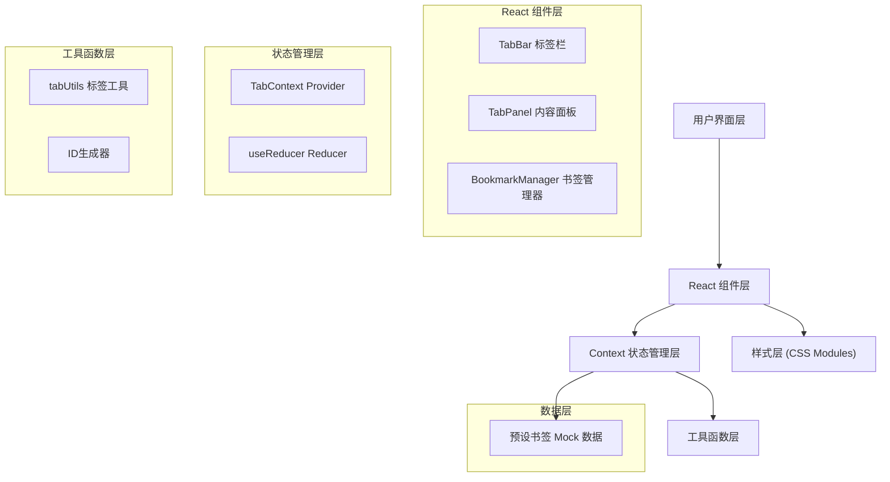

## 1. 架构设计



## 2. 技术描述

- **前端框架**: React@18 + TypeScript@5
- **构建工具**: Vite@5
- **状态管理**: React Context + useReducer
- **样式方案**: CSS Modules 内置
- **唯一ID**: uuid@9
- **类型支持**: @types/react, @types/react-dom, @types/uuid
- **路径别名**: @ 指向 src 目录

## 3. 项目结构

```
src/
├── context/
│   └── TabContext.tsx          # 全局标签页状态管理
├── components/
│   ├── TabBar.tsx              # 横向标签栏组件
│   ├── TabPanel.tsx            # 标签内容面板组件
│   └── BookmarkManager.tsx     # 书签管理器侧边栏
├── utils/
│   └── tabUtils.ts             # 工具函数模块
├── data/
│   └── bookmarks.ts            # 预设书签数据
├── types/
│   └── index.ts                # TypeScript 类型定义
├── App.tsx                     # 主应用组件
├── main.tsx                    # 应用入口
└── index.css                   # 全局样式
```

## 4. 状态管理设计

### 4.1 State 类型定义

```typescript
interface Tab {
  id: string;
  title: string;
  url: string;
  isActive: boolean;
  isLoading: boolean;
  isSleeping: boolean;
  lastActivityTime: number;
}

interface TabState {
  tabs: Tab[];
  activeTabId: string | null;
}
```

### 4.2 Action 类型

```typescript
type TabAction =
  | { type: 'ADD_TAB'; payload: { url: string; title: string } }
  | { type: 'REMOVE_TAB'; payload: { id: string } }
  | { type: 'SET_ACTIVE_TAB'; payload: { id: string } }
  | { type: 'REORDER_TABS'; payload: { fromIndex: number; toIndex: number } }
  | { type: 'SET_LOADING'; payload: { id: string; isLoading: boolean } }
  | { type: 'SET_SLEEPING'; payload: { id: string; isSleeping: boolean } }
  | { type: 'UPDATE_ACTIVITY'; payload: { id: string } }
  | { type: 'WAKE_UP_TAB'; payload: { id: string } };
```

## 5. 模块间数据流

所有组件通过 `TabContext` 共享状态：
- `TabBar` 读取 tabs 列表，通过 dispatch 触发切换、关闭、重排序
- `TabPanel` 读取 activeTabId，渲染对应 iframe
- `BookmarkManager` 调用 dispatch 添加新标签
- `tabUtils` 提供纯函数工具供 Reducer 和组件使用

## 6. 性能优化策略

1. **React.memo**：包裹 TabBar、TabPanel 等组件，避免不必要重渲染
2. **useCallback**：缓存 dispatch 回调函数
3. **iframe 缓存**：切换标签时不销毁 iframe，仅控制显示隐藏
4. **requestAnimationFrame**：拖拽排序动画使用 RAF 保证 60fps
5. **节流处理**：滚动事件使用节流，减少重绘
6. **will-change**：对动画元素优化合成层

## 7. 核心数据结构

### 7.1 书签数据结构

```typescript
interface Bookmark {
  id: string;
  name: string;
  url: string;
  favicon: string;
}
```

### 7.2 预设书签列表（12个）

- Google, GitHub, 知乎, B站, Twitter, Facebook
- Reddit, YouTube, DuckDuckGo, 维基百科, 百度, 微博

## 8. 配置文件

### 8.1 vite.config.js
- 路径别名 `@` → `src`
- 开发服务器端口 5173

### 8.2 tsconfig.json
- strict: true
- jsx: react-jsx
- 启用路径别名解析
