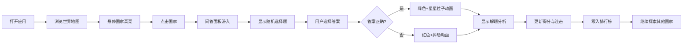

## 1. 产品概述

地理知识问答与探索应用是一款基于交互式世界地图的教育娱乐产品。用户通过点击地图上的国家触发随机问答，在游戏中学习各国文化、历史与地理知识，并通过排行榜系统激发学习动力。

- **核心目标**：以趣味化方式普及全球地理文化知识，提升用户学习参与度
- **目标用户**：学生、地理爱好者、休闲游戏玩家
- **产品价值**：将枯燥的知识学习转化为沉浸式地图探索体验

## 2. 核心功能

### 2.1 用户角色
| 角色 | 注册方式 | 核心权限 |
|------|---------|---------|
| 游客用户 | 无需注册 | 浏览地图、参与问答、查看本地排行榜 |

### 2.2 功能模块
1. **互动地图模块**：全球矢量化地图展示、国家悬停高亮、点击触发问答
2. **问答系统模块**：随机选择题生成、答案判定、连击加分、解析展示
3. **排行榜模块**：历史得分记录、前十名展示、最新记录高亮、本地存储

### 2.3 页面详情
| 页面名称 | 模块名称 | 功能描述 |
|---------|---------|---------|
| 主页面 | 互动地图 | 全屏Leaflet世界地图，卡其色陆地配浅蓝色海洋，国家边界清晰，悬停高亮透明度0.7 |
| 主页面 | 问答面板 | 底部滑入模态框，四选一选择题，正确绿色+星星粒子动画，错误红色+抖动，展示答案说明 |
| 主页面 | 排行榜 | 右下角半透明磨砂玻璃卡片，前十名得分与用时，滚动列表，最新记录金色高亮 |

## 3. 核心流程

用户打开应用 → 浏览世界地图 → 鼠标悬停国家查看高亮效果 → 点击任意国家 → 问答面板从底部滑入 → 显示随机选择题 → 用户选择答案 → 正确/错误反馈动画 → 显示答案解读 → 得分更新并写入排行榜 → 用户可继续点击其他国家答题

## 4. 用户界面设计

### 4.1 设计风格
- **主色调**：深灰蓝背景(#1a2332)、卡其色陆地、浅蓝色海洋、琥珀橙强调色(#ffb347)
- **卡片风格**：半透明白色(#ffffff1a)、磨砂玻璃效果(backdrop-filter: blur(8px))、圆角6px、柔和阴影
- **字体**：Google Fonts - Nunito
- **按钮风格**：圆角6px，悬停状态过渡300ms ease-out
- **动效**：统一使用CSS keyframes，过渡时间300ms ease-out

### 4.2 页面设计概览
| 页面名称 | 模块名称 | UI元素 |
|---------|---------|-------|
| 主页面 | 互动地图 | 全屏地图、卡其色陆地、浅灰国界、悬停透明度过渡 |
| 主页面 | 问答面板 | 底部滑入弹跳动画、朦胧遮罩、四选一按钮、星星粒子、抖动效果、解析文字 |
| 主页面 | 排行榜 | 右下角固定、磨砂玻璃卡片、滚动列表、金色高亮最新记录、fade-in切换 |

### 4.3 响应式设计
- **桌面端**：问答面板宽度500px，排行榜卡片右侧展示
- **平板端**：问答面板宽度320px并居中显示
- **手机端**：问答面板全宽，左右边距8px
- **地图触控**：移动端支持双指缩放和平移

### 4.4 性能指标
- 地图交互帧率 ≥ 45FPS
- 面板开关动画响应 ≤ 200ms
- 排行榜滚动流畅无卡顿
