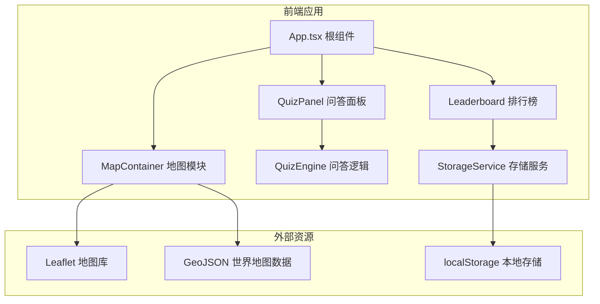

## 1. 架构设计



## 2. 技术描述

- **前端框架**：React 18 + TypeScript 5
- **构建工具**：Vite 5
- **地图引擎**：Leaflet 1.9 + react-leaflet 4
- **样式方案**：原生CSS + CSS Modules (SCSS可选)
- **唯一ID生成**：uuid
- **数据持久化**：localStorage
- **路径别名**：@ 指向 src 目录

## 3. 目录结构

```
src/
├── App.tsx                 # 根组件，模块聚合与状态管理
├── main.tsx               # 应用入口
├── index.css              # 全局样式与CSS变量
├── modules/
│   ├── map/
│   │   └── MapContainer.tsx   # 地图交互模块
│   ├── quiz/
│   │   ├── QuizPanel.tsx      # 问答面板组件
│   │   └── QuizEngine.ts      # 问答逻辑引擎
│   └── leaderboard/
│       ├── Leaderboard.tsx    # 排行榜组件
│       └── StorageService.ts  # 本地存储服务
└── data/
    └── quiz-questions.ts  # 题库数据
```

## 4. 模块接口定义

### 4.1 类型定义

```typescript
interface CountryInfo {
  name: string;
  code: string;
  lat: number;
  lng: number;
}

interface QuizQuestion {
  id: string;
  country: string;
  question: string;
  options: string[];
  correctIndex: number;
  explanation: string;
  category: 'culture' | 'history' | 'geography';
}

interface LeaderboardEntry {
  id: string;
  score: number;
  streak: number;
  duration: number;
  timestamp: number;
  countriesAnswered: string[];
}

interface QuizResult {
  isCorrect: boolean;
  scoreGained: number;
  streak: number;
  correctAnswer: string;
  explanation: string;
}
```

### 4.2 QuizEngine 接口

```typescript
class QuizEngine {
  getRandomQuestion(country: string): QuizQuestion;
  checkAnswer(questionId: string, selectedIndex: number): QuizResult;
  calculateScore(streak: number): number;
}
```

### 4.3 StorageService 接口

```typescript
class StorageService {
  getEntries(): LeaderboardEntry[];
  addEntry(entry: LeaderboardEntry): void;
  clearAll(): void;
  getTopTen(): LeaderboardEntry[];
}
```

## 5. 核心数据流

1. **地图点击 → 问答触发**：MapContainer 检测国家点击 → 传递国家信息给 App → App 控制 QuizPanel 显示
2. **答题流程**：QuizPanel 调用 QuizEngine 获取题目 → 用户选择答案 → QuizEngine 判定 → 返回结果 → QuizPanel 更新UI
3. **分数更新**：QuizPanel 累计得分 → 调用 StorageService 写入排行榜 → Leaderboard 组件自动更新
4. **状态管理**：App 组件持有全局状态（当前得分、当前题目、面板显示状态），通过 props 下发给子模块

## 6. 性能优化

- **地图渲染**：使用 GeoJSON 简化版世界地图数据，减少多边形顶点数
- **动画性能**：所有动画使用 transform 和 opacity 属性，触发 GPU 加速
- **排行榜更新**：使用 React.memo 避免不必要的重渲染
- **题目缓存**：QuizEngine 内部维护题库索引，避免重复计算
