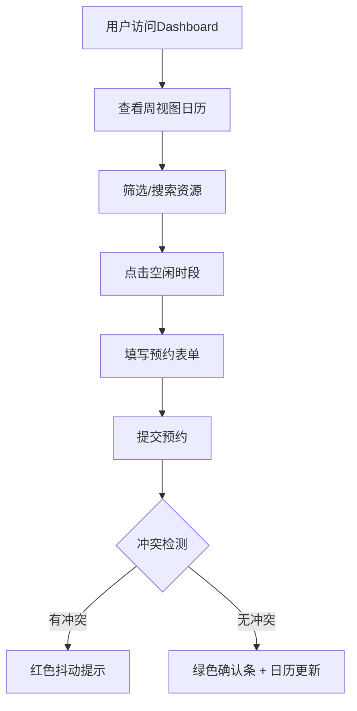

## 1. 产品概述

办公空间工位与会议室智能调度应用，解决共享办公空间资源冲突问题，实现实时查看空闲资源、预约时段、冲突提醒、管理员设置等功能。

- 主要目的：解决手动登记导致的资源冲突频繁问题，让管理员实时了解资源占用情况
- 目标用户：共享办公空间的普通用户（预约资源）和管理员（管理资源和规则）
- 市场价值：提升办公空间利用率，减少资源冲突，优化管理效率

## 2. 核心功能

### 2.1 用户角色

| 角色 | 注册方式 | 核心权限 |
|------|---------|---------|
| 普通用户 | 模拟登录 | 查看资源、预约资源、取消自己的预约、查看预约历史 |
| 管理员 | 模拟登录 | 所有普通用户权限 + 添加/删除资源、设置节假日禁用时段、查看所有预约历史 |

### 2.2 功能模块

1. **资源可视化看板**：周视图日历展示所有资源（工位、会议室、讨论区、露台座位），不同类型用不同颜色标识
2. **智能预约与冲突检测**：自动检测时段冲突和节假日禁用，冲突时红色抖动提示，成功时绿色确认条
3. **快捷筛选与搜索**：按资源类型筛选，按名称搜索高亮匹配
4. **管理员节假日设置**：设置全天禁用日期，支持批量设置周末，删除动画
5. **预约历史与统计**：今日占用率环形进度条、热门资源TOP3柱状图、本月平均时长折线图、最近预约表格

### 2.3 页面详情

| 页面名称 | 模块名称 | 功能描述 |
|---------|---------|---------|
| Dashboard | 顶部导航 | 用户信息、页面切换（仪表盘/管理面板） |
| Dashboard | 筛选栏 | 资源类型筛选按钮、搜索框 |
| Dashboard | 统计卡片 | 今日占用率、热门资源TOP3、本月平均预约时长 |
| Dashboard | 资源日历 | 周视图日历，显示各资源时段占用情况 |
| Dashboard | 预约表单 | 资源选择、日期时间选择、时长选择、备注输入 |
| Dashboard | 最近预约表格 | 最近10条预约记录，支持取消操作 |
| AdminPanel | 资源管理 | 添加/删除资源，设置资源名称和类型 |
| AdminPanel | 节假日设置 | 选择日期标记为全天禁用，批量设置周末 |
| AdminPanel | 预约历史 | 查看所有预约记录表格 |

## 3. 核心流程

### 用户预约流程
用户进入Dashboard → 查看周视图日历 → 筛选或搜索资源 → 点击空闲时段 → 弹出预约表单 → 填写信息提交 → 系统检测冲突 → 无冲突则预约成功，日历更新显示新预约块

### 管理员设置流程
管理员进入AdminPanel → 选择资源管理添加新资源 → 选择节假日设置标记禁用日期 → 查看所有预约历史

## 4. 用户界面设计

### 4.1 设计风格
- 主色调：蓝色 #1E88E5
- 背景色：白色 #FFFFFF
- 边框色：浅灰色 #E0E0E0
- 资源类型颜色：工位绿色、会议室蓝色、讨论区橙色、露台座位紫色
- 卡片样式：4px圆角 + 8px投影
- 按钮交互：hover放大1.05倍，active缩小
- 字体：Inter + Noto Sans SC（Google Fonts）

### 4.2 页面设计概述

| 页面名称 | 模块名称 | UI元素 |
|---------|---------|--------|
| Dashboard | 统计卡片 | 环形进度条（绿到红渐变）、横向柱状图（资源类型对应颜色）、折线图（平滑曲线） |
| Dashboard | 资源日历 | 周视图网格，预约块显示姓名首字母，悬停显示详情，空闲时段悬停显示"预约"按钮 |
| Dashboard | 预约表单 | 平滑弹出动画，冲突时红色文字+抖动，成功后淡入动画 |
| AdminPanel | 资源管理 | 资源列表，添加/删除按钮，删除左滑出动画 |
| AdminPanel | 节假日设置 | 日期选择器，批量设置周末按钮，灰色条纹显示禁用日期 |

### 4.3 响应式设计
- 大屏（>=1024px）：完整周视图 + 右侧详情面板
- 平板（768-1023px）：详情面板折叠到底部，标签切换
- 手机（<768px）：周视图改为日视图，筛选按钮改为下拉菜单

### 4.4 动画效果
- 预约块淡入动画
- 冲突检测抖动动画
- 确认提示条3秒后自动消失
- 删除操作左滑出动画
- 筛选切换平滑横向滑动过渡
- 按钮hover放大1.05倍，active缩小
