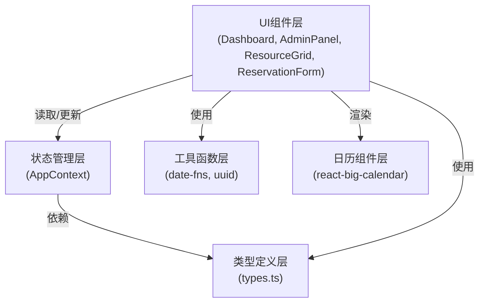
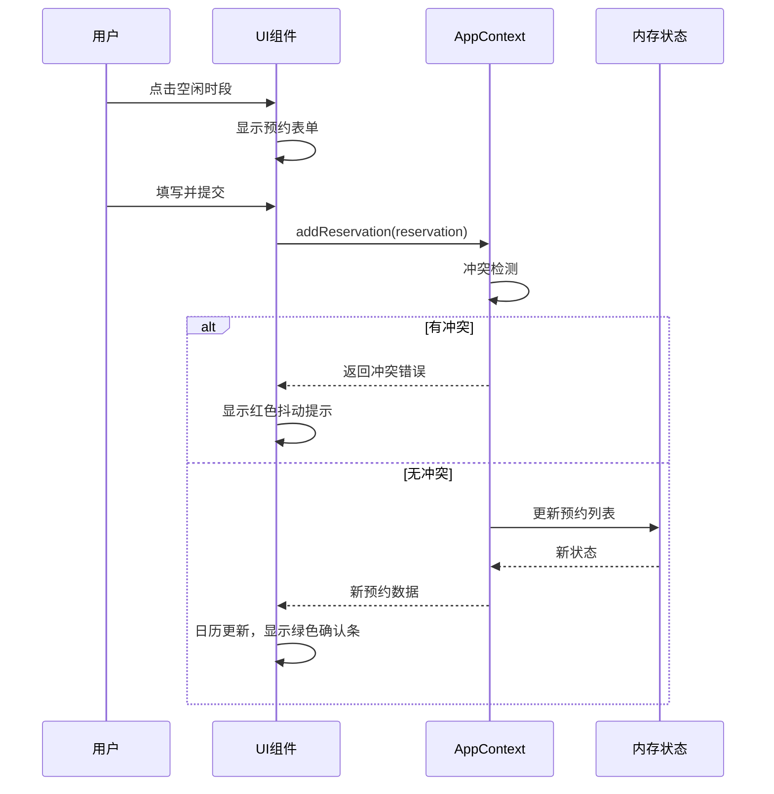

## 1. 架构设计



## 2. 技术描述

- **前端框架**：React 18 + TypeScript 5
- **构建工具**：Vite 5
- **状态管理**：React Context API（AppContext）
- **日期处理**：date-fns + moment
- **日历组件**：react-big-calendar
- **唯一ID生成**：uuid
- **字体**：Google Fonts (Inter, Noto Sans SC)
- **路径别名**：@ 指向 src 目录

## 3. 目录结构

```
src/
├── types.ts              # 核心类型定义
├── context/
│   └── AppContext.tsx    # 全局状态管理
├── components/
│   ├── ResourceGrid.tsx  # 资源日历网格
│   └── ReservationForm.tsx # 预约表单
├── pages/
│   ├── Dashboard.tsx     # 主仪表盘页面
│   └── AdminPanel.tsx    # 管理面板页面
├── utils/                # 工具函数（按需创建）
├── App.tsx               # 应用入口组件
├── main.tsx              # 应用挂载
└── index.css             # 全局样式
```

## 4. 核心数据类型定义

### ResourceType（资源类型）
```typescript
type ResourceType = 'station' | 'meeting_room' | 'discussion_area' | 'terrace';
```

### Resource（资源）
```typescript
interface Resource {
  id: string;
  name: string;
  type: ResourceType;
  capacity?: number;
  color: string;
}
```

### User（用户）
```typescript
interface User {
  id: string;
  name: string;
  role: 'user' | 'admin';
  avatar?: string;
}
```

### Reservation（预约）
```typescript
interface Reservation {
  id: string;
  resourceId: string;
  userId: string;
  userName: string;
  startTime: Date;
  endTime: Date;
  note?: string;
  createdAt: Date;
}
```

### BlockedPeriod（禁用时段）
```typescript
interface BlockedPeriod {
  id: string;
  date: string; // YYYY-MM-DD
  reason: string;
  isAllDay: boolean;
}
```

## 5. 数据流向



## 6. 状态管理设计

### AppContext State
```typescript
interface AppState {
  resources: Resource[];
  reservations: Reservation[];
  blockedPeriods: BlockedPeriod[];
  currentUser: User | null;
  filterType: ResourceType | 'all';
  searchQuery: string;
}
```

### AppContext Actions
```typescript
type AppAction =
  | { type: 'SET_CURRENT_USER'; payload: User | null }
  | { type: 'ADD_RESOURCE'; payload: Resource }
  | { type: 'DELETE_RESOURCE'; payload: string }
  | { type: 'ADD_RESERVATION'; payload: Reservation }
  | { type: 'DELETE_RESERVATION'; payload: string }
  | { type: 'ADD_BLOCKED_PERIOD'; payload: BlockedPeriod }
  | { type: 'DELETE_BLOCKED_PERIOD'; payload: string }
  | { type: 'SET_FILTER_TYPE'; payload: ResourceType | 'all' }
  | { type: 'SET_SEARCH_QUERY'; payload: string };
```

## 7. 性能优化策略

1. **组件拆分**：将大组件拆分为小组件，减少不必要的重渲染
2. **Memo优化**：使用React.memo包装纯展示组件
3. **按需计算**：统计数据使用useMemo缓存
4. **事件防抖**：搜索框输入使用防抖处理
5. **虚拟滚动**：长列表考虑虚拟滚动（本项目50个资源直接渲染即可）
6. **CSS动画**：使用transform和opacity属性实现高性能动画
